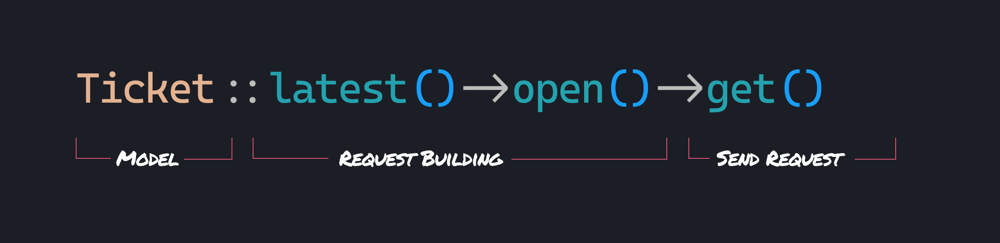
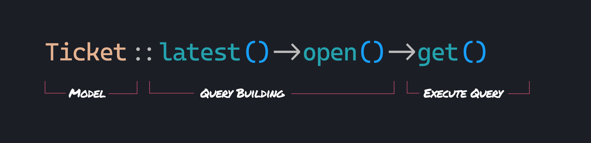

# SDKs, The Laravel way

Mỗi cuộc gọi tơi Builder sẽ điều chỉnh các request đang chờ xử lý cơ bản. Mỗi sự điều chỉnh, một liên kết khác trong
chuỗi, cái mà sẽ được gửi cuối cùng với get().



Điều thứ vị tôi nhận được khi sử dụng các API được xây dựng đẹp đẽ là tôi không thể hiểu. Một là cách tiếp cận cho người
mới băt đầu, một là một cú đấm cho các kỹ sư cao cấp. Đẹp, đơn giản và linh hoạt. Một kết nối khó nắm bắt cái mà tất cả
các kỹ sư tò mò nhưng có những người sẽ không tìm hiểu nó.
The joy I get when using a beautifully-crafted API cannot be understated. One that is approachable for beginners, and
can pack a punch for advanced engineers. Beautiful, simple, flexible. An elusive combination that all engineers strive
for, but some never find.

💡
> tldr;Gân đây tôi đã xây dựng 1 SDK cho API của ConnectWise, lấy cảm hứng từ 1 ví dụ của Eloquent. Nó là

# Đó là 1 sự đầu tư

Lau sạch lớp bụi cho 1 đặc tính cũ hàng tuần, hàng tháng, thậm chí là những năm sau, tôi muốn giảm số lần cào đầu cho
đến khi tôi hiểu được tôi đang thấy cái gì. Sử dụng Laravel trong nhiều năm, tôi nhận ra các APIs lỗi của nó dễ dàng để
quay lại. Vì vậy, thiết kế những thứ trong cách giống như `bản địa` với Laravel là 1 sự đầu tư cho tương lai của chính
tôi.

# Một ví dụ Eloquent

Bạn thường tìm nạp dữ liệu được lưu trong Laravel như nào? Eloquent. Hầu hết thời gian ( không phải tât cả), Một SDK(
Công cụ phát triển phần mềm ) chỉ là 1 lớp trừu tượng cho tìm nạp dữ liệu từ 1 API. Thỉnh thoảng, no chỉ là 1 trình bao
bọc đơn giản xung quanh việc tạo các HTTP requests. Nhưng sự khác biệt giữa tìm nạp dữ liệu từ Database và tìm nạp dữ
liệu từ API là gì?



Nếu chúng ta sử dụng các Model Eloquent để nhận dữ liệu từ CSDL của ứng dụng. Tìm nạp dữ liệu sẽ trông như này:

```php
// filtering
Ticket::where('status', 'open')->get();
Ticket::open()->get();

// selecting fields
Ticket::select(['id', 'summary'])->get();
Ticket::get(['id', 'summary']);

// sorting
Ticket::orderBy('created_at', 'desc')->get();
Ticket::latest()->get();

// eager loading
Ticket::with(['board', 'notes'])->get();

// all
Ticket::get();
```

Chúng ta có 1 Model, những phương thức cái mà trả về 1 đối tượng `Builder` cho các phương thức chuỗi tương lai, và những
phương thức cái mà thực thi các truy vấn và trả về `Collection`.

Tại sao chúng ta không, thay vì xây dượng 1 `query` để thực thi, chúng ta xây dựng 1 `HTTP request` để gửi?

Với những sự so sánh này trong đầu, module hóa SDK của chúng tôi để bắt chước Eloquent ...cảm giác đúng. Nó giống như
bơi trên dòng nước. Rất tự nhiên. Giống như hơi thở.

# Lấy Tịckets

Cuộc gọi cơ bản nhất, không yêu cầu lọc, không yêu cầu sắp xếp, sẽ trông như thế này.

```php 
$tickets = Ticket::get();
```

Nếu không có lỗi xẩy ra chúng ta sẽ nhận được `Collection`

# Model Ticket

```php

class Ticket {

public function  get():Collection 

{
 $settings = config('services.connectwise');

        $response = Http::baseUrl($settings['url'])
            ->withBasicAuth(
                "{$settings['company_id']}+{$settings['public_key']}",
                $settings['private_key'],
            )
            ->asJson()
            ->acceptJson()
            ->withHeaders(['clientId' => $settings['client_id']])
            ->throw()
            ->get($this->url());
        
        return new Collection($response->json());
}
public function url ():string 
{
 return '/tickets';
}

}

```

Phương thức `get()` trông khá dị, nhưng nó chỉ laasyc các thiết lập kết nối, xây dựng request, đóng gói response trong
1 `collection`. Chúng ta sẽ đơn giản hóa nó sau.

> 💡 Đừng cảm thấy sowh hãi để tạo ra các request cơ bản của chính bạn! Nếu API của bạn không sử dụng JSON, hay không sử
> dụng các định dạng khác của xác thực, hãy thay đổi những thứ cần thiết trong HTTP Client

Connection Settings
To make our base request work we'll need to add some values to our services config.

return [

    // other services ...
    
    'connectwise' => [
        'url' => env('CONNECTWISE_URL'),
        'public_key' => env('CONNECTWISE_PUBLIC_KEY'),
        'private_key' => env('CONNECTWISE_PRIVATE_KEY'),
        'client_id' => env('CONNECTWISE_CLIENT_ID'),
    ],

];

# Thiết lập kết nối

Để làm cho những request của chúng ta hoạt động, chúng ta cần để thêm những giá trị tới cấu hình `services` của chúng
ta .
> 💡 tôi đã chọn cấu hình để lưu các thiết lập connection API của tôi. Những thiết lập có thể đến từ bất kì đâu; một
> model khác trong hệ thống đa người thuê, từ 1 package giống như `spatie/laravel `, tùy thuộc vào bạn.

```php

return [

    // other services ...
    
    'connectwise' => [
        'url' => env('CONNECTWISE_URL'),
        'public_key' => env('CONNECTWISE_PUBLIC_KEY'),
        'private_key' => env('CONNECTWISE_PRIVATE_KEY'),
        'client_id' => env('CONNECTWISE_CLIENT_ID'),
    ],
    
];
```

# Cho phép thực hiện gọi các cuộc gọi phương thức tĩnh

Chú ý rằng phương thức `get` không `static`? tất nhiên bạn đã làm

```php

class Ticket 
{
//get() 
//url() 

public static  function  __callStatic($method, $parameters)
{
return (new static())->$method(...$parameters);

}
}

```

Đó là bản sao trực tiếp từ Model Eloquent laravel. Đó là tất cả những gì bạn cần làm.
Từ `Ticket` bạn có thể `call` tất cả các phương thức trên `Ticket` model.

```php

Ticket::get();
Ticket::url();

// instead of

(new Ticket)->get();
(new Ticket)->url();
```

# Lọc, sắp xếp, giới hạn


Trong Eloquents, những mối quan tâm được xử lý bởi đối tượng `Builder`. Đối tượng này chịu trách nhiệm cung cấp 1 giao
diện mượt mà cho
việc `cập nhật` các `thuộc tính` của chính nó và trả về thực thể cho phép các `method chaining`

```php

class RequestBuider 
{


public ?PendingRequest  $request = null;
public ?Model $model = null;

public function __construct($request, $model)
{
$this->model = $model;
$this->request= $request;
}
 // where()
    // whereIn()
    // whereBetween()
    // whereNull()
    // limit()
    // select()
    // ... and so on
    
    public  function  get( ):Collection 
    {
    $response =  $this->request->get($this->model->url());
    return new Collection ($response->josn());
    }
    
}
```

Như bạn thấy, đối tương này như chất `kết dính` giữa HTTP request `PenđingRequest` và `Ticket` model. 


# Truy cập vào Builder từ Model 

Một trong nhiều điều thú vị mà Eloquent đã làm là cung cấp cách dễ dàng để truy cập vào đối tượng `Builder` từ `model`. Bằng cách hướng bất kỳ cuộc gọi các phương thức cái mà không tồn tại trên model tới 1 `new Builder`
```php

class Ticket{

 use ForwardsCalls;
 //url();
 
 public  function  newRequest():RequestBuilder 
 {
 
 return new RequetBuilder($this);
 }
 
 public function __call($method, $parameters)
 {
 return $this->forwardCallTo($this->newRequest(), $method, $parameters);
 }
}
```

```php

$tickets = Ticket::get();

// instead of

$tickets = (new RequestBuilder(new Ticket))->get();
```

# CHỉnh sửa request 
Cho mỗi phương thức xây dựng khác như `where`, `whereIn`, `whereNot`, `limit`,`select`.... Mỗi cuộc gọi `RequestBuider` sẽ thực hiện điều chỉnh các `PendingRquest` đơn giản. Mỗi điều chỉnh, một liên kết khác trong chuỗi, 
cái mà sẽ được gửi, cuôi cùng với `get()`.


```php

public function where(string $field, $operator = null, mixed $value = null): static
{
    if (func_num_args() === 2) {
        $value = $operator;
        $operator = '=';
    }
    
    $options = $this->request->getOptions();

    $conditions = data_get($options, 'query.conditions');
    
    $conditions = ! empty($conditions) ? explode(' and ', $conditions) : [];
    
    $value = match (true) {
        $value instanceof Carbon => "[{$value->toIso8601String()}]",
        is_string($value) => "'{$value}'",
        is_array($value) => "'{$value[0]}'",
        is_bool($value) => $value ? 'true' : 'false',
        is_null($value) => 'null',
        default => $value,
    };
    
    $conditions[] = "{$field}{$operator}{$value}";
    
    $conditions = implode(' and ', $conditions);
    
    data_set($options, 'query.conditions', $conditions);
    
    $this->request->withOptions($options);

    return $this;
```

Đọc tài liệu cho cả API cái mà bạn đang thực hiện các request tới và HTTP Client của Laravel. Nhận các thông tin thực với chúng. Hẫy đào sâu vào tài liệu.Tôi chưa bao giờ hối tiếc về nó về nó. 

# Chuẩn bị nhiều hơn cho models 


CHúng ta có thể chuyển hầu hết các phương thức của model `Tịcket` sang class `Model` để các model khác có thể mở rộng. 
```php

abstract class Model
{
    use ForwardsCalls;

    abstract public function url(): string;
    
    // get()
    // newRequest()
    // __call()
    // __callStatic()
}
```
```php

class Ticket extends Model
{
    public function url(): string
    {
        return '/tickets';
    }
}
```

# HTTP Marco 

Để tạo nên cấu trúc của `RequestBuilder` không dài dòng, chúng ta có thể sử dụng 1 HTTP marco 

```php

public function boot()
{
HTTP::marco('connectWise', function(){
   $settings = config('services.connectwise');
        
        return Http::baseUrl($settings['url'])
            ->withBasicAuth(
                "{$settings['company_id']}+{$settings['public_key']}",
                $settings['private_key'],
            )
            ->asJson()
            ->acceptJson()
            ->withHeaders(['clientId' => $settings['client_id']])
            ->throw();
})
}
```

# Phạm vi request 

Tôi thực sự thích `query scope` trong Eloquent. Như những thức nhỏ khác.Nó làm cho trải nghiệm của dev trở nên tốt hơn rất nhiều. 


```php
class Ticket extends Model
{
    // url()
    
    public function open(): RequestBuilder
    {
        return $this->where('status', 'open');
    }
}
```

```php

Ticket::open()->get();

// instead of

Ticket::where('status', 'open')->get();
```
Nếu có 1 mô hình mới cần scope `open()` chúng ta nên gói nó trong 1 `trait` HasStatus.

# Những ý kiến khác 

Để cho ngắn gọn, tôi sẽ bỏ qua những chủ đề chính như định nghĩa các mối quan hệ. Tôi sẽ giải quyết chúng tương tự. Eloquent đã xử lý nó như nào? Mặc dù nếu câu trả lời là 'nó không làm gì', nó vẫn là nơi tốt để bắt đầu 
# Bạn nghĩ gì? 
 Tôi thực sự thích các cấu trúc của SDKs này và đã sử dụng phuong pháp này thành công trong nhiều năm. Nhưng tôi muốn biết suy nghĩ của bạn. Hãy cho tôi biết 


Đây là phần hai của chủ đề này ..Bấm [vào đây ](https://github.com/vn0202/web-knowledge/blob/main/SDKs-%20The-Laravel-way.md)


