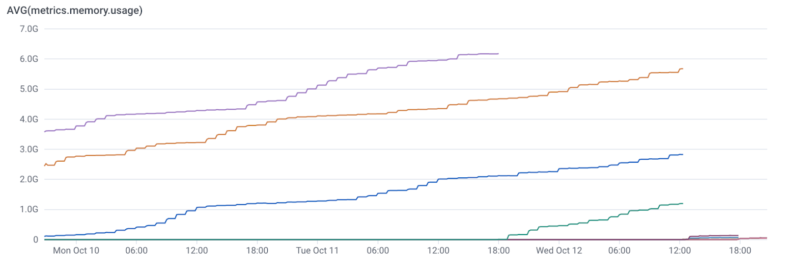

# Trinh điều khiển CSDL: Ngỗ nghịch hay tốt?

 Một danh sách các lỗi hàng đầu trinh điều khiển và hành vi sai trái chúng ta đã phát hiện trong những năm gần đây
 Chúng ta đã dành rất nhiều thời gian viết mã cho CSDL, kho dữ liệu và các trình điều khiển của chúng trong năm nay. Giống như, rất nhiều . Thông qua tiến trình đó, chúng ta đã không bao gồm các hành vi không mong đợi. Trong cac trường hợp, những cư xử này chống lại tài liệu của công cụ. TRong các trường hợp khác, chúng chỉ đi ngược lại lẽ thường(dù sao đi nữa   ý thức của chúng ta là phổ biến  trong chừng mực  ). Trong bất kỳ hoàn cảnh nào, chúng tôi đã phát hiện ra nó sẽ thú vị để biên dịch và chia sẻ chúng, cả cho giải trí và cho hậu thế :>
 Trước khi chúng ta đào sâu vào nó, có 1 chú ý. Chúng ta cảm thấy cực kỳ may mắn để làm việc với nhiều công cụ như vậy, và có khả năng để xây dựng trên các công việc của người khác để tiếp tục phân phối các sản phẩm tốt hơn. Chúng ta đã viết các phần mềm cho cuộc sống và chúng ta là người đầu tiên biết lỗi đó đến với lãnh thổ- trừ khi bạn là siêu nhânm hoặc bạn không viết bất kỳ các mã có ý nghĩa nào, các lỗi là không thể tránh khỏi

Mục tiêu của chúng ta ở đây rõ ràng không chế giễu bất kỳ sản phẩm hay công ty cụ thể nào vì sử dug chúng. Thay vào đó, chúng tôi đã phát hiện ra các kiên thức đủ thú vị để chia sẻ. Bất cứ khi nào và ở đâu có thể, chúng tôi làm hết khả năng để trở thành công dân trung thực và báo cáo các lỗi này với chủ sở hữu tương ứng của nó. Bất kể, để ngăn cản bài viết này khỏi việc phục vụ như 1 cơ hội " làm nhục tên tuôi", chúng tôi đã nghĩ nó tốt nhất để ẩn danh CSDL và các trình điều khiển ở đây. Nếu bạn làm việc ở công ty CSDL  và bạn muốn có các phản hồi trên 1 trình điều khiển cụ thể hoặc mở 1 dòng của cuộc giao tiếp, hãy gửi cho chúng tôi 1 ghi chú ở prequel.co!

Bây giờ, không cần quảng cáo thêm, ở đây là những bản hít top đầu của "hả, WTF?" của CSDL và hành xử của trinhf điều khiển của năm nay.

# Vài trình điều khiển bên thứ nhất không khia triển chức năng đưuọc quảng cáo. 

Trình điều khiển GoLang bên thứ nhất cho đa số CSDL/dwh không triển khai chức năng sao chép tệp, mặc dù rõ ràng phát biểu trong tài liệu của nó là có. Đưa cái gì? Chúng ta không chắc nữa, nhưng chúng ta biết từ trải nghiệm đầu tay cái mà khó để giữ cho tài liệu hoàn hảo để cập nhật. Vì vậy chúng tôi sẽ đưa chúng vượt qua. 

Để mở khóa đầy đủ chức năng, ( và giải quyết các vấn đề khác) chúng ta bắt đầu sử dụng nhiều hơn trình điều khiển dựa trên ODBC. Điều này mang đến cho chúng ta các bản hit tiếp theo. 

# vài trình điều khiển ODBC rò rỉ bộ nhớ

Giao diện ODBC được thiết kế cho việc sử dụng với ngôn ngữ lập trình C. Nói cách khác, trình điều khiển ODBC, theo tự nhiên, phải chạy mã C. Hóa ra, chương trinh C có thể rò rỉ bộ nhớ, và trình điều khiển ODBC không là ngoại lệ. Vài rò rỉ là 1 bit nhỏ với mỗi cuộc gọi, trong khi số khác có các cuộc gọi cụ thể và các mẫu sử dụng cái mà gây ra chúng để rò rỉ nhiều bộ nhớ.

Đây là 1 đồ thị hài hước của bộ nhớ sử dụng của chúng tôi, qua 1 chu kỳ vài ngày khi chúng tôi đang kiểm tra 1 rò rỉ bộ nhớ trong môi trường dev của chúng ta. NHờ dó, chúng tôi đã bắt đưuọc nó trước khi nó được sản xuất. Nguyên nhân gốc hóa ra là 1 mẫu cuộc gọi cụ thể bên trong trình điều khiển ODBC. 

# Một vài trình điều khiển rò rì chứng chỉ. 

Một vài trình điều khiển ghi các chứng chỉ nếu ở đó là 1 lỗi trong 1 chuỗi chứa 1 chứng chỉ như 1 khóa API hoặc 1 khóa bí mật AWS. Những thứ khác, những công dân trung thực hơn sẽ thay thế các trường chứng chỉ được biết với 1 chuỗi "dữ liệu đã xóa " khi đang đăng nhập vào thiết bị xuất hoặc ...

