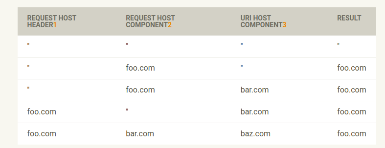

# PSR-7 : HTTP message Interface


Tài liệu này mô tả các giao diện phổ biến cho đại diện tin nhắn HTTP như được mô tả tỏng `RFC 7230` và `RFC 7231`, và URIs cho sử dụng tin nhắn HTTP như mô  tả trong `RFC 3986`

Các tin nhắn HTTP là nền tảng cho phát triển web. Các trình duyệt web và HTTP clients như cURL tạo ra các tin nhắn request HTTP để gửi tới 1 máy chủ web, nơi mà cung cấp 1 tin nhắn phản hồi. Mã phía máy chủ nhận tin nhắn `request message` và trả về 1 `response message`. 

Các tin nhắn HTTP cơ các tóm tắt cơ bản từ phía người dùng cuối, nhưng như các nhà phát triển, chúng ta cơ bản cần biết các chúng được cấu tạo  và cách để truy suất hay thao tác với chúng để thực thi các tác vụ của chúng ta, liệu có được thực hiện 1 request từ 1 HTTP API hay xử lý 1 yêu cầu đầu vào.


Mỗi tin nhắn yêu cầu HTTP có dạng cụ thể : 

POST /path HTTP/1.1
Host: example.com

foo=bar&baz=bat
The first line of a request is the "request line", and contains, in order, the HTTP request method, the request target (usually either an absolute URI or a path on the web server), and the HTTP protocol version. This is followed by one or more HTTP headers, an empty line, and the message body.

HTTP response messages have a similar structure:
```php
HTTP/1.1 200 OK
Content-Type: text/plain

This is the response body

```

Dòng đầu tiên là `dòng trạng thái` và chứa, theo thứ tự,phiên bản giao thức HTTP, mã trạng thái HTTP, và 1 `cụm lý do`, một mã trạng thái mô tả con người có thể đọc. Giống như tin nhắn yêu cầu, điều này sau đó được theo sau bởi 1 hoặc nhiều các `headers` HTTP, một dòng trống và tin nhắn `body`

Tin nhắn phản hồi HTTP cũng có cấu trúc tương tự: 
```php
HTTP/1.1 200 OK
Content-Type: text/plain

This is the response body
```

Dòng đầu tiên là `dòng trạng thái` và chứa, theo thứ tự, phiên bản giao thức HTTP, mã trạng thái HTTP, và 1 `lý do` một mã trạng thái mà con người có thể đọc. Giống như tin nhắn yêu cầu, điều này được theo sau bởi 1 hoặc nhiều tiêu đề HTTP, 1 dòng trống và tin nhắn Body. 

Các `giao diện` được mô tả trong tài liệu này là các `tóm tắt` xung quanh các tin nhắn HTTP và các thành phần tạo ra chúng
Các từ khóa `MUST`,`MUST NOT`,`REQUIRED`, `SHALL`, `SHALL NOT`, `SHOULD`, `SHOULD NOT`, `RECOMMENDED1`, `MAY`, và `OPTIONAL` trong tài liệu này như được mô tả trong RFC 2119.
## Reference 

- RFC 2119 
- RFC 3986 
- RFC 7230 
- RFC 7231


## 1. Mô tả 

### 1.1 Message

Một tin nhắn HTTP là 1 yêu cầu từ máy khách gửi tới server hoặc 1 lời phản hồi từ máy chủ tới máy khách. Sự mô tả rõ này định nghĩa các    `interfaces` cho các tin nhắn HTTP `Psr\Http\Message\RequestInterface` và `Prs\Http\Message\ResponseMessage` tương ứng 

Cả `Prs\Http\Message\RequestInterface` và `Prs\Http\Message\ResponseInterface` mở rộng từ `Prs\Http\Message\MessageInterface`. Trong khi  `Prs\Http\Message\MessageInterfac` có thể được khai triển trực tiếp, các trình khai triển nên triển khai `Prs\Http\Message\RequetInterface` và `Prs\Http\Message\ResponseInterface`

Bắt đàu từ đây, không gian tên `Prs\Http\Message` sẽ được bỏ qua khi tham chiếu đên những interfaces này 

### 1.2 HTTP headers
 
[cf. errata]

### Tên các trường tiêu đề không phân biệt in hoa 

Các tin  nhắn HTTP bao gồm tên các trường tiêu đề không phân biệt chữ hoa chữ thường. Các tiêu đề được truy suất bởi tên từ các lớp triển khai MessageInterface không phân biệt hoa thường. Ví dụ, truy xuất tiêu đề `foo ` sẽ trả về cùng 1 kết quả như khi truy xuất tiêu đề `foO`. Tương tự, thiết lập tiêu đề `Foo` sẽ ghi đề bất kì các thiết lập  giá trị tiêu đề `foo` .

```php
$message = $message->withHeader('foo', 'bar');

echo $message->getHeaderLine('foo');
// Outputs: bar

echo $message->getHeaderLine('FOO');
// Outputs: bar

$message = $message->withHeader('fOO', 'baz');
echo $message->getHeaderLine('foo');
// Outputs: baz
```


Mặc dù các tiêu đè này có thể truy suất không phân biệt hoa thường, trường hợp gốc phải được `bảo tồn` bằng các khai triển, trong trường hợp cụ thể khi truy xuất với `getHeaders()`
 
Các ứng dụng không HTTP không phù hợp có thể phụ thuộc vào 1 trường hợp chính, vì  vậy nó hữu dụng cho người dùng để có thể xác định  cho trường hợp các tiêu đề HTTP  khi tạo ra 1 request hay 1 response.

#### Các tiêu đề đa giá trị 

Để cung cấp các tiêu đề với đa giá trị cũng cung cấp cách hoạt động thuận lợi làm việc với tiêu đề như các chuỗi, các tiêu đề có thể được truy xuất từ 1 thực thể của `MessageInterface` như một mảng hay 1 chuỗi. Sử dụng `getHeaderLine()` để truy xuát 1 giá trị tiêu đề như 1 chuỗi chứa tất cả các giá trị tiêu đề của tiêu đề không phân biệt hoa thường bằng tên được nối với dấu ','. Sử dụng `getHeader()` để truy xuất 1 mảng tất cả các giá trị tiêu đề cho tiêu đề không phân biệt hoa thường cụ thể bằng tên.
```php

$message = $message
->withHeader('foo', 'bar')
->withAddedHeader('foo', 'baz');

$header = $message->getHeaderLine('foo');
// $header contains: 'bar,baz'

$header = $message->getHeader('foo');
// ['bar', 'baz']
```

Chú ý: Không phải tất cả các giá trị `header` được nối bởi dấu `,` (ví dụ Set-cookie). Khi làm việc với các tiêu đề như thế, người dùng các lớp dựa trên `MessageInterface` phụ thuộc vào phương thức `getHeader()` để truy xuất các `header` đa giá trị. 


## Tiêu đề máy chủ 

Trong các yêu cầu, hầu hết các tiêu đề cơ bản phản chiếu thành phần máy chủ của `URI`, cũng như  là máy chủ được sử dụng khi thành lập kết nối `TCP`. Tuy nhiên, mô tả HTTP cho phpes các tiêu đề `Host`  khác với hai cái kia. 

Trong suốt quá trình xây dựng, các khai triển phải cố để thiết lập các header `Host ` từ 1 URI được cung cấp trừ khi header `Host`không được cung cấp. 

`RequestInterface::withUri()` sẽ  theo mặc định, thay thế tiêu đề `host` của yêu cầu với 1 header `host` khớp với thành phần `host` được truyền cho `UriInterface`.

Bạn có thể tùy chọn để `bảo tồn` các trạng thái gốc của `header host` bằng cách truyền `true` cho tham số thứ hai ($preserveHost). Khi đối số này được thiết lập là `true`, các yêu cầu được trả về sẽ không cập nhật tiêu đề máy chủ của tin nhắn được trả về -- trừ khi tin nhắn không chứa `header host`. 

Bảng này chứng minhg cái mà phương thức `getHeaderLine('host')` sẽ trả về từ 1 request được trả về với `withUri()` với tham số `$preserverHost` được thiết lập là true cho các khởi tạo yêu cầu và URIs khác nhau. 



1. Giá trị tiêu đề trước  khi thao tác, 
2. Thành phần host của Uri cái mà được tạo trong request trước khi thực thi 
3. Thành phần host của Uri được tiêm thông qua withUri().


## 1.3 Luồng 

Các tin nhắn HTTP chứa 1 dòng bắt đầu, cac tiêu đề và 1 body. Thân của tin nhắn HTTP có thể là rất nhỏ hoặc cực kỳ lớn. Việc cố gắng để đại diện thân của 1 tin nhắn như 1 chuỗi có thể dễ dàng tiêu thụ nhiều hơn bộ nhớ theo dự định bởi vì nội dung phải được lưu hoàn toàn bằng bộ nhớ.Việc cố gắng lưu thân tin nhắn của 1 yêu cầu hây phản hồi trong bộ nhớ sẽ ngăn chặn việc sử dụng triển khia  khỏi  việc có thể sử dụng để làm viêc với các thân tin nhăn lớn. 

`StreamInterface` được sử  dụng để ẩn đi việc triển khai chi tiết khi mà 1 luồng của dữ liệu được đọc hoặc viết. Cho các trường hợp nơi mà một chuỗi sẽ là 1 triển khai tin nhắn thích hợp, các luồng dựng sẵn như `php://memory` và `php:/temp` có thể được sử dụng 
`StreamInterface` mở ra một vài phương thức cái mà có thể cung cấp các luồng để đọc, viết hoặc là duyệt qua một các hiệu quả

Các luồng mở ra các khả năng của chúng bằng các sử dụng 3 phương thức: `isReadable`,`isWriteable()` và `isSeekable`. Những phương thức có thể được sủ dụng bởi các luồng cộng tác để xác định  nếu 1 luồng đáp ứng được các yêu cầu của chúng. 

Mỗi thưc thể luồng sẽ có các khả năng khác nhau: có có thể chỉ đọc, chỉ viết, hoặc đọc-viết. Nó cũng có thể cho phép các khả năng tùy ý ngẫu nhiên ( tìm kiếm trở lại hoặc về sau tới bất kì vị trí nào) hoặc chỉ truy suất tuần tự ( ví dụ trong trường hợp của `socket`, `pipe` hay luồng dựa trên call-back)

Cuối cùng, `StreamInterface` định nghĩa 1 `__tóString` để chỉ rõ việc truy xuất hoặc phát ra toàn bộ nội dung của body 1 lần. 

Không giống như giao diện request và response, StreamInterface không mô hình hóa tính bất biến. Trong trường hợp nơi mà 1 luồng PHP thực tế được bao bọc, tính bất biến là không thể để bắt buộc, vì bất kỳ mã nào cái mà tương tác với tài nguyên có tiêm năng thay đổi trạng thái của nó ( bao gồm vị trí con trỏ, nội dung...). Khuyến nghị của chúng ta là các khai triển đó sử dụng luồng chỉ đọc cho các yêu cầu phía máy chủ và phản hồi phía máy khách. Người tiêu dùng nên nhận thức thực tế cái mà thực thể luồng có lẽ là bất biến và như, có thể thay thể trạng thái của tin  nhắn; khi nghi ngờ, tạo ra 1 luồng mới và gắn nó tới 1 tin nhắn để thực thi trạng thái. 
## 1.4 Đích yêu cầu và URIs. 

Theo RFC 7230, các tin  nhắn request chứa 1 `request-target` như phân đoạn thứ hai của dòng yêu cầu. Đích yêu cầu có thể là 1 trong các dạng sau: 

- **origin-form**,  cái mà chứa đường dẫn và nêu tồn tại, 1 chuỗi truy vấn; đây là 1 tham chiếu tới như  1 URL tương đối. Tin nhắn như đưược vận chuyển qua TCP là dạng cơ bản của `origin-form`; lược đồ dữ liệu và xác thực thường chỉ xuất hiện qua các biên CGI. 
- **absolute-form**, cái mà chứa lược đồ, xác thực ("[user-info@]host[:port]",nơi mà các phần tử trong dấu ngoặc là tùy chọn, `path` ( nếu tồn tại), `query string` (nếu tồn tại) và `fragment` (nếu tồn tại). Đây thường được gọi là URL tuyệt đối và là dạng duy nhất để chỉ rõ 1 URI như chi tiết trong RFC 3986. Dạng này thường được sử dụng khi tạo ra các yêu cầu tới HTTP proxies. 
- **authority-form**, cái mà chứa chỉ các xác thực. Đây được sử dụng cơ bản chỉ trong các yêu cầu CONNECT, để thiết lập 1 kết nối gữa 1 HTTP clients và 1 máy chủ proxy. 
- **asterisk-form**, cái mà chứa duy nhất chuỗi `*`, va cái được sử dụng với phương thức `OPTIONS` để xác định khả năng chung của 1 máy chủ web. 

Bên cạnh những `request-targets`, thường có 1 `URL hiệu quả` cái mà được chia ra từ 1 yêu cầu đích. URL hiệu quả là không được chuyển trong 1 tin nhắn HTTP, nhưng nó được sử dụng để xác định giao thức (http/https), cổng và tên máy chủ cho tạo các yêu cầu. 

`URL hiệu quả ` được đại diện bởi UriInterface. UriInterface mô hình hóa HTTP và HTTPs URIs như được mô tả trong RFC 3986( trường hợp sử dụng cơbản ). Giao diện cung cấp các phương thức để làm việc với các phần URI khác cái mà sẽ phòng ngừa những yêu cầu khỏi việc nhắc lại phân tích URI. Nó cũng chỉ rõ 1 hàm `__toString` cho ép kiểu URI được mô hình hóa sang đại diện chuỗi của chính nó. 

Khi truy xuất yêu cầu đích với `getRequestTarget()`, theo mặc định, phương thức này sẽ sử dụng đối tượng URI và phân tách tất cả các thành phần cần thiết để tạo ra `origin-form`. `origin-form` cho đến bây giờ là đích request phổ biến nhất. .


Nếu nó là mong muốn của nguồi dùng để sử dụng 1 trong 3 dạng khác, hoặc nếu nguồi dùng muốn chỉ rõ ghi đè yêu cầu đích, nó là có thể để sử dụng với `withReqestTarget()`. 

Gọi phương thức nyaf không ảnh hưởng tới URI, vì nó đươc yêu cầu từ `getUri()`.

```php
$request = $request
->withMethod('OPTIONS')
->withRequestTarget('*')
->withUri(new Uri('https://example.org/'));

```

Ví dụ này có thể là kết quả cuối củng trong 1 yêu cầu HTTP trông như này
```php
OPTIONS * HTTP/1.1

```

Nhưng máy khác sẽ có thể để sử dụng URL hiệu quả ( từ getUri())), để xác định giao thức, tên máy chủ và cổng TCP. 

Một máy khach HTTP phải bỏ qua giá trị của Uri::getPath() và Uri::getQuery(). và thay vào đó  sử dụng giá trị được trả về bởi getRequestTarget() cái mà mặc định được nối với hai giá trị này.


Máy khách cái mà chọn không khai triển 1 hoặc nhiều hơn 4 định dạng request đích, vẫn  `phải` sử dụng `getRequestTarget()`. Những máy khách phải `từ bỏ` những yêu cầu đích chúng không hỗ trợ và phải không được dựa vào các giá trị từ `getUri()`.  
`RequestInterface` cung cấp các phương thức cho truy xuất những yêu cầu đích hoặc tạo một thực  thể mới với yêu cầu đích được cung cấp. Theo mặc định, nếu không có yêu cầu đich được tạo ra rõ ràng trong thực thể,`getRequestTarget()` sẽ trả về mẫu `gốc` của URI được tạo ( hoặc "/? nếu URIs không được tạo). `withRequestTarget($requestTarget) tạo ra 1 thực thể mới với yêu cầu đích được chỉ định, và bởi vậy cho phép các nhà phát triển để tạo ra các yêu cầu tin nhắn cái mà đại diện cho 3 mẫu request-target ( absolute-form, authority-form và asterisk-form). Khi được sử dụng, thưc thể URI được tạo có thể vẫn được sử dụng, đặc biệt trong máy khách, nơi nó có thể được sử dụng để tạo kết nối với máy chủ


### 1.5 Các yêu cầu phía máy chủ 

`RequestInterface` cung cấp các đại diện chung của 1 tin nhắn yêu càu HTTP. Tuy nhiên, các yêu cầu phía máy chủ cần các xử lý bổ sung, do môi trường tự nhiên của phía máy chủ. Tiến trình xử lý phía máy chủ cần lấy tính đến Cổng giao diện chung, và cụ thể hơn, các lớp trừu tượng của PHP và mở rộng của CGI thông qua APIs máy chủ của nó (SAPI). PHP cung cấp các đơn giản hóa xoay quanh việc sắp  xếp đầu vào thông qua các biến toàn cục như: 

- $_COOKIE, cái mà khử tuần tự hóa và cung cấp các truy cập đơn giản tới cookies HTTP 
- $_GET, cái mà khử tuần tự hóa và cung cấp các truy cập đơn giản tới các đối số chuỗi truy vấn 
- $_POST, khử tuần tự hóa và cung cấp các truy cập đơn giản cho các tham số đã được mã hóa url được gửi qua HTTP `POST`; nói chung, nó có thể được xem như kết quả của việc phân tích nội dung của tin nhắn 
- $_FILES, Cái mà cung cấp các siêu dữ liệu tuần tự hóa thông qua cập nhập files. 
- $_SERVER,cái mà cung cấp truy cập tới CGI\SAPI biến môi trường, cái mà thường chứa những phương thức yêu cầu, lược đồ yêu cầu, URI request và các tiêu đề. 

ServerRequestInterface mở rộng từ RequestInterface để cung cấp các trừu tượng xung quanh những biến siêu toàn cục. Thực hành này làm giảm việc nhân đôi các biến siêu toàn cục bởi người dùng, và khuyến khích và thúc đẩy khả năng kiểm tra các yêu cầu của người tiêu dùng. 

Các yêu cầu máy chủ cung cấp các thuộc tính bổ sung, `attributes ` cho phép người tiêu dùng khả năng để quan sát, phân tích, và nối các yêu cầu với các quy tắc dành riêng cho ứng dụng ( chẳng hạn như các khớp đường dẫn, khớp lược đồ, khớp máy chủ...) . Như vậy, các yêu cầu máy chủ cũng có thể cung cấp các tin nhắn giữa nhiều yêu cầu người tiêu dùng. 
