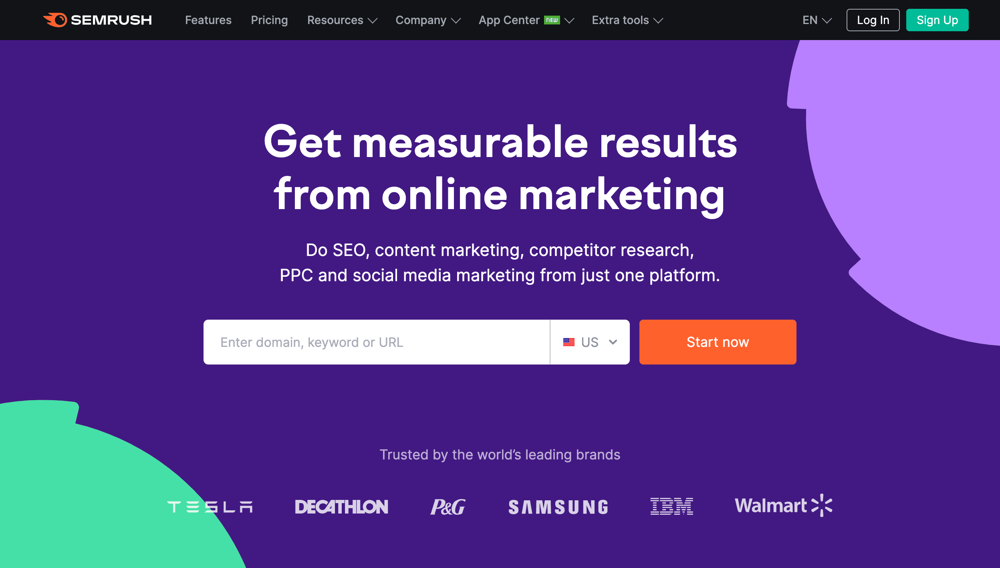

## From [https://benjamincrozat.com/seo-case-study?ref=laravelnews](https://benjamincrozat.com/seo-case-study?ref=laravelnews)

# Trường hợp nghiên cứu SEO điển hình ( tăng 10k click trong 6 tháng)

Vì tôi đã bắt đầu vào tháng 9 năm 2022, lượt clicks trên GG đi từ 0 lên hơn 10000
 Trong nghiên cứu trường hợp SEO này, tôi sẽ cho bạn thấy mọi điều tôi đã làm để đạt được ở đây. 

## Bảng nội dung

1. [Seo giúp bạn tiếp cận mọi người](#seo-giup-ban-tiep-can-moi-nguoi) 
2. [SEO không phải là gì](#what_is_seo_not)
3. [Cần làm gì để đat nhiều lượng truy cập hơn từ công cụ tìm kiếm](#what_to_do_to_get_more_traffic_from_search_engine)
   1. [Lập chỉ mục trang của bạn ngay lập tức; đừng chờ GG](#index_your_page_immediately_dont_wait_GG). 
   2. [Đừng làm nản lòng user; làm cho trang của bạn tải nhanh hơn.](#dont_discourage_your_users_make_yourpage_load_faster) 
   3. [Đưa nội dung của bạn đến với mọi người nhờ nghiên cứu keyword.](#get_your_content_in_front_of_user) 
   4. [Cung cấp cho người dùng nội dung để hiển thị với ngưởi dùng.](#feed_gg_your_content) 
      1. Chọn 1 keyword và viết 1 phiên bản tối thiểu khả thi.
      2. Làm cho bài viết của bạn thân thiện với đoạn trích.
      3. Đợi nó xếp hạng và tiếp tục chỉnh sửa bài viết. 
   5. [Nhận backlinks từ các trang web khác dể tăng thứ hạng của bạn.](#get_backlink_from_other_site_to_boost_your_rank) 
      1. Backlinks là gì ?
      2. Tôi có thể lấy backlinks như nào? 
4. [Thêm: Sử dụng các công cụ premium để đơn giản hóa và mở rộng quy mô.](#bonus_using_premium_tool_to_ease_and_scale)
   1. Semrush
   2. Wincher

5. [Những thực hành này sẽ chuyển thành kết quả. Đây là bằng](#translate_practise_to_result)  
   1. January 2023
   2. December 2022
   3. November 2022
   4. October 2022 
      1. The Google Discover effect
   5. September 2022

#   SEO giúp bạn tiếp cận tới mọi người 
Với tôi, lượng truy cập là tiền; nó nên được chủ động nhất có thể. Hãy để tôi giải thích. 

Khi quảng bá nội dung của bạn trên mạng xã hội, bạn có thể có hai hoặc 3 hoăc hàng nghìn người ghé thăm, phụ thuộc vào mức độ phổ biến của bạn. Nhưng bạn là ai không quan trọng, điều này sẽ là 1 đợt tăng lưu lượng đột biến trong thời gian ngắn. 

Viết nội dung mà mọi người tìm kiếm trên GG và những người khác sẽ có tiềm năng tăng lượng truy cập vô thời hạn. 
Tin tôi, *nó không quá khó*
Nhưng nó yêu cầu tính kiên nhẫn. Rất nhiều. 

#  SEO không là : 

- Hack 
- Một chiến thắng nhanh. 
- Một việc kinh doanh tốn ít sức. 
- Một vấn đề của việc sử dụng các thẻ HTML đúng. 
 
Một quan niệm sai lầm vê SEO là hầu hết mọi người nghĩ bạn chỉ cần cài đặt WP plugin, cái mà sẽ làm những điều tốt cho web của bạn một cách vi diệu. 

Bạn sẽ thấy trong bài viết này rằng điều đó là không đúng. 
Tôi đề nghị rằng bạn nên dừng đọc nếu bạn không sẵn sàng để băt tay vào làm.

#  Cần làm gì để có nhiều lượt truy cập hơn từ công cụ tìm kiếm 
1. Lập chỉ mục trang của bạn ngay lập tức, đừng chờ GG. 

[Google Search Console](https://search.google.com/search-console) là một công cụ quý giá. Bạn có thể nhận các dữ liệu quý giá về trang của bạn đang như thế nào trong SERPs( Trang kết quả công cụ tìm kiếm)

Nhưng bạn có biêt bạn có thể "bắt" GG crawl trang của bạn ngay khi bạn xuất bản chúng không? 

Trong trường tìm kiếm ở đầu của trình điểu khiển, nhập bất kỳ 1 url hoặc url đã cập nhật và GG sẽ ( gần như ngay lập tức) cào nó và cập nhạt chỉ mục của nó trong vài giờ.
In the search field at the top of the console, enter any new or updated URL, and Google will (most of the time) crawl it and update its index in hours.

[Đây là thực hành được xuất bản bởi GG](https://developers.google.com/search/docs/crawling-indexing/ask-google-to-recrawl)

2.  Đừng làm người dùng nản, làm cho trang của bạn tải nhanh hơn. 

Như một nhà phát triển web, tôi có sự xa hoa của việc không phải sử dụng WP hay bất kỳ nền tảng nào khác.

Blog của tôi đặt trên một nền tảng tùy chỉnh hòan toàn mà tôi đã code từ A->Z.
Bởi vậy, tôi có thể đảm bảo điểm số cao trên các tiêu chuẩn khác nhau ( như PageSpeed Insights,).Nó rất tự nhiên với tôi để áp dụng tất cả các thực hành hiệu zuất web tốt nhất.

Nếu bạn đang sử dụng những nền tảng như WP, tôi đề nghị bạn cần cẩn thận khi chọn các chủ đề và plugins, vì hầu hết chúng chất lượng thấp và ảnh hưởng xấu tới hiệu xuất trang và bởi vậy, cả thứ hạng của bạn. 
Tuy nhiên tin tốt, GG không đòi hỏi sự hoàn hảo.Nó quan tâm tới: 
- HTTPS;
- Khả năng sử dụng tốt;
- Thân thiện với Mobile;
- Thời gian tải tốt (Trang của bạn nên tải duwois 2s.)
Học nhiều hơn về cac [tín hiệu trải nghiệm trang từ GG](https://developers.google.com/search/docs/appearance/page-experience#signals) và sử dụng [PageSpeed Insights](https://pagespeed.web.dev/) để xem GG có "happy" với trang của bạn không.

 Một thức khác nữa trước khi tôi quên: 
- Các bài viết nên chỉ có duy nhât 1 thẻ tiêu đê <h1>
- Sử dụng các tiêu đề thấp hơn cho các vùng (h2,h3... luôn luôn theo thứ  tự giảm)
- Sử dụng các từ khóa liên quan bên trong các tiêu đề ( lạm dụng sẽ bị phạt, vì vậy hãy khôn ngoan)
 

 Nhưng có nhiều điều hơn nữa về công nghệ SEO. Hãy tiếp tục sử dụng [hướng dẫn cho người bắt đầu SEO Của GG](https://developers.google.com/search/docs/fundamentals/seo-starter-guide) ( mỏ vàng cho những ai nghiêm túc với SEO.)

##  Đưa nội dung của bạn tới mọi người nhờ nghiên cứu từ khóa. 
Nghiên cứu từ khóa là việc tìm các từ và cụm từ mà người dùng thường dùng khi tìm kiếm thông tin trên internet. 
Bằng cách đó, bạn có thể học được mọi người đang tìm kiếm gì và cách để web của bạn xuất hiện nhiều hơn với họ.

Để thực hiện nghiên cứu từ khóa, bạn có thể sử dụng các phương tiện miễn phí sau: 
- Gợi ý tự động của GG. 
- "People also ask" trên SERPs. 

 Sau đó, để những thứ bạn đang tìm trong [Google's keyword planner](https://ads.google.com/home/tools/keyword-planner/). Bạn sẽ có thể thấy : 

- Sô lượng tìm kiếm hàng tháng của các từ khóa được cung cấp. 
- Sự cạnh tranh, có thể ở mức thấp, trung bình hoặc cao. 
khi bạn bắt đầu, thứ hạng cho các từ khóa có tính cạnh trang thấp là dễ và nhanh hơn. Bởi vì GG không tin trang web của bạn và họ không muống đưa nó tới quá nhiều người dùng, 

Một khi bạn có mọi thứ bạn cần, bạn có thể bắt đầu viết các bài Blogs xung quanh chúng. Điều này sẽ giúp trang của bạn thường xuyên xuất hiện trong kết quả tìm kiếm, cuối cùng, có nhiều traffic hơn mà k cần làm gì cả. 

Vài Bloggers người mà thành thạo quy trình này ở mức quy mô và nó có thể trở nên cực kì tốn thời gian.

Đó là lý do tại sao họ ( và tôi ) sử dụng tất cả trong 1 công cụ để làm mọi thứ nhanh hơn: [Semrush](https://benjamincrozat.com/recommends/semrush). Đây là cách nó có thể mang lại lợi ích chi bạn:

- Theo dõi thứ hạng của bạn và đối thủ của bạn trên GG. 
- Nghiên cứu từ khóa và khám phá các từ khóa vô giá. 
- Kiểm tra nội dung và tối ưu hóa ý tưởng để thứ hạng cao hơn. 

Đây là thử nghiệm hoàn toàn miễn phí, vì vậy hãy thử nó. 

 # Hãy cung cấp cho GG nội dung để show cho mọi người 

 ## Chọn 1 từ khóa và viết 1 phiên bản khả thi tối thiểu. 

Lấy 1 từ khóa và viết 1 phiên bản khả thi tối thiểu của bài viết xung quang nó. 
Tôi sử dụng [Copy.ai](https://benjamincrozat.com/recommends/copy-ai) để tạo ra cấu trúc và vài nội dung, cái mà đẩy nhanh tiến trình. 

Chúng cung cấp hơn 2000 từ trên tháng, miễn phí và trọn đời  mà không cần thẻ Credit card. 

##  Làm cho các bài viết của bạn thân thiện với đoạn trích. 

Để nói rầng bạn đang viết 1 bài viết về Laravel 10. Mọi người thường tìm kiếm trên GG " Laravel 10 release date". Để có 1 đoạn văn cho điều này, chiến lược của tôi luôn luôn là : 

- Thêm  1 thẻ <h2> và hỏi câu hỏi," When will Laravel 10 be released?"

- Sau đó, trả lời câu hỏi ngay sau đó trong cách đơn giản nhất có thể, như "Laravel 10 trong lịch trình sẽ được phát hành vàomùng 7 tháng 2 năm 2023"
Nó luôn luôn làm tốt cho tôi, cung cấp đủ thời gian để xếp hạng. 

Không may, [tài liệu chính thức cho các đoạn văn](https://developers.google.com/search/docs/appearance/page-experience#signals). Tôi phải nghiêm cứu cách mà các dối thủ cạnh tranh có được nó trước. 

## Chờ nó xếp hạng và giữ tinh chỉnh bài viết 
Sau vài ngày trong GSC, bạn sẽ có 1 cái nhìn rõ ràng về từ khóa mà bài viết của bạn được xếp hạng. 

CHiến lược của tôi là giữ xếp hạng các từ khóa cao hơn khá ổn: 
- Chọn từ khóa cái mà có ấn tượng tốt nhất. 
- Sử dụng nó trong các tiêu đề bài của bạn. Ví dụ, "What's new in Laravel 10?" trở thành "Laravel 10: Release date and new features". Phần đầu tiên là từ khóa có hoạt động tốt nhât và phần còn lại của tiêu đề là các từ khóa khác. Đây là chiến lược dường như hoạt động khá tốt cho tôi. 

- Thông báo với GG rằng bài viết của bạn đã thay đổi. 

# Lấy các backlinks từ các website khác để đẩy thứ hạng của bạn. 
Xây dựng Link không phải sở thích của hầu hết mọi người. bao gồm cả tôi. Nhưng nó cân được hoàn thienj bởi ví nó là 1 trong những nhân tố quan trọng nhất của xếp hạng. 
Link building isn’t most people’s cup of tea. Myself included. But it needs to be done because it’s one of the most critical ranking factors.

## Vậy backlinks là gì?
 Backlinks là các links từ các trang web khác tới trang của bạn. 

Bạn có càng nhiều backlink từ các trang web chất lượng với độ uy tín cao, GG có thể xếp hạng bạn cao hơn trong kết quả tìm kiếm. 

Cho 1 backlink được theo dõi bởi GG'crawler, nó phải là 1 thẻ <a> mà không có giá trị nofollow trong các thuộc tính rel. Ngược lại, độ uy tín sẽ không được chuyển tới đích. 
## Tôi làm như nào để lấy backlinks?
về cơ bản, tôi lấy chúng bằng cách đăng các link cộng đồng trong các web phổ biến trong lĩnh vực thích hợp. ( những liên kết cũng được tái sử dụng trong các bài viết mới, cái mà là 1 kênh bổ sung cho traffic)

Thỉnh thoảng, các bài viết của tôi được chú ý, và mọi người liên kết tới chúng ( trên các site như JetBrain's blog, Freek van der Herten và Larachat).  

Nó là 1 cách thụ động để xây dựng các link, nhưng nó hoạt động tốt. 

#  Thêm: sử dụng các công cụ trả phí để đơn giản tiên trình và mở rộng quy mô. 

SEO thành công có thể đạt được bằng cách chỉ phân tích SERPs( Search engine results pages), trình điều khiển tìm kiếm và "keyword planner" chính thức. Bạn có thể dừng ở đây nếu bạn không có thêm tiền để đầu tư. 

Nhưng bạn có thể làm nhanh hơn rất nhiều, nhờ có công cụ dưới đây. 

 #### [Semrush](https://benjamincrozat.com/recommends/semrush)

Semrush là công cụ "tất cả trong 1 " dành cho những người làm SEO.  Tôi không thể sống thiếu nó. Đây là cai mà nó có thể làm: 

- Theo dõi xếp hạng của bạn và đối thủ của bạn trên GG. 
- Nghiên cứu từ khóa và khám phá, điều này là vô giá. 
- Kiểm tra nội dung và tối ưu hóa các ý tưởng để xếp hạng cao hơn. 

### [Wincher](https://benjamincrozat.com/recommends/wincher)

Những ai mà nghiêm túc với SEO đều làm ít nhất những thứ này: 

- Theo dõi thứ hạng của họ 
- Theo dõi đối thủ của họ 

Đây là cách duy nhất để có các chiến lựọc hành động. 

Bạn cần 1 công cụ của bên thứ 3 bời vì Đ không để bạn làm điều đó. 

Tôi cẩm thấy thích Wincher. Công cụ này có những UI và UX tôi từng thấy. Nó rất đáng để sử dụng, nó có 1 tuần thử nghiệm miễn phí và giá của nó hợp lý khi so sánh với những tool khác. 

Tôi thậm chí còn có thể giúp bạn giảm 30 bảng cho hóa đơn đầu tiên của bạn với mã WELCOME30. 

#  những hành động này sẽ thành kết quả.Đây là minh chứng. 
Nghiên cứu case SEO sẽ là gì nếu không có những con số cụ tể cho mỗi blog  bạn đang đọc.?

## Tháng 2, 2023

Số liệu: 

- Clicks: 13.6K (94+%)
- Impressions: 446K (+66%)
- Average CTR: 3% (+15%)
- Average position: 17.7 (+11%)

Tháng này đã thấy bản phát hành của Laravel, cái mà mang đến cho tôi lương traffic đột biến cho vài ngày. 
Không may, tôi đã không thể giữ được vị trí của mình, vì blog chưa có độ tin cậy cần thiết. 
Tuy nhiên, tôi bây giờ đã có gần 500 khách truy cập trên ngày làm việc từ GG, cái mà cải thiện hơn tháng trươc.  
## Tháng 1 năm 2023. 

Số liệu: 

- Clicks: 7.02K (+68%)
- Impressions: 265K (+115%)
- Average CTR: 2.6% (-31%)
- Average position: 19.7 (+7.1%)

Tháng này là tháng lười bieesng nhất trong tất cả nhưng cũng là tháng phát triển nhất tôi có. 

Tôi đã chỉ viết hai bài viết mới, nhưng tôi đã cập nhật những bài cũ nhiều lần. 
Tôi đã thu được các backlinks 1 cách tự nhiên, nhưng chúng chất lượng còn quá thấp. 
I keep naturally acquiring backlinks, but they were very low quality this month.
## Tháng 12 năm 2022 
The numbers:

- Clicks: 4.18K (+74%)
- Impressions: 123K (+173%)
- Average CTR: 3.4% (-52%)
- Average position: 21.1 (+38%)
Tháng này tôi tập trung vào giám sát thứ hạng của tôi, viết nội dung mới và cải thiện các bài viết đã tồn tại. 

Tôi đã đạt được các backlink và mặc dù nó không thực sự là vấn đề, my Ahrefs DR( Domain rating) đã tăng từ 11 lên 28.

## November 2022

Số liệu : 

- Clicks: 2.4K (+365%)
- Impressions: 45.8K (+60%)
 - Average CTR: 5.2% (+420%)
- Average position: 29.3 (-13%) (đã giảm do bây giờ tôi đang xếp hạng cho nhiều từ khóa hơn )

Tháng này, chiến lược của tôi khá giống nhau. tôi vẫn viết thêm nhiều các bài viết và vẫn cố để đạt được nhiều backlinks mới. 

Cái mà tôi đa thay đổi, là cách tôi viết các tiêu đề. Bây giờ, tôi đặt các từ khoá chính tôi muốn xếp hạng ở vị trí đầu tiên. Ví dụ, bài viêt này được gọi là "SEO case study example (2022): +8986% click in four months", bởi vì tôi đang cố gắng xếp hạng cho "SEO case study 2022". 

Vì tôi chưa bao giờ dám chắc về bất kyd diều gì cái mà không có tài liệu chính thức của GG, nhưng nó dường như mang lại những kết quả tốt ( nhưng không cho bài viết này)

## October 2022

Sô liệu:
- Clicks: 516 (+1021%);
- Impressions: 28.5K (+454%);
- Average CTR: 1.8% (+100%);
- Average position: 25.5 (+67%).
Tôi đã làm gì: 
- Viết những bài viết mới dựa trên nghiên cứu từ khóa;
- Cập nhật các bài viết dựa trên các đối thủ cạnh trang đang làm và khi tôi thấy tôi có thể cấu trúc chúng tốt hơn; 
- Tôi đã có các backlinks chất lượng cao một cách tự nhiên từ các cơ quan chức năng trong lĩnh vực này bằng cách viết về các chủ đề mới nổi trước bất kỳ ai. 

 ### Hiệu ứng Google Discovery

Tôi đã vừa được chọn bởi GG Discover

Tôi không phải là nhân viên của GG ngoài công cụ tìm kiếm của họ, vi vậy tôi đã không biết nhiều về dịch vụ này cho đến khi họ tặng tôi 1.08k khách truy cập trong 1 ngày và trong vài giờ. 

Tôi đã đọc về cách nó hoạt động trên các tài liệu chính thức, và mọi thứ đã trở lên rõ ràng hơn. [Thực hành tôt nhất Laravel của tôi: Hướng dẫn định nghĩa cho 2022](https://benjamincrozat.com/laravel-best-practices) xuát hiện bởi vì: 

- Tôi trở thành một người có thẩm quyền trong lĩnh vực này, nhờ có vài những backlinks chất lượng rất cao. 
- Tôi có bức ảnh hấp dẫn khiến bạn muốn bấm vào ( nó là hình ảnh duy nhất tôi có). 
- Tôi không có nội dung dụ nhấo chuột trong tiêu đề. 
Lượng traffic từ GG Discover giảm trong những ngày tới liên tiếp. Tôi đoán nó giống như hiện tượng đột biến  trên mạng xã hội: nó không giá trị trong thời gian dài. Nhưng sao tôi biết? Thời gian sẽ nói lên tất cả. 

- Clicks: 1.08K;
- Impressions: 19.3K;
- Average CTR: 5.6%;

## September 2022

Số liệu:

- Clicks: 46;
- Impressions: 5.14K;
- Average CTR: 0.9%;
- Average position: 42.7.
Tôi đã làm gì: 

- THiết lập 1 trang mới trên 1 domain đã 7 năm tuổi cái mà sẽ không bao giờ được sử dụng cho bất kỳ điều gì tốt;
- Tôi đã viết vài bài viết dựa trên nghiên cứu từ khóa. 
- Tôi yêu cầu GG crawl chúng;
- Tôi thường xuyên cập nhật tất cả các bài viết khi tôi nhận ra các lỗi hoặc cải thiện các cơ hội;
- Tôi đã cố gắng để xáy dựng vài links trên các trang web liên quan. 
