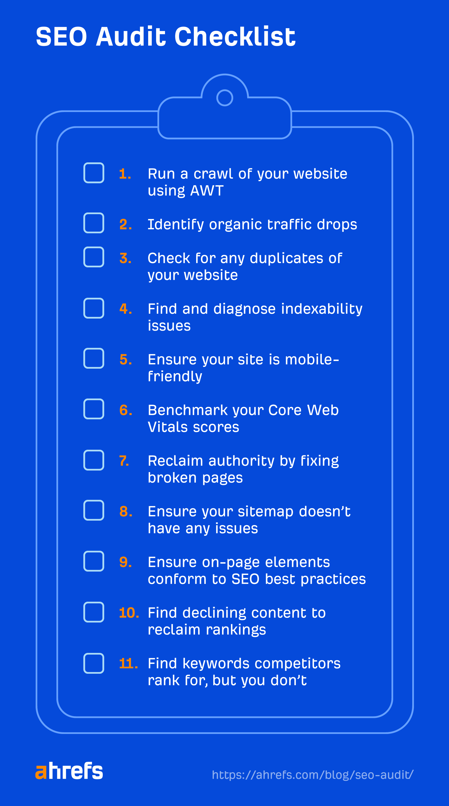

 # from [https://ahrefs.com/blog/seo-audit/](https://ahrefs.com/blog/seo-audit/)
 
# Cách đẻ tạo ra 1 bộ kiểm toán SEO trong 11 bước dễ dàng ( có  danh sách kiểm tra )

 Nếu trang web của bạn không có thứ hạng tốt trên các công cụ tìm kiếm, có thể  bởi vì các vấn đề SEO cụ thể đang kéo nó xuống. 

Bằng cách tìm và sửa những ván đề đó, bạn có thể tăng thứ hạng của bạn và đạt đươc nhiều traffic không mất tiền hơn. Đây là nơi Kiểm toán SEO xuất hiện. 

# Kiểm toán SEO là gì ?

Một kiểm toán SEO kiểm tra xem tranh web của bạn tối ưu tốt như nào cho các công cụ tìm kiếm. Nó tìm các vấn đề cái mà có thể ảnh hưởng xấu đến thứ hạng của website và cung cấp các cơ hội để cải thiện chúng. 

Ví dụ, có 1 trang web rất khó để sử dụng trên thiết bị điện thoại:: 

Bởi vì thân thiện với mobile là 1 trong [các nhân tố xếp hạng của Google](https://ahrefs.com/blog/google-ranking-factors/) và có [nhiều hơn lượt tìm kiếm trên điện thoại hơn là trên desktop](https://ahrefs.com/blog/seo-statistics/), vấn đề này có thể kéo web của bạn xuống. 

Đây là một vài lợi ích của việc hoàn thành kiểm toán SEO: 

- Cho phép bạn vượt qua các đối thủ. 
- Cải thiện trải nghiệm người dùng trên trang của bạn. 
- Có thể xác định các cơ hội SEO có giá trị cái mà có thể tối đa lợi nhuận của bạn trên các khỏan đầu tư.
- Cho phép bạn diều chỉnh chiến lược SEO Của bạn.
- Cho phép bạn truyền tài tầm quan trọng của SEO tới các cổ đông trong doanh nghiệp của bạn.

# Các công cụ bạn cần cho 1 kiểm toán SEO là gì?
Có nhiều công cụ khác nhau ban có thể sử dụng để hoàn thiện kiểm toán SEO, nhưng cách dễ nhất để bắt đầu là bằng cách sử dụng hai hai công cụ miễn phí có tất cả những thứ cơ bản: 

- Ahrefs Webmaster Tools(AWT)
- Google search Console (GSC)

# Cách tạo 1 Kiểm toán SEO
  
Mõi quy trình kiểm toán SEO của mỗi người là khác nhau, nhưng đây là cách bạn có thể taọ ra kiểm toán SEO của chính bạn trong 11 bước: 

## 1. Chạy thu thập dữ liệu trang của bạn 
 Một `crawl` là 1 phần mềm quét qua trang của ban để tìm các vấn đề seo. Bạn sẽ cần để chạy 1 cái bằng cách sử dụng [AWT](https://ahrefs.com/webmaster-tools) từ những cơ sở của trình kiểm toán SEO Của bạn. 

Để làm điều này, bắt đầu bằng tiêu đề của [Site Audit](https://ahrefs.com/site-audit), chọn `New project` và cho phép Ahrefs ủy quyền tài khỏan của bạn. 

 Sau đó bấm vào `Import` từ Google Search Console. ( bạn sẽ cần 1 tài khoản của Google Search Console để làm điều này.)

Một khi bạn ủy quyền vơi Google, lựa chọn trang của bạn và bấm Import, kiểm toán sẽ bắt đầu. 

Một khi bạn thiết lập kiểm toán của bạn, có là 1 trò chơi tốn thời gian. Nhưng Ahrefs sẽ gửi email cho bạn khi kiểm toán của bạn hoàn thành. 

Kiểm toán có thể xác định hơn 100 vấn đề, cái mà có thể gây choáng cho những người mới. Vì vậy, nếu bạn là mới với kiểm toán, tôi gợi ý bạn tập trung vào các bước dưới đây hơn là cố gắng để sửa tất cả các vấn đề từng cái một.

## 2. Xác định lượng traffic miễn phí giảm và tìm ra nguyên nhân của vấn đề. 

 Google cập nhật thuật toán tìm kiếm thường xuyên. Những cập nhật này hướng tới những thứ đặc biệt như chất lượng nội dung và các link spam. Nếu bạn có lượng traffic giảm đi với sau những lần cập nhật, điều này có nghĩa là nơi bạn cần tập trung vào. Và đây là cách để kiểm tra. 

 Suy giảm có thể bị gây ra bởi nhiều thứ, nhưng hai nguyên nhân chính là: 

- Cập nhật thuật toán của GG
- Các hành động thủ công. 

 Cách nhanh nhất để kiểm tra xem liệu bạn có bị ảnh hưởng bới 1 lần cập nhật không là đưa link của bạn vào [`trang khám phá của Ahrefs`](https://ahrefs.com/site-explorer) và xem nếu bất kỳ lượng giảm traffic vào trùng với lượt cập nhật .

Ví dụ, chúng ta cùng xem ví dụ dưới đây có lượng truy cập giảm trùng hợp với lần cập nhật Spam của GG. 

Bạn có thể kiểm tra lại hiệu xuất của tìm kiếm miễn phí của bạn trong GSC. Điều này quan trọng để thực hiện vì số traffic miễn phí của Ahrefs là ước lượng. 

Đề làm điều này: 

- Đi tới báo cáo kết quả tìm kiếm 
- THiết lập ngày thành 12 tháng gần nhất
- TÌm kiếm bất kỳ các sụt giảm có ý nghĩa 
- Kiểm tra suy giảm lại trên bảng điều khiển của `Google' search Status ` để xem nếu chúng trùng hợp ngẫu nhiên. 

 Nếu traffic của bạn đi về `zero` có lẽ bạn cần kiểm tra cho 1 `manual action`. Đây là nơi một con đánh giá con người ở gg quyết định trang của bạn không tuân thủ các yêu cầu thiết yếu của Tìm kiếm gg. Nó có nghĩa là một vài hoặc tất cả các trang của bạn sẽ không hiện trong kết quả tìm kiếm của gg. 

Bạn không chắc để có 1 `manual action` trù khi bạn đã làm thứ gì dó sai một cách nghiêm trọng. Nhưng nó vẫn rất quan trọng để kiểm tra bạn không chết duwosi nước trước khi bạn bắt đầu. 

Để kiểm tra `manual actions`, đi tới báo cáo Manual actions trong  Google Search Console ( GSC)

Nếu nó nói bất kỳ điều gì khác ngoài " No issues detected", hãy đọc hướng dẫn phạt đền của GG. 

Nếu không có 1 hành động thao tác thủ công, bạn cần kiểm tra thêm cập nhật thuật toán của GG, vì nó có thể ảnh hưởng đáng kể tới lượng traffic không mất tiền của bạn. 

Ví dụ, lần cập nhật trong tháng 8 năm 2018, xuất hiện ảnh hưởng lớn tới các trang về sức khỏe và y tế các trang mà không chứng minh được chuyên môn, độ xác thưc  và độ tin cậy ( E-A-T). Thực tế, Barry Schwartz, một blogger nổi tiếng, gọi nó là bản cập nhật "Medic".

Bản cập nhật gần nhữ đã phá hủy những trang này: 

 Nếu bạn phát hiện ra 1 lượng sụt giảm lớn traffic trùng hợp với Update của GG, kiểm tra [lịch sử cập nhật thuật toán của GG](https://ahrefs.com/google-algorithm-updates)

## 3. Kiểm  tra bất kỳ các bản sao chép trang của bạn. 

Khách tơi trang của bạn nên chỉ có thể truy cập vào 1 trong những địa chỉ sau: 

- https://domain.com
- https://www.domain.com

Nếu nó là có thể truy cập ở cả hai hoặc ở các đối tác khoong bảo mật của bạn (ví dụ : http://domain.com, http://www.domain.com), bạn có rắc rối . 

Các biến thể trên nên chuyển hướng tới phiên bản chính trang của bạn. 

Điều này là quan trọng bởi vì GG nhìn những URLs như các phiên bản trang khác biệt. Có nhiều hơn 1 trang có thể truy cập, có thể gây ra vấn đề thu thập và đánh chỉ mục. Trong vài trường hợp, nó thậm chí có [giảm giá trị link](https://ahrefs.com/seo/glossary/link-equity) do đó, có thể ảnh ưởng tiêu cực tới thứ hạng.  

Để kiểm tra mọi thứ hoạt động theo đúng chức năng của nó, cài đặt thanh công cụ [SEO](https://ahrefs.com/seo-toolbar) của Ahrefs, nhập từng phiên bản url vào trình duyệt, sau đó kiểm tra tiêu để HTTP để chắc chắn chúng đều chuyển hướng tới cùng phiên bản `master`. 

Ví duj, nếu chúng ta tới trang http://ahrefs.com, nó sẽ chuyển hướng tới phiên bản bảo mật ở https://ahrefs.com 

Điều tương tự xảy ra nếu chúng ta tới phiên bản bảo mật www ( https://www.ahrefs.com )

Nếu điều này không xảy ra, chúng ta cần triển khai điều hướng tới trang chính. 

**Đọc thêm** : [Chuyển hướng cho SEO ](https://ahrefs.com/blog/redirects-for-seo/)

## 4. Tìm và chuẩn đoán vấn đề khả năng lập chỉ mục 
 Kết quả tìm kiếm của GG đến từ `index` của nó, cái mà là 1 CSDL của hàng trăng tỷ các trang web. Trang của bạn cần được nằm trong index này đẻ đứng trong bất kỳ cơ hội tìm kiếm nào. 
 Vấn đề đánh index có thể  khá phúc tạp , nhưng bạn có thể kiểm tra các vấn đề khá dễ dàng. 

Đầu tiên, kiểm tra báo cáo khả năng lập chỉ mục trong [site audit](https://ahrefs.com/site-audit) để biết cảnh báo "Trang không lập chỉ mục"

 GG không thể lập chỉ mục với cảnh báo này, vì vậy nó đáng để kiểm tra chúng không phải là các trang bạn muốn lập chỉ mục. Nếu chúng là các trang bạn muốn, xóa hoặc sửa [thẻ meta robots](https://ahrefs.com/blog/meta-robots/).
## 5. Đảm bảo trang của bạn thân thiện với mobile

Thân thiện với mobile là một nhân tố xếp hạng của GG kể từ năm 2019, vì vậy nó đáng để kiểm tra xem nếu trang của bạn là có thân thiện với mobile không. 

Để làm điều này, hãy đi tới báo cáo khả năng sử dụng Mobile trong GSC. Nó sẽ nói cho bạn liệu bất kỳ Urls có lỗi không cái mà ảnh hướng tới khả năng sử dụng điện thoại. 

Nếu bạn không thể truy cập vào GSC, đưa bất kỳ trang nào của bạn vào công cụ kiểm tra [Google's Mobile-Friendly](https://search.google.com/test/mobile-friendly)

Đây là những mẹo khi nói đến độ thân thiện mobile: 

- Sử duụng 1 giao diện hay 1 chủ đề thân thiện mobile. 
- Ưu tiên cac nội dung của bạn và đảm bảo nó dễ đọc trên thiết bị mobile. 
- nén hình ảnh của banj để chúng thân thiện với mobile, nhưng không hi sinh chất lượng .
- Luôn luôn kiểm tra trang của bạn qua nhiều thiết bị khác nhau.
**Đọc thêm:**
- [Lập chỉ mục điện thoại trước: Những điều bạn cần biết](https://ahrefs.com/blog/mobile-first-indexing/)

- [SEO Mobile: 10 tip tối ưu hóa để xây dưng 1 trang thân thiện với mobile](https://ahrefs.com/blog/mobile-seo/)
