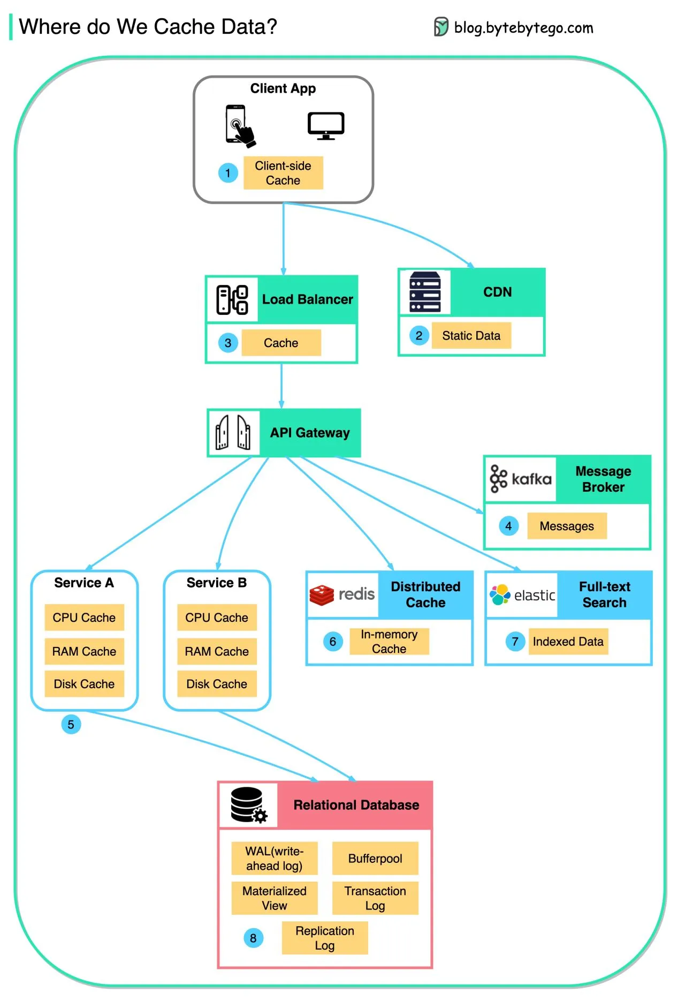
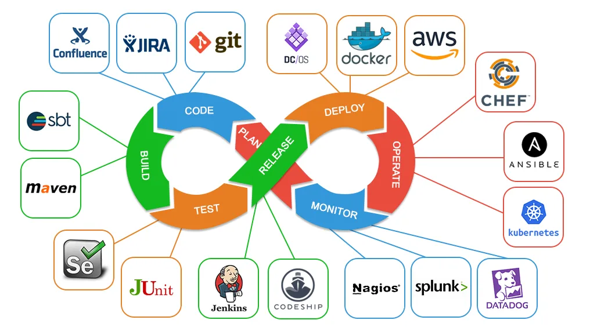

# Chúng ta lưu dữ liệu ở đâu?

Dữ liệu được lưu bộ nhớ đẹm ở mọi nơi, từ frontend đến back end!

Sơ đồ dưới đây chứng minh nơi chúng ta lưu trữ dữ liệu trong 1 kiến trúc cơ bản. 

Có nhiều lớp cùng với luồng sau: 

- ứng dụng máy khách: Phản hồi HTTP có thể được lưu trữ bởi trình duyệt. Chúng yêu cầu dữ liệu thông qua HTTP cho lần đầu tiên, và nó được trả về với 1 chứng chỉ có thời hạn trong tiêu đề HTTP, chúng ta yêu cầu dữ liệu lại lần nữa, và ứng dụng máy khách cố gắng để truy suất dữ liệu từ bộ nhớ của trình duyệt đầu tiên 
- CDN: CDN lưu trữ các tài nguyên web tĩnh. Máy khách có thể truy suất dữ liệu từ 1 nut CDn bên cạnh 
- Cân bằng tải: Cân bằng tải có thể lưu trữ các tài nguyên. 
- CƠ sở hạ tầng tin nhắn: Các nhà môi giới tin  nhắn lưu trữ tin nhắn ở ở đĩa đầu tiên, và sau đó người tiêu dùng truy suất chúng theo tốc độ riêng của họ. Tùy thuộc vào chính sách lưu trữ, dữ liệu được lưu trong cụm Kafa cho 1 khoảng thời gian. 
- Dịch vụ: chúng là nhiều lớp của bộ nhớ đệm trong service. Nếu dữ liệu không đưọc lưu trữ trong bộ nhớ đệm trong CPU, `service` sẽ cố gắng để truy suất dữ liệu từ bộ nhớ. Thỉnh thoảng, `service` có 1 bộ nhớ đệm cấp 2 để lưu trữ dữ liệu trên ổ đĩa. 
- Bộ nhớ đệm phân tán: Bộ nhớ đệm phân tán như `Redis` giữ các cặp `key-value` cho nhiều `services` trong bộ nhớ. Nó cung cấp hiệu năng đọc /ghi tốt hơn database. 
- Tìm kiếm đầy đủ văn bản: Chúng ta thỉnh thoảng cần để tìm kiếm văn bản đầy đủ như `Elastic search` cho tìm liếm tài liệu hoặc tìm kiêm nhật ký. Một bản sao dữ liệu được đánh chỉ số trong các công cụ tìm kiếm 

- Database: mặc dù trong database, chúng ta có các cấp độ khác nhau của lưu trữ:  

  - WAL( Nhật ký ghi đầu :>): Dữ liệu được viết ở WAL đầu tiên trước khi xây dựng cây chỉ mục B. 
  - Bộ đệm : Một vùng bộ nhớ được chỉ định để lưu các kết quả truy vấn .
  - Nhật ký giao dich: bnar ghi cho tất cả cacs giao dịch và cập nhật CSDL. 
  - Nhật ký sao chép: được sử dụng để ghi lại các trạng thái sao chép trong cụm CSDL. 

Thông qua bạn: Với dữ liệu được lưu trong nhiêu cấp, chúng ta có thể bảo đảm như nào với những dữ liệu nhạy cảm của người dùng bị xóa hoàn toàn khỏi hệ thống?

# CI/CD Pipeline

Một đường ống `CI/CD` là 1 công cụ cái mà tự động xử lý xây dựng, kiểm tra và triển khai phần mềm. 

Nó tích hợp các trạng thái khác nhau của vòng dời phát triển phần mềm, bao gồm tạo mã và sửa mã, kiểm tra và triển khai, trong 1 cơ chế đơn thống nhất 

SƠ đồ dươi đây chứng minh  những công cụ cái mà thường được sử dụng 

