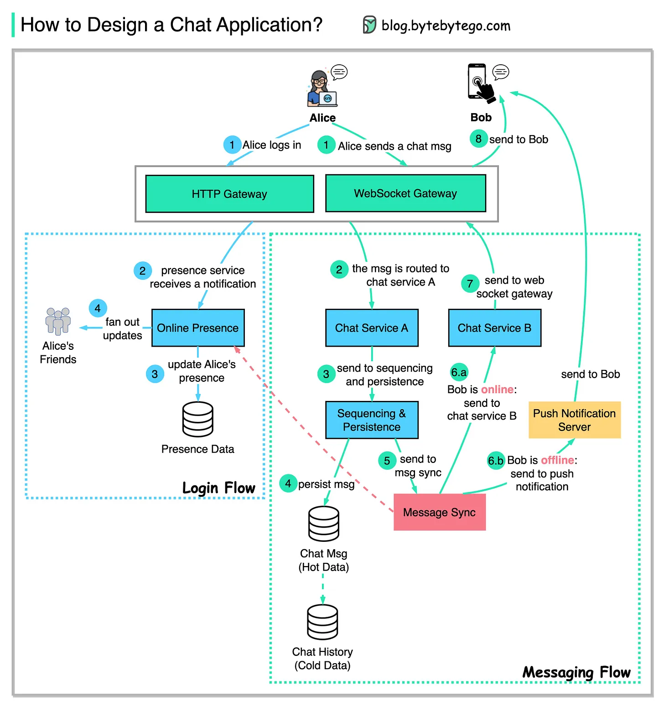

# Cách để tạo ra ứng dụng chat như WhatApps, Messenger 

sơ đồ dưới đây thể hiện 1 thiết cho ứng dụng chat 1-1 đơn giản

 Luồng đăng nhập người dùng 

- Bước 1 : Alice đăng nhập vào ứng dụng chat và hình thành 1 kết nối sowebsockecket với phía máy chủ 
- Bước 2-4: DỊch vụ nhận diện nhận thông báo của Alice, cập nhật sự hiện diện của cô ấy và thông báo cho các bạn của Alice về sự hiện diện của cô ấy. 

Luồng tin nhắn 

- Bước 1-2: ALice gửi tin nhắn chat tới BOb. Tin nhắn chat sẽ được định tuyến tới Dịch vụ Chat A. 
- Bước 3-4: Tin nhắn chat được gửi tới dịch vụ giải trình tự, cái mà sinh ra 1 ID duy nhất và tồn tại trong kho lưu trữ tin nhắn. 
- Bước 5: Tin nhắn chat được gưởi tới hàng đợi tin nhắn đồng bộ để đồng bộ với dịch vụ chát của Bob. 
- Bước 6: TRước khi chuyển tiếp tin nhắn, dịch vụ đồng bộ tin nhắn kiểm tra sự hiện diện của Bob: 

  - Nếu Bob online tin nhắn chat được gửi tới dịch vụ chat B. 
  - Nếu Bob không online, tin nhắn được gửi tới máy chủ đẩy và được đẩy tới thiết bị của Bob

- Bước 7: Nếu Bob online,  tin nhắn được đẩy tới BOb thông qua web s

