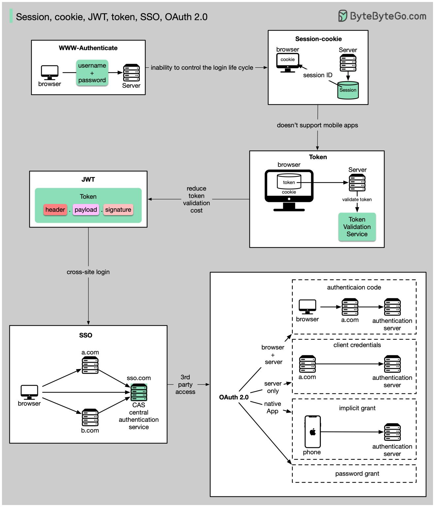
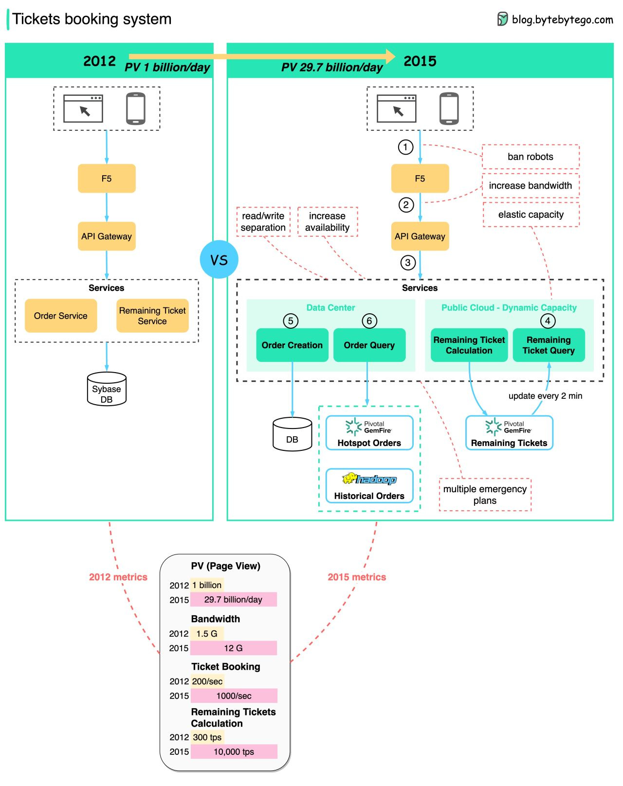

# EP34: Session, cookie, JWT, token, SSO, and OAuth

## Token, Session, cookies 

Session, cookie, JWT, token, SSO và Oauth 2.0 là gì ? 

Những thuật ngữ này là tất cả những liên quan đến quản lý danh tính người dùng. Khi bạn đăng nhập vào 1 website, bạn khai báo Bạn là ai (định danh). Định danh của bạn được xác nhận ( xác thực) và bạn được cung cấp các quyền cần thieest( ủy quyền). Nhiều giải pháp được đề xuất trong quá khứ,và danh sách vẫn đang phát triển. 

Từ đơn giản đến phức tạp, đây là hiểu biết của tôi về quản lý định danh người dùng: 
- www-Authenticate là phương thức cơ bản nhất. Bạn được yêu cầu dăng nhập và mật khẩu bởi trình duyệt. Vì kết quả của việc không thể kiểm soát vòng đời của đăng nhập, nó hiếm khi được sử dụng ngày nay. 
- Một cách kiểm soát tốt vòng đời đăng nhập là session - cookie. Máy chủ duy trì lưu trữ phiên, và trình duyệt giữ ID của phiên. Một `cookie` thường chỉ làm việc với các trình duyệt và nó không thân thiện với các ứng dụng đt. 
- Để giải quyết vấn đề tương thich, `token` có thể được sử dụng. Máy khách gửi `token` tới máy chủ, và máy chủ xác thực `token`. Nhược điểm của `token` là mã cần được mã hóa và giải mã, cái mà có thể tiêu tốn thời gian.
- JWT là 1 cách tiêu chuẩn của các mã đại diện. Thông tin này có thể được xác thực và được tin bởi vì nó là chữ ký số. Vì JWT chứa các cữ ký, không cần để lưu thông tin phiên trên phía máy chủ. 
- Băng cách sử dụng SSO( đăng nhập 1 lần ), bạn có thể chỉ cần đăng nhập 1 lần và ghi thông tin vào nhiều trang web. Nó sử dụng CAS ( dich vụ xác thực trung tâm) để duy trì thông tin qua các trang web. 

- Bằng cách sử dụng Oauth 2.0, bạn có thể xác thực 1 website để truy cập các thông tin của bạn trên website khác. 

# Nền tảng bán vé trực tuyến. 

Tuần trước, hệ thống Ticketmaster đã tạm dừng bán vé công khia tour của Taylor do nhu cầu quá cai trên hệ thống bán vé. 

Đây là một vấn đề thú vụ, vì vậy chúng ta đã nghiên cứu chủ đề này. Sơ đồ dươi đây thể hiện sự tiến hóa của hệ thống đặt ve tầu hỏa online của Tàu. 

Hệ thống đặt vé Tàu của Trung quốc có  những thách thức  tương tự như hệ thống Ticketmaster: 
- Lượng truy cập đồng thời cao trong suốt những giờ cao điểm 
- QPS cho việc kiểm tra những vé còn lại và những đơn đặt hàng là rất cao. 
- Rất nhiều bots. 

## các giải pháp. 

1. Chia các yêu cầu đọc và ghi . Bởi vì những người dùng lo lắng giữ cho trang web làm mới liên tục để kiểm tra xem những vé còn sẵn, hệ thống có thể chịu áp lực lớn. 
Để giải quyết các tính toán và truy vấn trong bộ nhớ, những thành phần vé còn lại đưuọc chuyển toàn bộ tới `GemFire`. Nó là có thể để phù hợp với toàn bộ nhuwxg vé tàu của quốc gia trong vài GB của bộ nhớ. 
Ngòai ra, thành phần truy vấn đơn hàng đã được chuyển qua GemFire để giảm việc tải trên CSDL đơn hàng. Hadoop được sử dụng để lưu lịch sử đơn hàng. 

2. Tận dụng đám mây công cộng để có khả năng đàn hồi.

3. Cấm bot. Nó giảm 95% lưu lượng truy cập.

4. Tăng băng thông của hệ thống.

5. Tăng tính khả dụng của hệ thống bằng cách thiết lập nhiều trung tâm dữ liệu hơn ở các thành phố khác nhau.

6. Thiết kế nhiều kế hoạch khẩn cấp.

*Lưu ý: các con số dựa trên ước tính phía sau phong bì (không phải dữ liệu chính thức).* 

