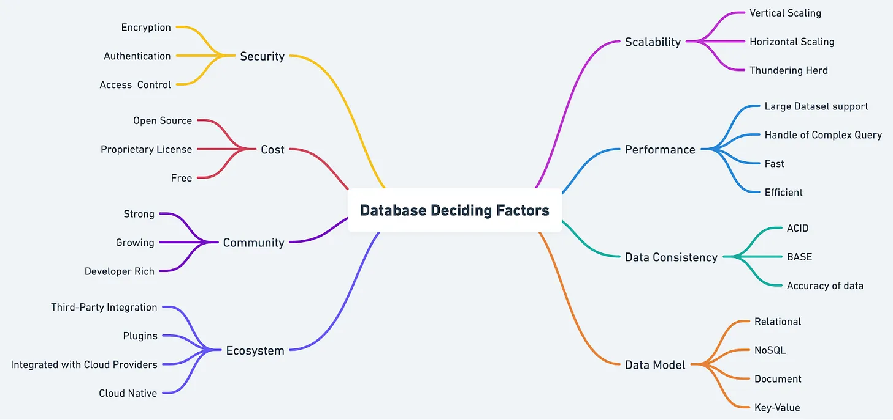
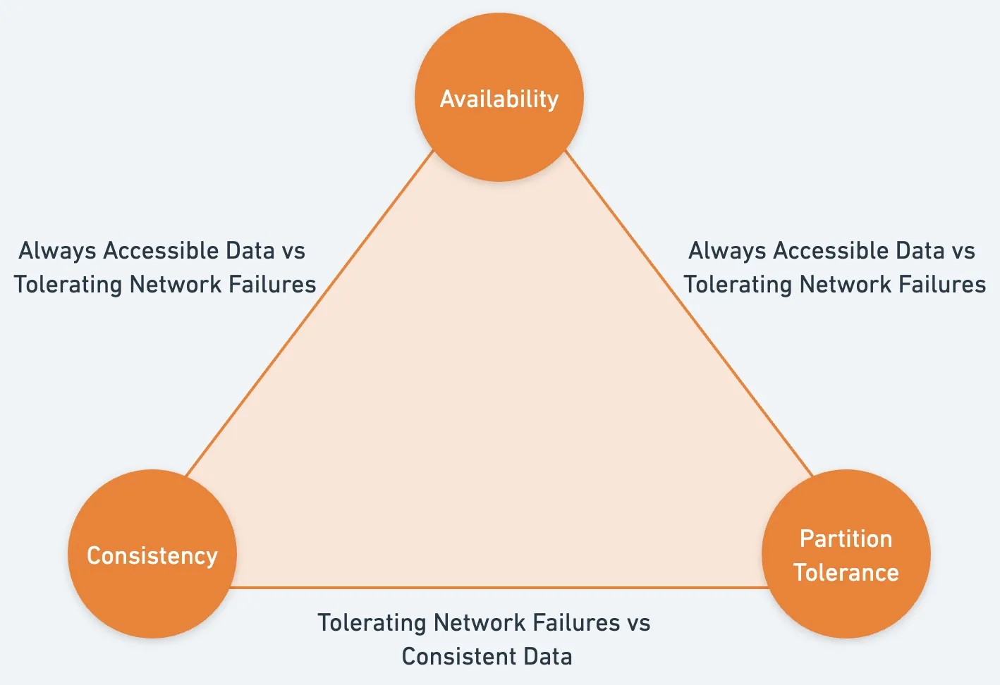
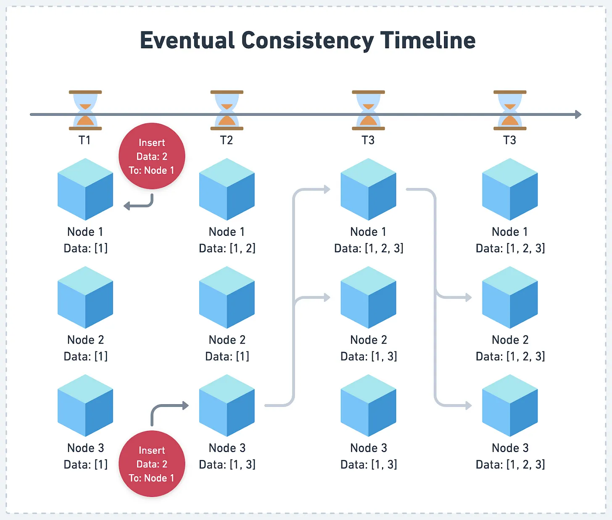
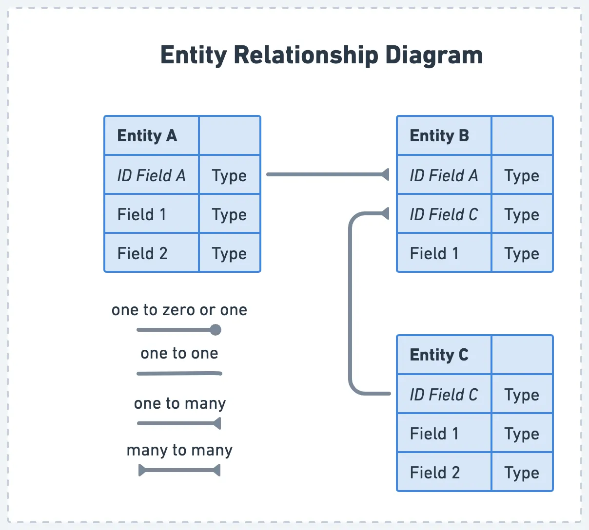

## From [https://blog.bytebytego.com/p/factors-to-consider-in-database-selection](https://blog.bytebytego.com/p/factors-to-consider-in-database-selection)

Trong phần đầu của chuỗi bài này, chúng ta đã đặt nền tảng cho sự hiểu biết về sự đa dạng các loại CSDL và các trường hợp sử dụng của chúng. Vì chúng ta tiếp tục khám phá nghệ thuật lựa chọn CSDL, chúng ta sẽ đào sâu hơn vào các nhân tố quan trọng cái mà ảnh hưởng tới quá trình đưa ra quyết định. Bằng cách giải thích từng nhân tố 1 cách chi tiết, chúng ta có thể có trang bị tốt hơn để có các lựa chọn tốt hơn phù hợp với các yêu cầu của dự án của chúng ta và thúc đẩy sự thành công của dự án phát triển phần mềm của chúng ta. 

# Khả năng mở rộng 

Tính mở rộng là 1 khía cạnh quan trọng của bất kỳ CSDL nào. Nó xác định các hệ thống có thể phát triển tốt như thế nào. Hai phương pháp cơ bản của mở rộng quy mô: chiều ngang và chiều dọc. Mở rộng theo chiều dọc liên quan đến sự tăng dung lượng của 1 máy chủ đơn bằng cách thêm các nguồn tài nguyên như CPU hay bộ nhớ. Mở rộng chiều ngang,  nói cách khác, liên quan đến việc thêm nhiều máy chủ cho hệ thống. 

Sự khác biệt kiểu CSDL xử lý mở rộng quy mô trong những cách khác nhau. Ví dụ, cac CSDL quan hệ có thể khó khăn để mở rộng theo chiều ngang, trong khi CSDL NoSQL thường nổi bật trong khả năng này. Khi lựa chọn CSDL, cân nhắc sự phát triển được kỳ vọng của dự án và cách mà CSDL có thể xử lý tốt như nào cho việc mở rộng.

Để đánh giá khả năng mở rộng của CSDL, chúng ta đầu tiên phải hiểu về kiến trúc của nó và các quy tắc thiết kế. CDSL quan hệ ,ví dụ, việc lưu dữ lieuj trong bảng với 1 lược dồ được định nghĩa trước và chúng có thể khó để mở rộng theo chiều ngang do cần duy trì tính nhất quán giữa nhiều máy chủ. Thách thức nàu có thể dẫn tới `nút thắt cổ chai` hiệu năng khi làm việc với số lương lớn dữ liệu  hoặc khối lượng truy cập cao. 

CSDL NoSQL, hay nói cách khác, được thiết kế với khả năng mở rộng. Chúng sử dụng nhiều chiến lược khác nhau, chẳng hạn như `phân mảnh` và `phân vùng`. để phân phối dữ liệu thông qua đa máy chủ. Cách tiếp cận này cho phép mở rộng theo chiều ngang hiệu quả hơn và có thể sử lý tốt hơn sự phát triển dữ liệu và  lươt truy cập cao hơn. Tuy nhiên, CSDL NoSQL có thể hi sinh vài mức độ tính nhất quán của dữ liệu để đạt được tính mở rộng này.  

CSDL NewSQL, được thiết kế nhằm mục đích để nối sự tốt nhất của cả hai được đề nghị tính mở rộng của CSDL NoSQL và tính nhất quán truyền thống của CSDL quan hệ. Những CSDL này sử dụng kiến trúc đổi mới và các công nghẹ để phân phối dữ liệu và duy trì tính nhất quán thông qua đa máy chủ. Nó có thể hiệu quả với mở rộng quy mô chiều ngang mà không ảnh hưởng tới tính nhất quán. Tuy nhiên, có những nhược điểm cần cân nhăc.CSDL NewSQL có thể thiếu hụt sự trưởng thành của hệ thống truyền thống, dẫn đến các nguồn tài nguyên và cộng đồng hỗ trợ hạn chế. Sự phức tạp của chúng có thể tạo ra 1 đường cong học tập dốc hơn cho các nhà phát triển , gia tăng thời gian và nỗ lực cần cho việc triển khai và bảo trì.  

CSDL chuỗi thời gian, được thiết kế cho xử lý dữ liệu dựa trên thời gian, cũng có thể mở rộng tốt cho khi khối lượng của dữ liệu tăng lên. Chúng sử dụng các kỹ thuật nen và đánh chỉ mục đặt biệt để lưu và truy vấn một cách hiệu qủa khối lượng dữ liệu chuỗi thời gian , làm cho chúng 1 ý tưởng lựa chọn cho ứng dụng cái mà sung ra 1 khối lượng lớn thông tin được đánh dấu thời gian, như là IoT hay hệ thống giám sát. 

Khi lựa chọn CSDL, cân nhắc sự phát triển được kỳ vọng của dự án và CSDL có thể sử lý mở rộng tốt như nào. Đánh giá khả năng của CSDL để mở rộng chiều ngang hay chiều dọc, và đánh giá hiệu năng của nó dưới sự phát triển của Dữ liệu và lượng tải.

# hiệu năng 

Hiệu năng là 1 nhân tố thiết yếu khác trong việc lựa chọn CSDL. Nó ảnh hưởng trực tiếp tới trải nghiệm người dùng. Hiệu qủa truy  vấn và sự cân bằng giữa đọc và ghi nên được cân nhắc. Vài CSDL có thể tối ưu hóa cho lượng đọc lớn, trong khí số khác ưu tiên cho hiệu năng ghi. Sự hiểu biết của các yêu cầu hiệu năng cụ thể của ứng dụng của bạn sẽ giúp bạn phân biệt được loại CSDL phù hợp nhất 

Để đánh giá hiệu năng của CSDL, chúng ta nên bắt đầu bằng cách phân tích hiệu quả truy vấn của nó.
- CSDL quan hệ thường cung cấp khả năng truy vấn hiệu quả do lược đồ được cấu trúc của chúng và hỗ trợ SQL. Hiệu năng của chúng thường được tối ưu hóa cho các truy vấn phức tạp liên quan đến `join` và `aggregation`. Tuy nhiên, vì khối lượng dữ liệu và phức tạp gia tăng, hiệu năng truy vấn có thể giảm, đặc biệt khi làm việc với tập dữ liệu lớn.

- Mặt khác, NoSQL có thể cung cấp tốc độ ghi nhanh hơn do sự đơn giản mô hình dữ liệu và lược đồ linh hoạt hơn. Lợi thế hiệu năng này có thể đặc biệt hữu ich trong ngữ cảnh nơi mà dữ liệu được liên tục sinh ra và cập nhật, chẳng hạn như các ứng dụng phát sóng trực tiếp hay phân tích thời gian thực. Tuy nhiên, CSDL NoSQL có thể không hiệu quả với các truy vấn phức tạp hoặc tích hợp, vì nó thiếu sự hỗ trợ tương tự của SQL và lược đồ được cấu trúc.  
- CSDL NewSQL mục đích nhằm cung cấp cả hai khả năng truy vấn hiệu quả và hiệu năng ghi cao bằng cách kết hợp sức mạnh của CSDL quan hệ và NoSQL. CHúng thường sử dụng các công nghệ đổi mới chẳng hạn như tiến trình truy vấn phân tán và lập chỉ mục nâng cao, để phân phối khả năng viết và truy vấn hiệu suất cao. Và kết quả là, NewSQL có thể là 1 lựa chọn tốt cho các ứng dụng cái mà yêu cầu cả hiệu năng viết cao và truy vấn phức tạp. 

- CSDL `time-series` được  thiết kế cho xử lý các dữ liệu dựa trên thời gian, và hiệu năng của chusg được tối ưu hoascho trường hợp sử dụng đặc biệt này. Chúng sử dụng các công nghệ nén và đánh chỉ mục đặc biệt để lưu và truy vấn khối lượng lớn dữ liệu chuỗi thời gian. Điều này tập trung vào dữ liệu chuỗi thời gian, cho phép CSDL chuỗi thời gian mang lại hiệu suất cáo cho các ứng dụng cái mà sing ra lượng thông tin lớn theo thời gian. như IoT hay hệ thống giám sát. 

Khi lựa chọn CSDL, nó là quan trọng để hiểu về yêu cầu hiệu năng của dự án. Điều này sẽ ảnh hưởng trực tiếp tới trải nghiệm người dùng. Cân nhăc cân bằng giữa đọc và ghi, cũng như hiệu quả của tiến trình truy vấn. Bằng việc đánh giá cẩn thận nhân tố hiệu năng của các kiểu CSDL khác nhau trong ngữ cảnh mà dự án cần, chúng ta có thể chọn 1 CSD cái mà mang lại tối ưu trải nghiệm người dùng   và hỗ trợ cho sự thành công của ứng dụng.

# Tính nhất quán của dữ liệu 

Tính nhất quán dữ liệu đảm bảo các thông tin trong CSDL duy trì tính chính xác và cập nhật hàng ngày. Để đạt được tính nhất quán, CSDL thường dựa trên các thuộc tính ACID ( Tính nguyên tử, tính nhất quán, tính độc lập và tính bền) và định lý CAP ( Nhất quán, khả dụng và dung sai phân vùng). Các CSDL khác nhau ưu tiên những khía cạnh này khác nhau, kết quả là mức độ nhất quán khác nhau. 

Để đánh gía cách tiếp cận của CSDL đối với tính nhất quán dữ liệu, chúng ta nen bắt đầu bằng cách nghiên cứu sự tuân thủ của nó các thuộc tính ACID. CSDL quan hệ cơ bản nhấn mạnh tính nhất quán mạnh mẽ. Nó đảm bảo rằng mỗi giao dich duy trì tính toàn vẹn của dữ liệu. Chúng đạt được điều này bằng cách khiển khai các thuộc tính ACID, cai mà chỉ rõ các giao dịch là   `atomic`,`nhất quán`, `độc lập` và `tính bền`. 

Đinh lý CAP phát biểu rằng 1 hệ thống CSDL phân tán chỉ có thể đat được hai trong 3 thuộc tính: nhất quán, tính khả dụng và dung sai phân vùng. Định lý này nhất mạnh chi phí rằng CSDL phải chịu khi nói đến tính nhất quán và nó có thể là 1 công cụ hữu ích để hiểu mô hình tính nhất quán của các kiểu CSDL khác . 

Trong khi định lý CAP được biết rộng rãi, 1 mô hình tinh thần tốt hơn để tuân theo khi đánh giá 1 CSDL là định lý`PACELC`. Định lý này phát biểu rằng, nếu 1 hệ thống là tính dung sai phân vùng, nó phải chọn giữa tính khả dụng và tính nhất quán trong suốt quá trình phân vùng mạng và giữa độ trễ với độ nhất quán khi mạng hoạt động bình thường. Định lý này nhấn mạnh chi phí đánh đổi mà CSDL phải chịu khi nói đến tính nhất quán và có thể là 1 công cụ hữu ích để hiểu về mô hình nhất quán của các loại CSDL khác.

NoSQL thường nghiêng về tính nhất quán cuối cùng. Cập nhật 1 dữ liệu cuối cùng sẽ lan ra tất cả các nút trong hệ thống, nhưng chúng có lẽ không thể thấy ngay lập tức. Các tiếp cận này cho phép tính khả dụng cao hơn và hiệu năng cao hơn trong hệ thống phân tán, nhưng nó có thể dẫn dến sự không nhất quán tạm thời giữa các nút. 

Khi lựa chọn CSDL, cân nhắc tầm quan trọng của tính nhất quán trong dự án và cách nó có thể ảnh hưởng như nào tới trải nghiệm người dùng. cho các ứng dụng như giao dịch tài chính, tính nhất quán mạnh mẽ là thiết yếu để đảm bảo dữ liệu toàn vẹn và tránh lỗi.  Ngược lại, cho các ứng dụng như các bài viết phương tiện truyền thông hoặc tìm kiếm chỉ mục , tinhs nhất quán cuối cùng có thể là hợp lý, vì sự không nhất quán tạm thời là hạn chế giống như các ảnh hưởng tiêu cực tới trải nghiệm người dùng. 

Nó là quan trọng để hiểu ci phí đánh đổi giữa tính nhất quán, tính khả dụng, và tính dung sai phân vùng khi lựa chọn 1 CSDL. Băng cách cân nhắc cẩn thận các yêu cầu tính nhất quán của dự án, và đánh giá mô hình tính nhất quán của các loại CSDL khác, chúng ta có thể chọn 1 CSDL đáp ứng các nhu cầu trong khi cung cấp các trải nghiệm người dùng tốt nhất có thể. 

# Mô hình dữ liệu 

  Mô hình dữ liệu của CSDL là 1 nhân tố quan trọng khác để cân nhăc khi lựa chọn CSDL. Nó định nghĩa cách mà dữ liệu được xây dựng, lưu và truy vấn. Các nhân tố như tinhs linh hoạt lược đồ và hỗ trợ cho các mối quan hệ dữ liệu phức tạp nên được đánh giá khi đánh giá mô hình dữ liệu của CSDL.
Các CSDL quan hệ sử dụng 1 lược đồ cố định. Nó đảm bảo 1 cấu trúc nhất quán trong tất cả các bản ghi. Lược dồ này có thể có lợi cho việc bảo đảm tính toàn vẹn của dữ liệu. Nó ngăn cho việc chèn các dữ liệu cái mà không phù hợp với cấu trúc đã xác định. Tuy nhiên, nó cũng có thể là 1 hạn chế khi làm việc với dữ liệu đa dang hoặc thay đổi nhanh chóng, vì 1 lược đồ thay đổi có thể tiêu thụ thời gian và có thể yeu cầu thời gian chết. 

