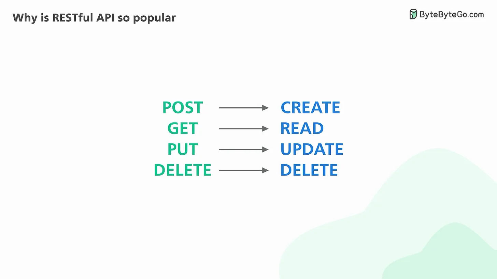

# Tại sao Restfull API lại phổ biến?

REST là 1 trong những tiêu chuẩn giao tiếp phổ biến nhất giữa các máy tinh với nhau thông qua internet. Nó là cái gì? Tại sao nó lại phổ biến? 


Tiêu chuẩn API phổ biến được bởi sử dụng bởi hầu hết bởi các ứng dụng web và điện thoại để giao tiếp với máy chủ và được gọi  là `REST`. Nó viết tắt của `Chuyển trạng thái biểu hiện`. :>>>


REST không phải 1 đặc tả kĩ thuật. Nó là một tập các quy tắc lỏng lẻo cái mà đã trở thành tiêu chuẩn thực tế cho việc xây dựng các API WEB từ đầu năm 2000.


Một API theo tiêu chuẩn RÉST đưowjc gọi là RESTfull API. Những ví dụ thực tế là Twilio, Stripe và google maps. 


Hãy cem 1 REST cơ bản dưới đây. Một RESTfull API tổ chức các tài nguyên trong một tập hợp các URIs duy nhất hoặc trong các định danh tài nguyên đồng nhất. 


Các tài nguyên nên được chia nhóm bằng danh từ và không nên động từ. Một API để lấy tất cả các sản phẩm nên là: 


Một máy khách tương tác với 1 tài nguyên bằng cách tạo yêu cầu tới điểm cuối cho tài nguyên thông qua HTTP. Các yêu cầu có 1 định dạng rất đơn giản. 
```php
POST /products HTTP/1.1

```

Dòng chứa URI cho các tài nguyên chúng ta cần truy cập. URI được đi trước bởi 1 động từ HTTP cái mà nói cho máy chủ cái mà chúng ta đang muốn làm với tài nguyên này

Chúng ta có thể đã nghe về cụm từ viết tắt `CRUD `. Đây là cái mà cụm từ đầy đủ: 

Trong nội dung của những yêu cầu có thể có 1 yêu cầu HTTP tùy chọn cái mà chứa các dữ liệu trọng tải tùy chỉnh, thường được mã hóa snag JSON. 


Máy chủ nhận yêu cầu và thực thi nó, và định dạng kết quả trả về vào trong 1 phản hồi

Dòng đầu tiên của phản hồi chứa mã trạng thái HTTP để nói với máy khách cái gì đã xảy ra với yêu cầu. 


Một khai triển RESTfull APi tốt trả về các mã trạng thái API hợp lệ 


Một máy khách cư xử tốt có thể chọn để  thử lại các yêu cầu thất bại với mã trạng thái 500. 
 

Chúng ta đã nói " có thể chọn để thử lại " bởi vì một vài hành động không được bình thường và những yêu cầu đó cần cẩn thận hơn khi thử. Khi 1 API là bình thường, tạo nhiều request định danh có cùng ảnh hưởng như tạo 1 yêu cầu đơn. Điều này thường không là trường hợp cho 1 yêu cầu POST để tạo ra 1 tài nguyên mới. 


Nội dung phản hồi là tùy chọn và có thể chứa trọng tải dữ liệu và thường được định dạng JSON. 
Có 1 thuộc tính quan trọng của REST cái mà đáng để thảo luận nhiều hơn 

Một khai triển REST nên là vô trạng thái. Nó có nghĩa là có điều đó có hai phần không cần để lưu bất kỳ thông tin gì về cái còn lại và mỗi yêu cầu và 1 hôi đáp là tự do từ tất cả những thứ khác. 


Điều này dẫn đến các ứng dụng web dễ dàng để mở rộng và có cách cử xử đúng. 

Có hai điểm tốt hơn để thảo luận  để hoàn thiện 1 API RESTful hoạt động tốt. 
Nếu 1 điểm cuối API trả về 1 số lượng lớn dữ liệu, sử dụng phân trang. 


Một lược đồ phân trang phổ biến đưuọc sử dụng giới hạn và  độ lệch. đây là ví dụ: 
Nếu chúng không được chỉ rõ, máy chủ nên giả sử những giá trị mặc định có ý nghĩa. 


Cuối cùng, phiên bản của 1 API là rất quan trọng. 


Phiên bản cho phép 1 khai triển để cung cấp các tương thích ngược để nếu chúng ta hướng dẫn các thay đổi bị phá vỡ từ 1 phiên bản tới phiên bản khác, người tiêu dùng cần đủ thời gian để chuyển sang phiên bản tiếp theo. 


Có nhiều cách để lấy phiên bản của 1 API. Phương pháp nhanh nhất là thêm tiền tố phiên bản trước tài nguyên trong URI. Ví dụ : 
Có những API phổ biến tùy chọn giống như GrapQl và gRPC. Chúng ta sẽ thảo luận về chúng và so sánh chúng riêng. 


