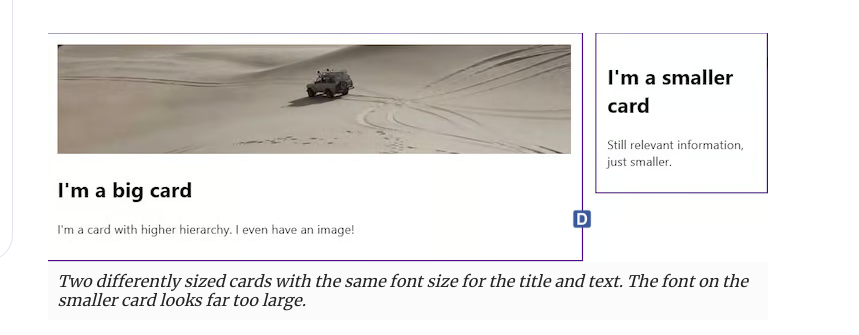

 ### from [https://blog.logrocket.com/fluid-vs-responsive-typography-css-clamp/](https://blog.logrocket.com/fluid-vs-responsive-typography-css-clamp/)
# Fluid vs. responsive typography with CSS clamp

 Kiểu chữ là một khía cạnh rất quan trọng của website, việc thiết lập tone và thêm tính thẩm mỹ. Sử dụng các thành phần của kiểu chữ như tỷ lệ, khoảng cách, kích thước  có thể ảnh hưởng tơi khả năng sử dụng, khả năng đọc và khả năng tiếp cận. Trong bài bài viết này, chúng ta sẽ tập trung vào thành phần đầu tiên: `Tỷ lệ` 

Tỷ lệ kiểu chữ có thể cung cấp các âm tiết và phân cấp có ý nghĩa của website, nhưng nó cũng ảnh hưởng tới một font sẽ khác như nào trên các kích thước màn hình khác nhau. Một kích thước font chữ có trông có vẻ tối ưu trên màn hình rộng nhưng quá lón trên màn hình nhỏ hơn. 

Dây là nơi mà các khái niệm của kiểu chữ `fluid` hỗ trợ. Trong bài viết này, chúng ta sẽ thảo luận cách mà các công nghệ css hiện đại có thể tối ưu font cho các màn hình khác nhau. Chúng ta sẽ nghiên cứu vài công cụ có thể sử dụng để tạo ra các tỷ lệ kiểu chữ fluid . 

 Cấu trúc : 
- Tiếp cận  truyền thống: Kiểu chữ phản ứng. 
- Tiếp cận hiện đại : Kiểu chữ `Fluid` bằng cách sử dụng css `clamp`
- Kiểu chữ linh hoạt cho khả năng tiếp cận như nào? 
- Tạo ra 1 tỷ lệ kiểu chữ linh hoạt 
- Sử dụng tool để tạo ra 1 tỷ lệ kiểu chữ linh hoạt 
- Sử  dụng css để tạo ra 1 hàm kiểu chữ linh hoat 
- Kiểu chữ linh hoạt và truy vấn vùng chứa.

## Tiếp cận truyền thống 
Trong quá khứ, các nhà phát triển tiếp cận vấn đề của việc tạo ra các kiểu chữ đáp ứng bằng cách sử dụng truy vấn phương tiện để thay đổi thuộc tính `font-size` ở các điểm ngắt khác nhau. Đây là ví dụ: 

```html
:root {
  --font-size-300: 1rem; /* 16px */
}

/* Between 600px and 767px */
@media screen and (min-width: 37.5rem) and (max-width: 47.9375rem) {
  :root {
    --font-size-300: 1.0625rem; /* 17px */
  }
}

/* Between 768px and 1023px */
@media screen and (min-width: 48rem) and (max-width: 63.9375rem) {
  :root {
    --font-size-300: 1.125rem; /* 18px */
  }
}

/* 1024px or bigger */
@media screen and (max-width: 64rem) {
  :root {
    --font-size-300: 1.1875rem; /* 19px */
  }
}

/* Applying the font-size */
body {
  font-size: var(--font-size-300);
}

```
Mã này sẽ làm cho kích thước font của website chỉnh sửa để phù hợp với các kích thước màn hình khác nhau, ít nhất là theo lý thuyết. Tuy nhiên, kết quả có thể cảm thấy 1 chút vụng về, chữ có thể xuất hiện quá nhỏ trên một số màn hình và quá to trên các màn hình còn lại. Nếu bạn sử dụng cách tiếp cận nà, đảm bảo kiểm tra xem kết quả cuối cùng trong như thế nào và điều chỉnh nếu cần. 

Kiểu chữ đáp ứng không phải là yếu tố chỉnh tập chung của bài viết này. Nếu bạn muốn hiểu hơn cách mà kiểu chữ linh hoạt hoạt động, tôi đề nghị bạn xem [bài viết này](https://ryanfeigenbaum.com/easy-responsive-typography/) của Ryan Feigenbaum, anh ấy từng chia sẻ plugin Sass cái mà làm cho cách tiếp cận này hoạt động dễ dàng hơn. Hãy nhớ rằng cách tiếp cận kiểu chữ đáp ứng tồn tại và trong khi với các điểm hạn chế của nó, nó vẫn tốt cho một vài trường hợp sử dụng.   


# Tiếp cận hiện đại: Kiểu chữ linh hoạt bằng cách sử dụng css `clamp`


Bây giờ chúng ta đã xem các hạn chế của kiểu chữ đáp ứng, bây giờ là thời điểm để thảo luận về một cách linh hoạt hơn để tạo kiểu chữ cái mà phản hồi lại kích thước của màn hình dễ hơn - bằng cách sử dụng hàm `clamp` của CSS để tạo ra kiểu chữ linh hoạt. 

Hàm này để chúng ta thiết lập 3 giá trị: tối thiểu, ưa thích và tối đa. Điều này có nghĩa là chúng ta có thẻ thiết lập giá trị cái mà dao động giữa tối giá trị tối thiểu và giá trị tối đa, nhưng luôn luôn cố gắng để thiết lập giá trị ưa thích nếu có thể. 

Để sử dụng hàm `clamp` để tạo ra kiểu chữ linh hoạt, chúng ta cần 1 giá trị `preferred` cái ,mà thích nghi với màn hình. Chúng ta có thể hoàn thành điều này bằng cách sử dụng đơn vị `vw` để tạo ra kích thước chữ cái mà đáp ứng màn hình người dùng, như này:
```html

body {
font-size: clamp(1rem, 1vw, 1.1875rem);
}
```
 Trong ví dụ này, cái mà chúng ta sẽ tham khảo suốt bài viết, kích thước chữ sẽ dao động giữa 16px và 19px và giá trị mặc định sẽ là 1 % của chiều rộng màn hình. Cách tiếp cận đơn giản này có thể giúp chúng ta hoàn thiện cỡ chữ linh hoạt cái mà thích nghi với bất kỳ kích thước màn hình. Ngoài ra, hàm `clamp` được hỗ trợ tốt, có nghĩa là nó là 1 giải pháp vô cùng mạnh mẽ cho tạo kiểu chữ linh hoạt. 
j
# Kiểu chữ linh hoạt như nào cho khả năng tiếp cận? 

Kiểu chữ linh hoạt không phải là không có cảnh báo trước. Ví dụ, chúng ta vừa nhìn thấy có một vấn đề lớn khả năng tiếp cận. Như Adrian Roseli đã chỉ ra trong bài viết của anh ấy, `Kiểu chữ đáp ứng và zoom`, đơn vị `vw` không phản hồi tốt với chức năng zoom. 

Nếu chúng ta phản hồi đơn lẻ trên đơn vị `vw` cho kích thước chữ, nó sẽ không tăng khi người dùng cố gắng để phóng to font bằng cách phóng to màn hình. Điều này tạo ra 1 vấn đề tiếp cận nghiêm trọng, vì nó không đáp ứng tiêu chuẩn WCAG chi thay đổi văn bản 

Chúng ta có thể giải quyết điều này bằng cách sử dụng đơn vị CSS cái mà tỷ lệ với zoom, như `rem`. Điều mà chúng ta cần làm là tạo ra giá trị `prederred` kết hợp của giá trị `vw` và `rem`. cách tiếp cận này cân nhắc cả hai kích thước màn hình và sự yêu thích của người dùng khi phóng. 

Hãy quay lại ví dụ trước đó của chúng ta và làm cho cỡ chữ tỷ lệ với cả màn hình và sự cân nhắc ưu thích của người dùng. 
```html
body {
clamp(1rem, calc(0.93rem + 0.33vw), 1.19rem);
}
```

Với cách tiếp cận này, nó vẫn quan trọng để kiểm tra kết quả của chính bạn để đảm bảo tỷ lệ font là chính xác. Thậm chí nếu nó hoạt động theo lý thuyết, nó co stheer có những hành vi không mong đợi cái mà đáng cân nhắc. 

# Tạo ra 1 tỷ lệ kiểu chữ linh hoạt. 
 Chúng ta đã thảo luận trước đó việc tạo ra 1 tỷ lệ kiểu chữ linh hoạt với hàm clamp CSS nói chung, nhưng có những câu hỏi khác chúng ta cũng cần cân nhắc. Ví dụ, chúng ta sẽ cần xác định cách để lựa chọn giá trị trung bình cho đúng cái mà tỷ kệ tốt với kích thước màn hình và cân nhắc các nhân tố khác có thể cần. Điều này đặc biệt quan trọng cho các dự án cái mà sử dụng nhiều cỡ nhữ, thường gắn với 1 tỷ lệ font để tạo cảm giác phân cấp và nhịp điệu trong trang . 

Có hai cách chúng ta có thể tiếp cận nhiệm vụ này. Chúng ta có thể sử dụng tool để tạo ra tỷ lệ kiểu chữ linh hoạt hoặc chúng ta có thể sử dụng SASS để tạo ra 1 hàm có thể có chúng ta để sử dụng 1 tỷ lệ kiểu chữ bằng cách dùng hàm clamp. 

Chúng ta sẽ thảo luận cả hai lựa chọn trong bài này. Không nhất thiết là cái nào tốt hơn cái nào, một cái làm cho công việc dễ hơn, nhưng cái còn lai có thể hữu dụng nếu bạn tạo ra 1 công cụ hoặc thư viện cho team của bạn, vì vậy tùy vào bạn để quyết định cách tiếp cận nào để chọn. 

# Sử dung tools để tạo ra 1 tỷ lệ kiểu chữ linh hoạt 

Nhiều trang web để chúng ta tạo ra 1 tỷ lệ kiểu chữ khá dễ dàng. Một trong những trang được biết đến nhất là [Utopia](https://utopia.fyi/type/calculator/) tính toán tỷ lệ cái mà sử dụng các thông tin sau để tạo ra tỷ lệ kiểu chữ.:

- Giá trị nhỏ nhất và lớn nhất của kích thước màn hình cái mà kiểu chữ nên tỷ lệ. 
- Giá trị nhỏ nhất và lớn nhất của cỡ chữ để cân nhắc như là tính toán cơ bản. 
- Tỷ lệ font để cân nhắc cho kích thươc màn hình nhỏ nhất và lớn nhất. Utopia có 1 danh sách các tỷ lệ xác định trước chúng ta có thể sử dụng, và chúng ta có thể sử dụng các tỷ lệ font khác nhau cho cỡ chữ nhỏ nhất  và lớn nhất. 
  Đây là ví dụ, thể hiện cách mà trình sinh Utopia trông như này: 


 Sau khi thêm các kích thước font, tỷ lệ và kích thước màn hình mong chờ, công cụ sẽ cung cấp 1 danh sách các thuộc tính tùy chỉnh CSS cái mà sử dụng hàm clamp để tạo ra tỷ lệ. 

```html
/* @link <https://utopia.fyi/type/calculator?c=320,18,1.2,1240,20,1.333,5,2,&s=0.75|0.5|0.25,1.5|2|3|4|6,s-l&g=s,l,xl,12> */

:root {
  --step--2: clamp(0.70rem, calc(0.81rem + -0.13vw), 0.78rem);
  --step--1: clamp(0.94rem, calc(0.94rem + 0.00vw), 0.94rem);
  --step-0: clamp(1.13rem, calc(1.08rem + 0.22vw), 1.25rem);
  --step-1: clamp(1.35rem, calc(1.24rem + 0.55vw), 1.67rem);
  --step-2: clamp(1.62rem, calc(1.41rem + 1.05vw), 2.22rem);
  --step-3: clamp(1.94rem, calc(1.59rem + 1.77vw), 2.96rem);
  --step-4: clamp(2.33rem, calc(1.77rem + 2.81vw), 3.95rem);
  --step-5: clamp(2.80rem, calc(1.94rem + 4.28vw), 5.26rem);
}
```

Có các công cụ khác chúng ta có thể xem xét, cũng khá tốt. Một trong sở thich của tôi là [Máy tính tỷ lệ kiểu linh hoạt](https://www.fluid-type-scale.com/) được tạo bởi Aleksandr Hovhannisyan; nó cung cập nhiều diều khiển dạng hạt hơn và cho phép chúng ta có tạo ra 1 hệ thống được đặt tên cho thuộc tinh tùy chỉnh của chúng ta. 

Mọt công cụ khác để cân nhắc là bộ tính toán `Interpolation Min-Max-Value` cho phép chúng ta tạo ra 1 phép tính cho các phần tử đặc biệt thay vì tạo ra toàn bộ tỷ lệ. Điều này hữu ích cho các trường hợp đặc biệt như tạo ra văn bản trông nhỏ hơn trên màn hình nhỏ hơn nhưng thực sự lơn trên các màn hình rộng hơn, hoặc thậm chí cho việc tạo ra 1 font mà giảm tên khi màn hình trở nên rộng hơn. Diều này có thể đạt được với các công cụ trước đây nhưng chúng ta có thể phải sao chép toàn bộ tỷ lệ  - có một công cụ cho csac trường hợp đặc biệt thì thực tế hơn. 


# Sử dụng css để tạo ra tỷ kiểu chữ linh hoạt . 
Aleksander Hovhannisyan đã viết 1 bài viết tuyệt vời về cách sử dụng clamp cho kiểu chữ linh hoạt. Trong bài viết này, anh ấy đã bao gồm 1 chủ đề đáng để chia sẻ: phép toán đằng sau tính toán kiểu chữ. 

Theo hướng dẫn của Aleksander, hãy nhìn ví dụ dể hiểu hơn về cách mà phép toán phía sau hoạt động. Cho ví dụ của chúng ta, hãy tạo ra 1 cỡ chữ 16px trên màn hình 320px và 19 px trên màn hình 1280px. Đây là cách mà font nên tăng với kích thươc màn hình:


 Cỡ chữ duy trì ở 16px cho đến khi màn hình đạt 320px và sau đó tăng tuyến tính tói 19px khi màn hình đạt 1280px. 

Chúng ta cần làm để xác đinh ở đây là tỷ lệ của mức tăng. Bởi vì tăng là tuyến tính nên chúng ta có thể sử dụng phương trình hệ số góc-tung độ: `y= mx + b`

Theo Aleksander, chúng ta có thể tìm ra được hệ số của đường tăng bằng cách sử dụng phương trình ở trên và xem xet sự khác nhau giữa kích thước max và min (giá trị Y) và sự khác biệt giữa kích thước màn hình max và min. ( giá trị x)

Đây là phép toán chúng ta cần theo dõi để xác định hệ số trong phép nội suy cỡ chữ. 
```html
m = (19px - 16px) / (1280px - 320px)
m = 3/960
m = 0.003125
```

Một khi chúng ta biêt được hệ số (m) và chúng ta có thể gắn vào trong phép toán y = mx + b, cùng với bất kỳ giá trị của x và y để tìm ra giao điểm trục y (b). Đây chúng ta sử dụng 19px chho giá trị Y và 1280px cho giá trị x: 
```html 
19px = (0.003125 * 1280px) + b
b = (0.003125 * 1280px) - 19px
b = 19px - 4px = 15px
```

Bây giờ chúng ta có giá trị px và hệ số độ dốc . Để biểu thị độ đốc như 1 giá trị hợp lệ với đơn vị `vw`, ,chúng ta cần nhân nó với 100, có nghĩa là hệ số góc là 0.3125( làm tròn 0.31)
```html
body {
--font-size-300: clamp(16px, 0.31vw + 15px, 19px)
}

```
 Tiếp tep, chúg ta có thể chuyển nó thành đơn vị rem bằng cách chia nó với 16: 

```html
body {
--font-size-300: clamp(1rem, 0.31vw + 0.938rem, 1.19rem)
}
```
 Như Alecksander đã chỉ ra, một khi chúng ta hiểu được logic này, chúng ta có thể tạo ra 1 hàm trong Sass cho phép chúng ta áp dụng những tính toán này để tạo ra kiểu chữ linh hoạt. Chi tiết liên quan trong viêc tạo ra 1 thư viện cho tỷ lệ kiểu linh hoạt là 1 chút vượt ra ngoài phạm vi của bài viết, nhưng tôi khuyên bạn tham khảo bài viết của aleksander : ["Tạo ra 1 tỷ lệ linh hoạt với clamp css"](https://www.aleksandrhovhannisyan.com/blog/fluid-type-scale-with-css-clamp/)

Tạo ra 1 thư viện tỷ lệ linh hoạt có thể có ích cho dự án tương lai của bạn, vì vạy hãy nhớ điều này như 1 khả năng. Bnaj có thể sử dụng các công cụ để tạo ra 1 tỷ lẹ kiểu chữ linh hoạt ,như chúng ta đã chứng minh trước dó trong bài viết này. 

# Tỷ lệ linh hoạt và truy vấn vùng chứa. 
Kiểu chữ linh hoạt có thể rất hữu ích, nhưng có những trường hợp cần nhiều quyền kiểm soát dạng hạt hơn, và việc tính toán cỡ chữ theo kích thước chiều rộng màn hình không phải là giải pháp tốt nhất. Thay vào đó, chúng  ta có thể muốn tính toán cỡ chữ bằng cách sử dụng chiều rộng của vùng chứa, đây là nơi chúng ta có thể kết hợp kiểu linh hoạt với truy vấn vùng chứa. 

Hãy cân nhắc 1 ví dụ nới  chúng ta có hai thẻ. Ở một thời điểm nhất định, một trong hai card sẽ giữ nguyên kích thước trong khi cái còn lại sẽ chiếm phần không gian còn lại. - làm cho các card nhỏ hơn trông như một thanh bên. Đây là cỡ chữ chúng ta đã tạo với hàm clamp: 
```html
:root {
--fs-300: clamp(1.00rem, 0.93rem + 0.33vw, 1.19rem);
--fs-400: clamp(1.2rem, 0.883rem + 1.58vw, 2.11rem);
}
```

Đây là kết quả khi chúng tôi áp dung những cỡ chữ này cho ví dụ của chúng ta. 



Điều này trông không tốt lắm nhỉ. Thẻ nhỏ hơn có title quá lớn. May thay, chúng ta có thể sử dụng truy vấn vùng chứa để cải thiện sự hiện diện của cards. 

Đầu tiên , chúng ta cần để trình duyệt kiểm tra vùng chứa tương ứng để bắt đầu đo lường chiều rộng của nó.  Chúng ta có thể làm điều đó bằng thuộc tính `container-type`
```html 
li {
  container-type: inline-size;
}
```
 Tiếp theo, chúng ta cần thêm một vài thuộc tính tùy chỉnh cái mà kiểm tra chiều rộng của thùng chứa thay vif chiều rộng màn hình, vì vạy chúng ta sẽ cần thay thế đơn vị `vw` với `cpi` ( container query inline). Chúng ta có thể sử dụng `cqw` ( Container query width - chiều rộng truy vấn vùng chứa ), nhưng nó không thân thiện cho quốc tế hóa. 
Chúng ta sẽ cung cấp thêm các thuộc tính mới cùng tên nhưng chúng ta thêm tiền tố - container: 
```html
:root {
--fs-300: clamp(1.00rem, 0.93rem + 0.33vw, 1.19rem);
--fs-400: clamp(1.2rem, 0.883rem + 1.58vw, 2.11rem);
--container-fs-300: clamp(1.00rem, 0.93rem + 0.33cqi, 1.19rem);
--container-fs-400: clamp(1.2rem, 0.883rem + 1.58cqi, 2.11rem);
}
```
Bạn sẽ nhận ra rằng tính tóan của chúng ta là như nhau, sự thay đổi bên cạnh chỉ trong đơn vị của chiều rộng tương ứng. Bây giờ hãy áp dụng những thuộc tính này cho các vùng chứa của chúng ta: 
```html
li h2 {
  font-size: var(--container-fs-400);
}

li p {
  font-size: var(--container-fs-300);
}
```

## Kết thuc 
 Kiểu linh hoat  có thể hữu ích cho việc giữ website dễ đọc và tỷ lệ thuận với các màn hình khác nhau. Nó cũng dễ để triển khai với các công cụ có sẵn khác nhau. 

Trong bài viết này, chúng ta đã chứng minh cách mà các CSS hiện đại đạt được các kết quả nhất quán hơn cái mà tôn trọng kích thước chiều rộng vùng chứa với chỉ một vài dòng mã bổ sung. Khi sử dụng cách tiếp cận này, nó luôn luôn là ý tưởng tốt để thêm các dự phòng cho trình duyệt không hỗ trợ truy vấn vùng chứa. 

Ngoài ra, hãy chắc chắn kiểm tra tính tiếp cận của kiểu linh hoạt, bởi vì nó có thể không có các hành vi bạn mong muốn. Miễn là bạn đảm bảo trang của bạn vẫn duy trì khả năng tiếp cận, tỷ lệ linh hoạt là công cụ rất hữu ích trong dự án của bạn. 

