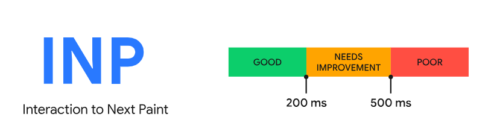
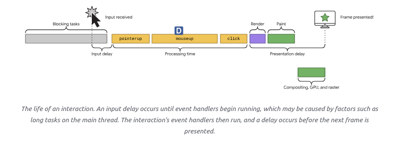
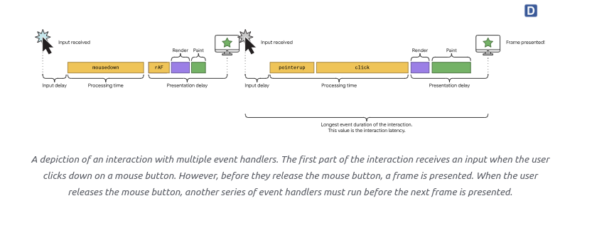

### from [https://web.dev/inp/](https://web.dev/inp/)

# Interaction Next Pain (INP)

    Interaction next pain(INP) là một chỉ số Core Web Vital đang chờ xử lý sẽ thay thế cho chỉ số 
    First Input Delay(FID- Độ trễ đầu vào ddaaafu tiên) vào tháng 3 năm 2024.
    INP đánh giá khả năng sử dụng dữ liệu từ `Event Timing API`. Khi có một tương tác khiến 1 trang trở lên không đáp
    ứng, đó là 1 trải nghiệm người dùng kém. 
    INP quan sát độ trễ của tất cả các tương tác một người dùng tương tác với trang, và báo cáo một giá trị duy nhất mà 
    tất cả ( hoặc gần như tất cả ) tương tác dưới đây. 
    Một `INP` thấp có nghĩa là trang đó hoàn toàn có khả năng phản hồi nhanh tới tất cả các hầu hết đa số các tương tác 
    của người dùng. 

Dữ liệu sử dụng của Chrome thể hiện rằng 90% thời gian người dùng trên một trang là sau khi nó được tải, Bởi vậy, việc cẩn thận đo lường khả năng phản hồi thông qua vòng đời của trang là quan trọng . Đây là cái mà chỉ số INP khám phá.

Phản hồi tốt có nghĩa là trang đó phản hồi nhanh tới các tương tác với nó. Khi một trang phản hồi với các tương tác, kết quả là một phản hồi trực quan, cái mà dược đại diện bởi trình duyetj trong 1 khung tiếp theo mà trình duyệt hiển thị. `Visual feedback` cho  bạn biết , ví dụ , một phần tử bạn thêm vào 1 giỏ hàng shopping online là đã đang được thêm hay không, liệu một menu điều hướng trên mobile có được mở, nếu một nội dung biểu mẫu đăng nhập đang được xác thực bởi máy chủ hay không và etc..

Một vài phản hồi bản cần nhiều thời gian hơn các tương tác khác theo một lẽ tự nhiên, nhưng cho các tương tác đặc biệt phức tạp, nó quan trọng  để nhanh chóng thể hiện phản hồi trực quan như một dấu hiệu cho người dùng biết cái gì đang xảy ra. THời gian cho đến khi `next pain` là cơ hội sớm nhất đề thực hiện điều đó. Bơi vậy, mục đích của `INP` không để đo lường tất cả các hiệu ứng cuối cùng của tương tác ( chẳng hạn như tìm nạp mạng và cập nhật UI từ các thao tác bất đồng bộ), nhưng là thời gian mà `next pain` bị chặn ở đó. Bằng cách trì hoãn `visual feedbeck`, bạn có thể tạo ra ấn tượng với người dùng rằng trang web đang không phản hồi lại các hành động.

Mục tiêu của INP là đảm bảo thời gian từ khi người dùng khởi tạo một tương tác cho tới khi khung tiếp theo được `pain` là ngắn nhất có thể, cho tất cả hoặc gần như tất cả các tương tác người dùng tạo ra. 

Trong video dưới dây, ví dụ bên phải cung cấp các phản hồi ngay lập tức rằng 1 accordion đang mở. Nó cũng chứng minh khả năng phản hồi kém có thể gây ra nhiều phản hồi không đúng dự định với đầu vào bởi vì người dùng nghĩ trải nghiệm đã hỏng. 
 Ví dụ về khả năng phản hồi kém đấu với phản hồi tốt . Ở bên trái, các tác vụ dài chặn việc mở accordion. Điều này khiến người dùng nhấp nhiều lần, nghĩ rằng hành động bị hỏng. Khi mà luồng chinsg bắt kịp, nó thực thi trễ , kết quả là việc mở dóng accordion không như mong đợi.
Link tới ví dụ [ở đây ](https://storage.googleapis.com/web-dev-uploads/video/jL3OLOhcWUQDnR4XjewLBx4e3PC3/WSmcjiQC4lyLxGoES4dd.mp4)

Bài viết này đã giải thích cách mà INP hoạt động, cách để đo lường nó và chỉ ra các tài nguyên để cải thiện nó. 

# INP là cái gì? 

INP là một chỉ số cái mà đo lường khả năng phản hồi tổng quan của một trang web với các tương tác của người dùng bằng  cách quan sát độ trễ của tất cả các tương tác click, tap, nhấn phím xảy ra thông qua tuổi thọ của một lần ghé qua trang của người dùng. Giá trị cuối cùng của INP là tương tác được quan sát dài nhất bỏ qua các ngoại lệ.

## **Một chú ý trên cách tính toán INP**
Như đã bắt đầu ở trên, INP được tính bằng các quan sát tất cả các tương tác với trang. Cho hầu hết các trang, tương tác với độ trễ tệ nhất được báo cáo như là INP. Tuy nhiên, với các trang với số lượng lớn các tương tác, các trục trặc ngẫu nhiên có thể dẫn đến các tương tác cao không bình tường trên một trang web phản hồi khác. Các nhiều tương tác, càng nhiều khả năng điều này xảy ra. Để tính toán điều này, và cung cấp 1 đo lường tốt nhất cho khả năng phản hồi thực tế với những kiểu trang đó, chúng ta bỏ qua một tương tác cao nhất cho mỗi 50 tương tác. Hầu hết đa số trải nghiệm trang không quá 50 tương tác, vì vậy sẽ báo cáo tương tác tệ nhất. Phần trăm  thứ 75 của tất cả lượt xem trang là sau đó được báo cáo là bình thường, cái mà tương lai xóa bỏ các ngoại lệ để lấy về giá trị cái mà đa số trải nghiệm người dùng hoặc tốt hơn 

Một `tương tác ` là một nhóm các trình xử lý sự kiện cái mà kích hoạt trong cùng 1 cử chỉ người dùng. Ví dụ, 'tap' tương tác trên thiết bị chạm màn hinhfbao gồm nhiều sự kiện, như là `pointerup`, `pointerdown` và click. Một tương tác có thể được điều khiển bởi JS, Css các điều khiển trình duyệt dựng sẫn ( như các phần tử biểu mẫu ) hoặc 1 kết hợp của chúng. 

ĐỘ trễ của tương tác bao gồm 1 khoảng thời gian dài nhất của nhóm các trinh xử lý sự kiện cái mà điều khiển tương tác, từ thời gian người dùng bắt đầu tương tác tới thời điểm khung tiếp theo được thể hiện với phản hồi trực quan. 

**Quan trọng 
Càng chi tiết về cách mà INP được đo lường, đọc phần [Một tương tác là cái gì?](https://web.dev/inp/#whats-in-an-interaction)**

## Một điểm INP tốt là như nào? 

Ghim một nhãn như là `tốt` hay `nghèo` trên các đơn vị khả năng phản hồi là khó. Một mặt, bạn muốn khuyến khích sự phát triển thực hành cái mà ưu tiên khả năng phản hồi tốt. Mặt khác, bạn phải tính toán cho sự thật rằng có một sự thay đổi đáng kể trong khả năng thiết bị con người sử dụng để thiết lập các kỳ vọng phát triển có thể đạt được.

Để bảo đảm bạn đang phân phối trải nghiệm người dùng với khả năng phản hồi tốt, một ngưỡng để đo lường là phần trăm thứ 75 của bản ghi tai trang được ghi trong trường, được phân đoạn trên thiết bị điện thoại và máy tính để bàn: 

- Một INP dưới hoặc ở 200 milliseconds có nghĩa là trang của bạn có phản hồi tốt. 
- Một INP trên 200 milliseconds và dưới 500 milliseconds có nghĩa là trang của bạn cần được cải thiện. 
- Một INP trên 500 ml giây có nghĩa là trang của bạn có khả năng phản hồi kém.

# Một tuong tác là cái gì? 

 Trình điều khiển cơ bản của tương tác thường là JS, mặc dù trinh duyệt cung cấp các tương tác thông qua các điều khiển không được hỗ trợ bởi JS, ví dụ như checkbox, nút radio, và được hỗ trợ bởi CSS. 

 Theo như INP, chỉ các kiểu tương tác sau được quan sát: 
- Click chuột. 
- Chạm vào thiết bị với màn hình chạm. 
- Nhấn 1 phím hoặc là vật lý hoặc là phím màn hình. 

**Quan trọng
Hành động hỏver và cuộn không ảnh hưởng đến INP. Tuy nhiên, cuộn với bàn phím (thanh space, page up, page down, và vân vân) liên quan đến một thao tác nhấn phím, cái mà kích hoạt các sự kiện lhasc mà INP đo lường. Bất kỳ kết quả cuộn nào không tác động đến đến cách INP được tính toán. 

Các tương tác xảy ra trong trang chính hoặc trong các khung được nhúng trong trang, ví dụ click để chạy video trên 1 video được nhúng. Người dùng cuối không nhận thức được đó là trong 1 khung hay không. Bởi vậy, INP bên trong khung cũng cần được đo lường trải nghiệm người dùng cho trang bên ngoài. Chú ý, các Javascript Web APIs sẽ không truy cập vào nội dung của khung vì vậy không thể đo lường INP trong 1 khung và điều này sẽ thể hiện 1 sự khác biêt giữa CrUX và RUM

Các tương tác có thể gồm hai phần, mỗi phần với nhiều sự kiện. Ví dụ, gõ phím bao gồm nhấn phím, giữ phím, thả phím. Tương tác chạm bao gồm chạm xuống và thả ra. Mỗi sự kiện với thời gian dài nhất trong 1 tương tác được chọn như là độ trễ của tương tác. 

 Một mô tả của tương tác với nhiều trình xử lý sự kiện. Phần đầu tiên của tương tác nhận đầu vào khi người dùng nhấp xuống một nút. Tuy  nhiên, trước khi họ nhả nút chuột, một khung được thể hiện. Khi người dùng thả nút chuột, một chuỗi các trình xử lý sự kiện phải được chạy trước khi khung tiếp theo được thể hiện. 

INP được tính toán khi người dùng rời trang, kết quả dẫn đến 1 giá trị duy nhất cái mà đại diện cho khả năng phản hồi chung cuả trang thông qua toàn bộ vòng đời của trang. Một INP thấp có nghĩa là trang phản hồi hợp lý tới đầu vào người dùng. 

# INP khác như thế nào với FID( First Input delay - đỗ trì hoãn đầu vào đầu tiên)

Trong khi mà INP cân nhắc tất cả các trang, FID chỉ tính toán cho tương tác đầu tiên. Nó cũng chỉ đo lường độ trễ đầu vào của tương tác đầu tiên, không phải thời gian nó cần để chạy trình xử lý sự kiện, hoặc độ trì hoãn trong hiển thị khung tiếp theo. 

Cho rằng FID cũng là 1 đơn vị phản hồi tải, lý do đằng sau nó là nếu tương tác đầu tiên với trang trong giai đoạn tải có ít hoặc không có độ trễ đầu vào, trang phải có ấn tượng đầu tiên tốt. 

INP là nhiều hơn cả một ấn tượng đầu tiê. Bằng cách lấy mẫu tất cả các tương tác, khả năng phản hồi được đánh giá toàn diện, làm cho INP trở thành một trình chỉ định của khả năng phản hồi đáng tin cậy hơn là FID. 

# Nếu không có giá trị INP báo cáo thì sao? 
 Nó có thể một trang không trả về giá trị INP. Điều này có thể xảy ra cho các lý do sau: 
- Trang đã tải, nhưng người dùng không bao giờ bấm , chạm hoặc nhấn giữ phím trên bàn phím của họ. 
- Trang được tải, nhưng người dùng tương tác với trang bằng các cử chỉ cái mà không liên quan đến click, chạm hoặc sử dụng bàn phím.  Ví dụ, cuộn hoặc hover các phần tủ không tác động đến cách mà INP được tính toán. 

# Đo lường INP 
 INP có thể được do bằng cả [field](https://web.dev/lab-and-field-data-differences/#field-data) và [lab](https://web.dev/lab-and-field-data-differences/#lab-data) thông qua rất nhiều công cụ. 

**Quan trọng 
Cách tốt nhất để đo chỉ số INP của trang web của bạn là nhóm các chỉ số từ người dùng thực tế trong `field`. Nếu bạn quen với việc báo cáo tren dữ liệu phòng thí nghiệm cho đánh giá hiệu suất, dành thời gian để đọc [Tại sao lab và field data khác nhau, và phải làm gì với nó](https://web.dev/lab-and-field-data-differences/) **

# Trong fied. 
Lý tưởng, hành trình trong quá trình tối ưu hóa INP sẽ bắt đầu với trường dữ liệu. Tốt nhát, trường dữ liệu từ RUM( Real User Monitering - Giám sát người dùng thực tế) sẽ cho bạn không chỉ giá trị INP của trang, mà còn dữ liệu ngữ cảnh cái làm nổi bật các tương tác đặc biệt chịu trách nhiệm cho giá trị INP của chinh nó, kiểm tra xem liệu tương tác đã xả ra trong suốt hay sau khi trang được tải, kiểu của tương tác ( click, giữ phím hay chạm) và các thông tin giá trị khác. 

**Đọc thêm [Tìm các tương tác chậm trong field.](https://web.dev/find-slow-interactions-in-the-field/)
 Nếu trang của bạn đủ điều kiện đưa vào [Báo cáo trải nghiệm người dùng Chrome( CrUX -Chrome Use Experience Report)](https://developer.chrome.com/docs/crux/), bạn có thể nhanh chóng nhận được các dữ liệu field cho INP thông qua CrUx trong [PageSpeed Insights](https://web.dev/find-slow-interactions-in-the-field/#get-field-data-quickly-with-crux).ở mức tối thiểu, bạn có thể nhận được bức trang mức độ gốc của INP của trang của bạn, nhưng trong một số trường hợp, bạn cũng có thể nhận được dữ liệu  mức độ trang. 

Tuy nhiên trong khi CrUx là hữu ích đê nói với bạn rằng ở đây có 1 vấn đề ở mức độ cao, nó thường không cung cấp đủ dữ liệu để giúp hiểu đầy đử vấn đề là gì. Một giải pháp RUM có thể giúp bạn đi sâu vào chi tiết như là các trang, người dùng hoặc tương tác người dùng cái mà là các trải nghiệm tương tác chậm. Việc có thể gán các INP tới các tương tác riêng lẻ tránh việc phỏng đoán và lãng phí nỗ lực. 

# Trong phòng thí nghiệm 
Tối ưu, bạn sẽ muốn bắt đầu để kiểm tra trong phòng thí nghiệm, một khi bạn có trường dữ liệu cái mà gợi ý cho bạn các tương tác chậm. Trong trường hợp thiếu các dữ liệu thực , có một vài chiến lược cho tái sản xuất các tương tác chậm trong phòng thí nghiệm. Như các chiến lược bao gồm việc theo dõi các luồng người dùng phổ biến và việc kiểm tra các tương tác trong suốt quá trình, cũng như việc tương tác với trang trong suốt quá trình tải khi mà luồng chính thường bận rộn nhất để hiển thị các  tương tác chậm trong phần quan trọng đó của trải nghiệm người dùng. 

**Đọc  thêm: [chuẩn đoán các tương tác chậm trong phòng thí nghiệm](https://web.dev/diagnose-slow-interactions-in-the-lab/)

# Cách để cải thiện INP 
 [Một bộ sư tập các hướng dẫn](https://web.dev/optimize-inp/) trong việc tối ưu hóa IP là có sẵn để hướng dẫn bạn thông qua tiến trình của việc xác định các tương tác chậm trong dữ liệu thực  và sử dụng dữ liệu phòng thí nghiệm để đào sâu và tối ưu hóa chúng trong nhiều cách khác nhau. 

CHANGELOG #
 Thỉnh thoảng, các lỗi được khám phá trong APIs được sử dụng để làm đơn vị đo lường, và thỉnh thoảng, trong chính các định nghĩa của đơn vị đo lường. Kết quả là, các thay đổi phải được diễn ra. và những thay đổi này có thể thể hiện như sự cải thiện hoặc hồi quy trong các báo cáo nội bộ của bạn và bảng điều khiển. 

To help you manage this, all changes to either the implementation or definition of these metrics will be surfaced in this CHANGELOG.

If you have feedback for these metrics, you can provide it in the web-vitals-feedback Google group.

