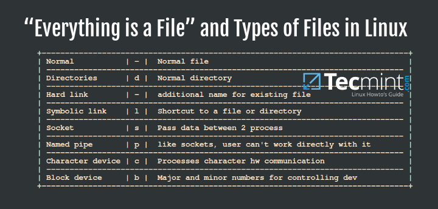

## from [https://www.tecmint.com/everything-is-file-and-types-of-files-linux/](https://www.tecmint.com/everything-is-file-and-types-of-files-linux/)

# Giải thích về "mọi thứ đều là tệp " và các loại tệp trong Linux

 Nếu bạn là người mới với Linux hoặc đã sử dụng nó trong vài tháng, sau đó bạn phải nghe hoặc đọc các câu phát biểu như: "**trong Linux, mọi thứ đều là tệp**"

Đó là 1 thực tế đúng mặc dù no chỉ là 1 khái niệm khái quát, trong Unix và các dẫn xuất của nó như Linux, mọi thứ được cân nhắc như 1 tệp. Nếu những thứ không phải là 1 tệp, sau đó nó phải đang hoạt dộng như một tiến trình trên hệ thống. 

Để hiểu điều này, xem một ví dụ về số lượng không gian trên thư mục `root` của bạn là luôn luôn được tiêu thụ bởi các loại tệp Linux. Khi bạn tạo ra 1 tệp hoặc chuyển đổi 1 tệp tới hệ thống của bạn, nó sẽ chiếm không gian trên ổ đĩa vật lý và nó được cân nhắc là  1 định dạng chỉ định.( kiểu tệp)




Ngoài ra, hệ thống Linux không có sự khác biệt giữa tệp và các thư mục, nhưng các thư mục thực hiện 1 công việc quan trọng, cái mà để lưu các tệp khác trong 1 nhóm phân cấp để dễ xác định vị trí. Tất cả các thành phần phần cứng của bạn được đại diện như các tệp và hệ thống giao tiếp với chúng bằng cách sử dụng các tệp. 

Ý tưởng là 1 mô tả quan trọng của 1 thuộc tính tuyệt vời của Linux, nơi các nguồn tài nguyên đầu ra/ đầu vào như tài liệu của bạn, các thư mục ( các thư mục trong Mac Os X và window), bàn phím, màn hình, ổ cứng, removeable media, máy in, modems, thiết bị đầu cuối ảo, và các tiến trình bên trong và giao tiếp mạng là các luồng của các bytes được xác định bởi không gian hệ thống tệp.

Một lợi ích đáng chú ý của việc mọi thứ đều là 1 tệp là cùng 1 bộ công cụ của Linux, tiện ích  và APIs có thể được sử dụng trên các nguồn tài nguyên đầu ra / đầu vào. Mặc dù mọi thứ trong Linux là 1 tệp, có những tệp đặc biệt cụ thể cái mà hơn cả chỉ là 1 tệp chẳng hạn như `sockets` và `các đường ống được đặt tên`.

# Các kiểu tệp khác nhau của Linux?
 Trong Linux có 3 kiểu tệp cơ bản: 

- Ordinary/Regular files
- Special files 
- Directories
1. Ordinary/Regular files 

 Những tệp tệp này là các tệp dữ liệu chứa text, dữ liệu hoăc các chương trình hướng dẫn và chúng là các kiểu phổ biến nhất của tệp bạn có thể mong chờ để tìm thấy 1 hệ thống Linux chúng bao gồm: 

- Tệp có thể đọc 
- Tệp nhị phân 
- Têp hình ảnh. 
- Tệp nén ..

## Tệp đặc biêt 

Tệp đặc biệt bao gồm những thứ sau: 

### Teeoj khối Linux 

 Những tệp này là các tệp thiết bị cung cấp các quyền truy cập bộ đệm tới các thành phần phần cứng của hệ thống. Chúng cung cấp 1 phương thức giao tiếp với các trình điều khiển thiết bị thông qua hệ thống tệp. 


Một khía cạnh quan trọng của tệp khối là chúng có thể chuyển đổi 1 khối lượng lớn dữ liệu và thông tin một lần. 
 

Liệt kê các sockets tệp khối trong 1 thư mục sử dụng lệnh ls: 

```php
# ls -l /dev | grep "^b"

brw-rw----  root disk        0 B  Wed Apr 26 08:39:09 2023 loop0
brw-rw----  root disk        0 B  Wed Apr 26 08:39:09 2023 loop1
brw-rw----  root disk        0 B  Wed Apr 26 08:39:09 2023 loop2
brw-rw----  root disk        0 B  Wed Apr 26 08:39:09 2023 loop3
brw-rw----  root disk        0 B  Wed Apr 26 08:39:09 2023 loop4
brw-rw----  root disk        0 B  Wed Apr 26 08:39:09 2023 loop5
brw-rw----  root disk        0 B  Wed Apr 26 08:39:09 2023 loop6
brw-rw----  root disk        0 B  Wed Apr 26 08:39:09 2023 loop7
brw-rw----  root disk        0 B  Wed Apr 26 08:39:09 2023 sda
brw-rw----  root disk        0 B  Wed Apr 26 08:39:09 2023 sda1
brw-rw----  root disk        0 B  Wed Apr 26 08:39:10 2023 sda2
brw-rw----  root disk        0 B  Wed Apr 26 08:39:09 2023 sdb
brw-rw----  root disk        0 B  Wed Apr 26 08:39:09 2023 sdb1
brw-rw----  root disk        0 B  Wed Apr 26 08:39:09 2023 sdb2
brw-rw----  root disk        0 B  Wed Apr 26 08:39:09 2023 sdb3
...

```
## Tệp ký tự Linux 

những tệp này cũng là các tệp thiết bị cung cấp các quyền truy cập nối tiếp không có bộ đệm tới các thành phần phần cứng của hệ thống. Chúng hoạt động bằng cách cung cấp 1 cách giao tiếp với các thiết bị bằng cách chuyển dữ liệu từng ký tự 1. 

Liệt kê sockets tệp ký tự trong 1 thư mục: 

```php
# ls -l /dev | grep "^c"

crw-r--r--  root root        0 B  Wed Apr 26 08:39:09 2023 autofs
crw-rw----  root disk        0 B  Wed Apr 26 08:39:09 2023 btrfs-control
crw--w----  root tty         0 B  Wed Apr 26 08:39:09 2023 console
crw-------  root root        0 B  Wed Apr 26 08:39:09 2023 cpu_dma_latency
crw-------  root root        0 B  Wed Apr 26 08:39:09 2023 cuse
crw-------  root root        0 B  Wed Apr 26 08:39:09 2023 ecryptfs
crw-rw----  root video       0 B  Wed Apr 26 08:39:09 2023 fb0
crw-rw-rw-  root root        0 B  Wed Apr 26 08:39:09 2023 full
crw-rw-rw-  root root        0 B  Wed Apr 26 08:39:09 2023 fuse
crw-------  root root        0 B  Wed Apr 26 08:39:09 2023 hidraw0
crw-------  root root        0 B  Wed Apr 26 08:39:09 2023 hidraw1
crw-------  root root        0 B  Wed Apr 26 08:39:09 2023 hidraw2
crw-------  root root        0 B  Wed Apr 26 08:39:09 2023 hidraw3
crw-------  root root        0 B  Wed Apr 26 08:39:09 2023 hpet
crw-------  root root        0 B  Wed Apr 26 08:39:09 2023 hwrng
crw-------  root root        0 B  Wed Apr 26 08:39:09 2023 i2c-0
crw-------  root root        0 B  Wed Apr 26 08:39:12 2023 i2c-1
crw-------  root root        0 B  Wed Apr 26 08:39:12 2023 i2c-2
crw-------  root root        0 B  Wed Apr 26 08:39:12 2023 i2c-3
crw-r--r--  root root        0 B  Wed Apr 26 08:39:09 2023 kmsg
crw-rw----+ root kvm         0 B  Wed Apr 26 08:39:09 2023 kvm
crw-rw----  root disk        0 B  Wed Apr 26 08:39:09 2023 loop-control
crw-rw----  root lp          0 B  Wed Apr 26 08:39:09 2023 lp0
crw-------  root root        0 B  Wed Apr 26 08:39:09 2023 mcelog
crw-------  root root        0 B  Wed Apr 26 08:39:09 2023 mei0
...
```

## Các tệp liên kết tượng trưng Linux. 

Một liên kết tượng trưng là 1 tham chiếu tới 1 tệp khác trên hệ thống. Bởi vậy, các tệp liên kết tượng trưng là các tệp trỏ tới các tệp khác, và chúng có thể hoặc là các thư mục hoặc là các tệp thông thường. 

Liệt kê các socket liên kết tượng trưng trong 1 thư mục: 
```php
# ls -l /dev/ | grep "^l"

lrwxrwxrwx  root root       13 B  Wed Apr 26 08:39:04 2023 fd ⇒ /proc/self/fd
lrwxrwxrwx  root root       11 B  Wed Apr 26 08:39:04 2023 core ⇒ /proc/kcore
lrwxrwxrwx  root root       12 B  Wed Apr 26 08:39:09 2023 initctl ⇒ /run/initctl
lrwxrwxrwx  root root       28 B  Wed Apr 26 08:39:09 2023 log ⇒ /run/systemd/journal/dev-log
lrwxrwxrwx  root root        4 B  Wed Apr 26 08:39:09 2023 rtc ⇒ rtc0
lrwxrwxrwx  root root       15 B  Wed Apr 26 08:39:04 2023 stderr ⇒ /proc/self/fd/2
lrwxrwxrwx  root root       15 B  Wed Apr 26 08:39:04 2023 stdin ⇒ /proc/self/fd/0
lrwxrwxrwx  root root       15 B  Wed Apr 26 08:39:04 2023 stdout ⇒ /proc/self/fd/1
...
```
Có thể tạo các liên kết tượng trưng bằng cách sử dụng tiện ích `ln` trong linux như ví dụ sau: 
```php
# touch file1.txt
# ln -s file1.txt /home/tecmint/file1.txt  [create symbolic link]
# ls -l /home/tecmint/ | grep "^l"         [List symbolic links]
```

Trong ví dụ trên, tôi đã tạo ra 1 tệp gọi là file1.txt trong thư mục tmp, sau đó tạo ra liên kết tượng trưng, /home/tecmint/file1.txt để trở tới /tmp/file1.txt. 

## Đường ống Linux hoặc các đường ống được đặt tên 

 Những tệp này là các tệp cho phép giao tiếp các tiến trình bên trong bằng cách kết nối đầu ra của 1 tiến trình với đầu vào của 1 tiến trinh khác. Một đường ống được đặt tên thực tế là 1 tệp cái mà được sử dụng bằng bởi hia tiến trình để giao tiếp với nhau  và nó hoạt động như 1 đường ống Linux. 

 Liệt kê các sockets đường ống trong thư mục: 

```php
# ls -l | grep "^p"

prw-rw-r-- 1 tecmint tecmint    0 Apr 18 17:47 pipe1
prw-rw-r-- 1 tecmint tecmint    0 Apr 18 17:47 pipe2
prw-rw-r-- 1 tecmint tecmint    0 Apr 18 17:47 pipe3
prw-rw-r-- 1 tecmint tecmint    0 Apr 18 17:47 pipe4
prw-rw-r-- 1 tecmint tecmint    0 Apr 18 17:47 pipe5
```
 CÓ thể sử dụng tiện ích `mkinfo` để tạo ra 1 đường ống được đặt tên như sau: 
```php
# mkfifo pipe1
# echo "This is named pipe1" > pipe1
```
 Trong ví dụ trên, tôi đã tạo ra 1 đường ống gọi lả pipe1 , sau đó truyền các dữ liệu vào nó bằng cách sử dụng lệnh echo, sau đó shell không thể tương tác trong khi đang xảy ra tiến trình đầu vào. 

Sau đó tôi mở 1 `shell` khác và chạy 1 lệnh khác để in ra cái mà đã truyền tới đường ống. 

```php
# while read line ;do echo "This was passed-'$line' "; done<pipe1

```
## tệp sockets Linux 

Những tệp này là các tệp cung cấp 1 giao tiếp tiến trình bên trong , nhưng chúng có thể chuyển dịch dữ liệu và thông tin giữa các tiến trình trên các môi trường khác nhau. 

Điều này có nghĩa là các sockets cung cấp dữ liệu và thông tin chuyển dịch giữa các tiến trình đang  chạy trên các máy khác nhau  trên 1 mạng .

Một ví dụ để thể hiện công việc của sockets  sẽ là 1 trình duyệt tạo ra kết nối với máy chủ web. 

```php
# ls -l /dev/ | grep "^s"

srw-rw-rw-  1 root root             0 Apr 18 10:26 log

```

Đây là một ví dụ của socket được tạo trong ổ C bằng cách sử dụng cuộc gọi hệ thống socket().
```php
int socket_desc= socket(AF_INET, SOCK_STREAM, 0 );
```

Trong ví dụ trên: 

- À_INET là địa chỉ quen thuộc (IPv4)
- SOCK_STREAM là kiểu ( kết nối được định hướng theo giao thức TCP )
- O là giao thức ( giao thức IP) 

Để tham chiếu tới tệp socket, sử dụng `socket_desc`, giống như bộ mô tả tệp và sử dụng gọi hệ thống  `read()` và `write()` để đọc và ghi từ các socket  tương ứng.  

## Thư mục đặc biệt Linux 
Đây  là những tệp đặc biệt lưu trữ cả các tệp thông thường và các tệp đặc biệt và chúng được tổ chức trên hệ thống tệp Linux trong 1 cấu trúc phân cấp bắt đầu từ thư mục `root`. 


Liệt kê các sockets trong 1 thư mục: 
```php
# ls -l / | grep "^d"

drwxr-xr-x root root 4.0 KB Fri Apr 21 10:21:42 2023 boot
drwxr-xr-x root root 4.0 KB Wed Oct  6 22:55:05 2021 cdrom
drwxr-xr-x root root 4.4 KB Wed Apr 26 08:39:12 2023 dev
drwxr-xr-x root root  12 KB Sat Apr 22 10:59:02 2023 etc
drwxr-xr-x root root 4.0 KB Wed Oct  6 22:55:12 2021 home
drwx------ root root  16 KB Wed Oct  6 22:52:31 2021 lost+found
drwxr-xr-x root root 4.0 KB Thu Oct  7 18:03:09 2021 media
drwxr-xr-x root root 4.0 KB Mon Jul 18 11:34:54 2022 mnt
drwxr-xr-x root root 4.0 KB Tue Apr  4 15:09:01 2023 opt
dr-xr-xr-x root root   0 B  Wed Apr 26 08:39:04 2023 proc
drwx------ root root 4.0 KB Fri Apr  7 11:28:42 2023 root
drwxr-xr-x root root 1.1 KB Wed Apr 26 08:44:09 2023 run
drwxr-xr-x root root 4.0 KB Wed Dec 15 13:23:40 2021 srv
dr-xr-xr-x root root   0 B  Wed Apr 26 08:39:04 2023 sys
drwxrwxrwt root root 4.0 KB Wed Apr 26 10:14:23 2023 tmp
drwxr-xr-x root root 4.0 KB Sat Jul  3 22:29:26 2021 usr
drwxr-xr-x root root 4.0 KB Thu Mar 30 10:46:04 2023 var
```

có thể tạo ra một thư mục bằng lệnh `mkdir`

```php
# mkdir -m 1666 tecmint.com
# mkdir -m 1666 news.tecmint.com
# mkdir -m 1775 linuxsay.com
```


# Kểt luận 
 
Bạn nên có sự hiểu biết rõ ràng rằng tại sao mọi thứ trong Linux là 1 tệp và các kiểu tệp khác nhau của tệp có thể tồn tại trong hệ thống Linux của bạn. 

Bạn có thể hiểu nhiều hơn về nó bằng cách đọc nhiều hơn về các kiểu tệp dọc lập và chúng được tạo. Hi vọng bạn thấy hướng dẫn này là hữu ích và cho bất kỳ câu hỏi nào và các thông tin bổ sung cái mà bạn muốn chia sẻ, vui lòng để lại 1 bình luận và chúng ta sẽ thảo luận nhiều hơn. 
