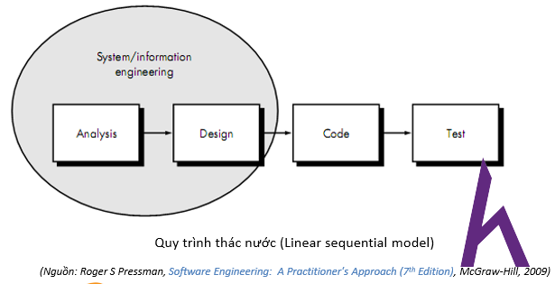
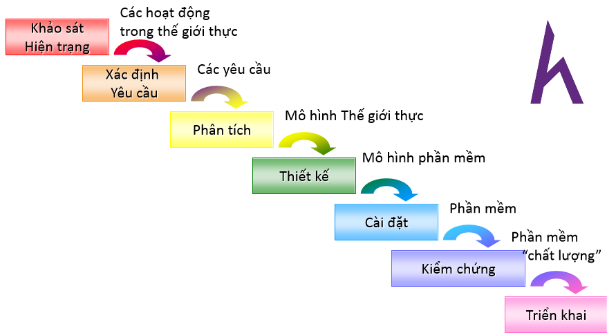
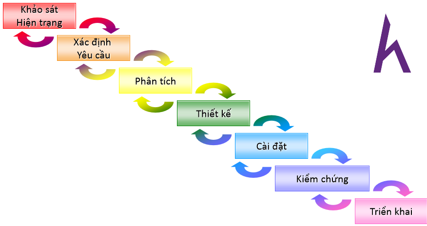
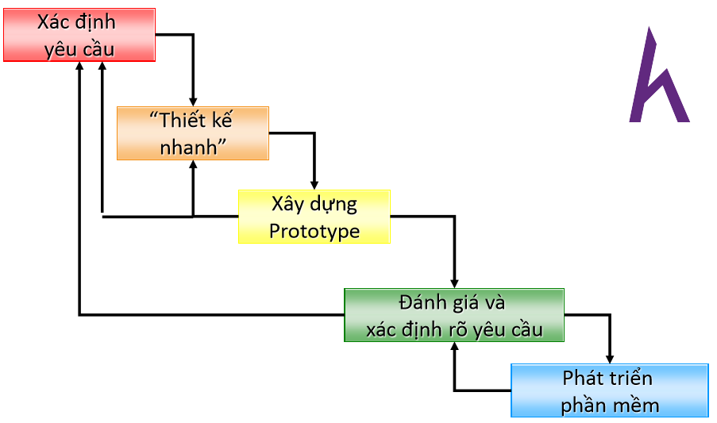
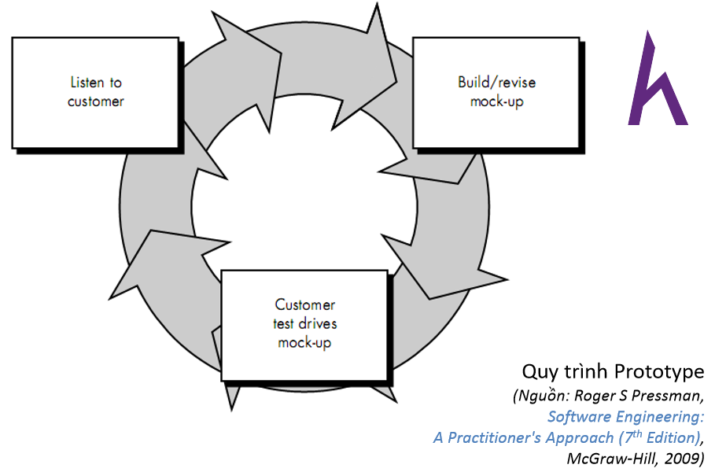
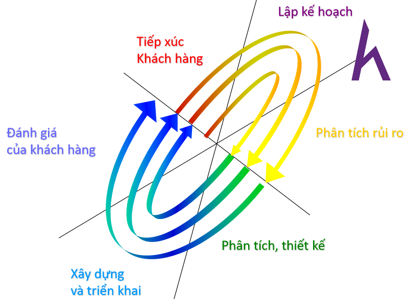
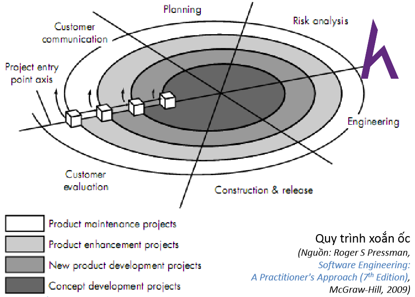
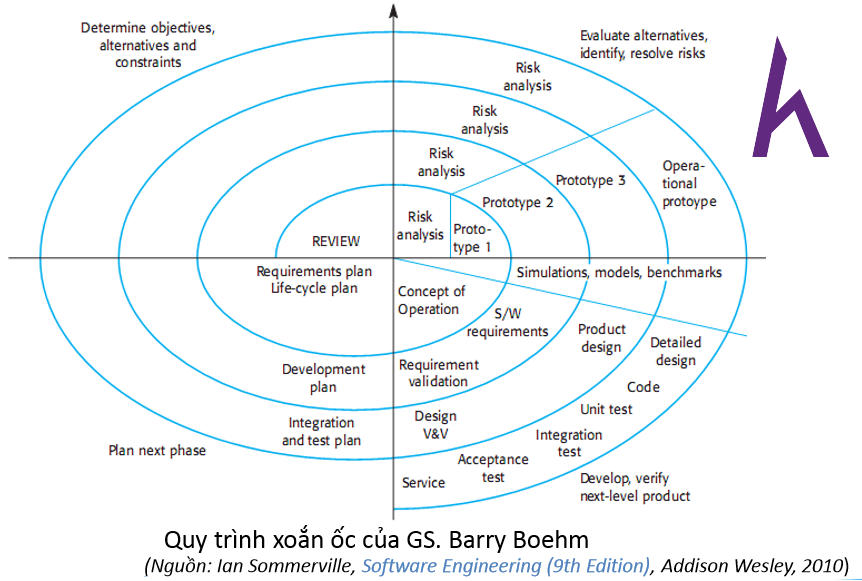

# Instruction about software desinging analytic 

## Why need design software? 

1. make sure that a software created with the best quality.
2. Easy to develop new version 
3. can see how the software look like before we create it. 

## What will we learn? 

- How is the quality software? 
- Software processing 

### How is the quality software?

A quality software should have some following characters: 

1. The rightness . 

  The rightness have two asides:
  
  - The completeness: response the customer's requirements fully and specific description. 
  - The exactness: response the specific description's requirements exactly, not residual.

2. The effective: 
 
- Optimal the CPU: make sure not get residual resources that lead to waste memory.Not execute the redundant actions repeatedly.require and release memory consequently.  
- OPtimal memory: make sure not to require and release memory without thinking. Having suitable storage structure.
- Optimal the device: suitable and smooth on many devies. 
3. The compatibility 

- import/export data: easy to import/export data for user and software operate. 
- The interaction: make sure interact with user and operating system properly. Not go backward to system's logic and user'behaves. 

4. The evolution: This is the most important character. If a software only use in a particular time, it a bad software. 
5. The convenient 

- Esay to learn: It is easy to learn how to use the software. 
- Easy to use 
- Intuitive interface: It is easy for user to catch it. 
- natural: Operate with interface natural. 
6. The easy testing:
7. The easy of fixing 
8. The reusing 
9. The maintaining: when having a component that is not suitable for new requirement. you need to update software. And 
the updating should be quick,exactly as posible as and limited influence to other components. 

## The software processing 

**Note**: The earliest in the stage of software process, the lowest cost of fixing bugs 

1. Waterfall - Linear sequential model

> Must finish the previous stage, you just can move to the next one. 

- The advantage: it is easy to hold all information of previous stage to build the current stage, it is quick and consice. 
- The disadvantage: ìf having a bug in the previous stage, it is very difficult to fix or take hight cost. 

2. advanced waterfall 

> essentially, it is the same waterfall, but it can fix the previous stage. 
- The advantage: like the waterfall and it can fix the traditional problem of waterfall 
- The disadvantage: It has not  been optimal with  long terms systems .It needs to research and implement 
 concurrent.
3. Protype process 

> essentially, it is the same waterfall, but it has a loop  that create a prototype to evaluate   and 
> determine the requirements . If the requirements have been response, it will move into developing software. 
- The strength: 
   
   - There a prototype to evaluate and determine requirements. 
   - suitable for small and medium project. 
   - if the prototype is good, it can help increase the development's speed. 
- The weakness: 

  - still not suitable with long terms system. 
  - waste cost to create the prototype. 

4. Spiral process 

