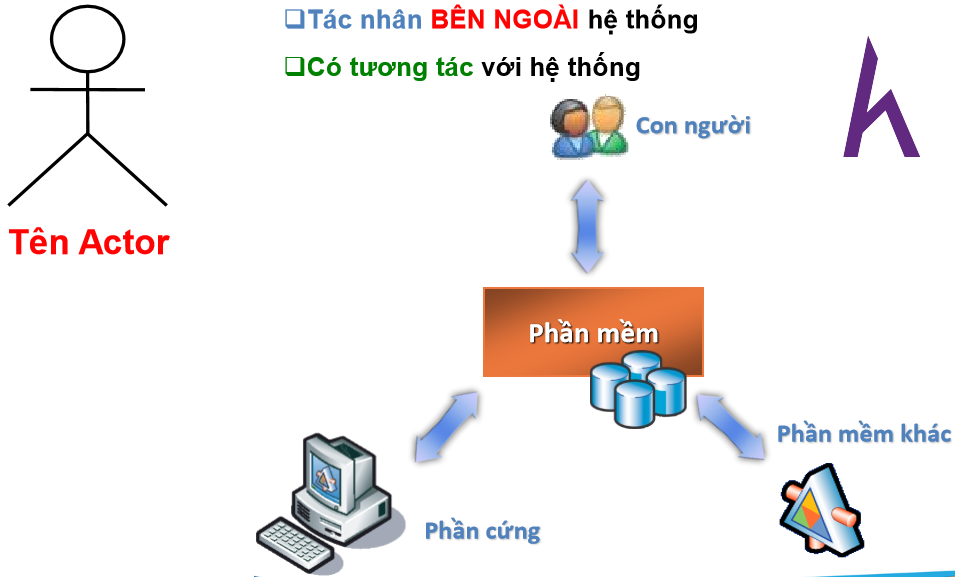
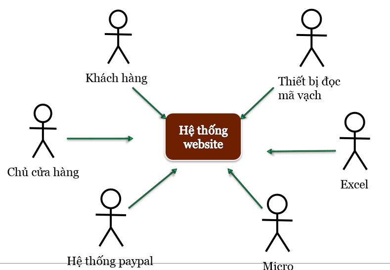
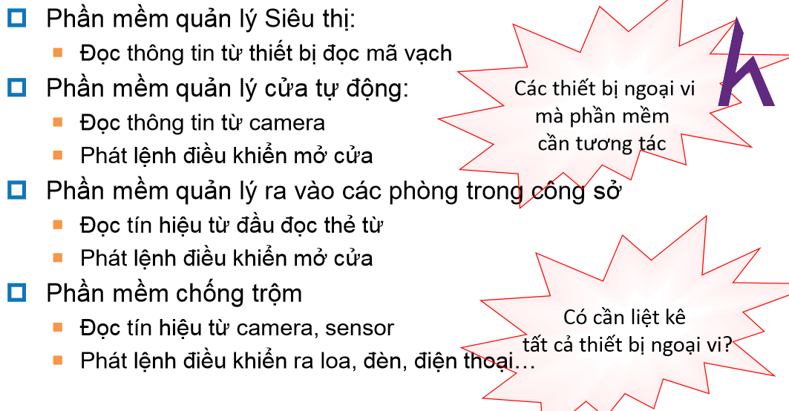
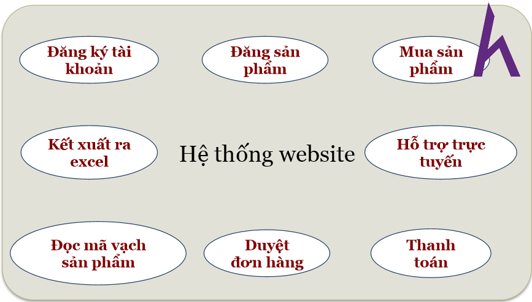
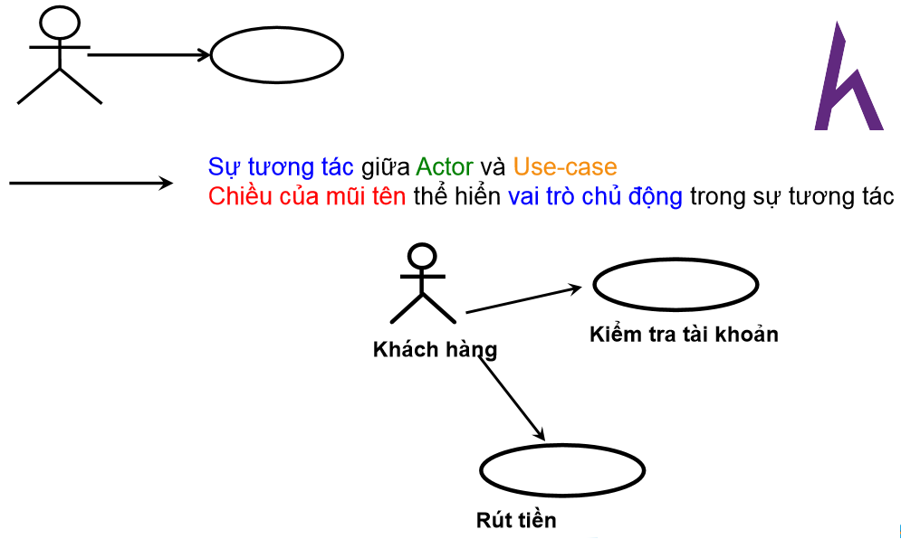
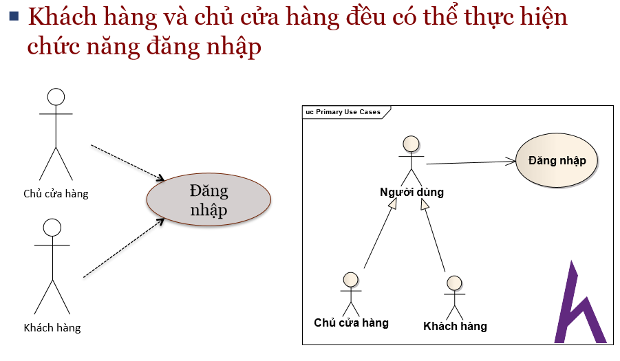
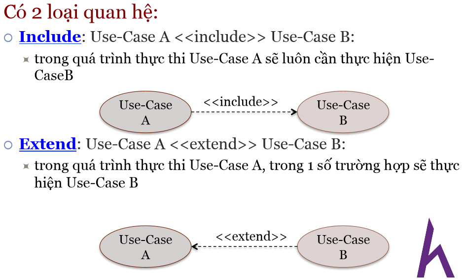

# Create use-case diagram 

The most important things you need when analytic a system is understanding problem cleanly. 
And in order to understand requirements, we need reading it. To show that we are understood that requirements and concurrently we have documents to analytic, we will create use-case diagram 

## What will we learn ? 
- Definition of Actors and Use-case 
- The relationships in use-case schema : 
- use-case diagram 
- use-case Specific definition 

### What is Actor 

It is factors that is outside of system and interact with it. 
- User 
- Other software 
- Peripherals

**The user group**
we can determine the actor by following picture: 

**The peripherals** 

**other software**: expample: import/export excell..

### Use-case 

- A use-case is a chain of actions that system execute to bring a observable result for actor. 
- It can be understood like a function of system that have a certain meaning for actors

### use-case diagram  

### Generalization between actors 

Both user and store owner can login, so we can merge two actors into one other actor. 

 The direction of arrow show the active role of actor when excecute use-case 

