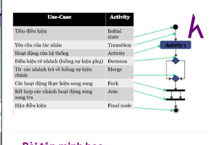

# Create activity diagram 

## what will we learn? 
- what is activity-diagram? 
- what are components of acivity-diagram ?
- The maps of use-case diagram to Activity diagram 

## what is Activity diagram?

- Activity diagram is a logical model used to modeling actions of a business process. on other words, Activity diagram is a handler-thread diagram of system. Including  the stream of data and events. 
- Being used to describe actions in a function of system. You can understand it  describes handler-stream of use-case
- Describing main actions and relationship between these actions in processing. On the other words, it describes both main handler-stream including sub stream and handler-stream of use-case.

### The components ( 6 main components)

1. Start : 
  
  - symbol: Big black dot 
  - Features: Initial an action and one Activity-diagram can have many state of start.
  on the other words, it is start point of handler-stream 

2. Activity 

 
- symbol: a square with the name of  actionn inside. 
- Features: Describe object's behave in the process. it should be short and full. 

3. Transition 

- symbol: an arrow. 
- Features: Describe the transform states of actions 

From this action to other action, needs a transition to indicate the way. 
Note that transition has an arrow. 

4. Decision 

- symbol : shuttle 
- Features: 

  - including a set of condition to trigger the transition state 
  - Inclduding :

   - **Branch**: 

     - Describing the branch conditions
     -  Only having a condition come in 
     - 2 or more conditional streams go out 
     - Only a stream leading to result. 
     - each stream has a condition( guard) and guard must relate to conditions and eliminate each other

   - Merge: 

     - 2 or more conditional streams come in 
     - only having  one stream go out 

 Can understand this is symbol of branch conditions, Depending on the result of express inside, there is a suit transition. 
     

5. Synchronization bar

- symbol : an long bold black underscore. 
- Feature: Describing actions that execute parallel 

  - Fork : 

     - Describe a control stream separated to 2 stream and execute parallel
     - There is only one stream come in. 
     - There are 2 or more streams go out. 
     - USing Fork when actions are executed regardless order of them. 
    
  - Join: 

     - Combine parallel actions. 
     - There are 2 or more streams come in 
     - There is only 1 stream go out 
     - The control stream has been  created when all necessary stream have came in. 
 
**note** : join and fork don't need label 

Understanding simply, some cases that have enough conditionals to combine into a stream, let use join. Some cases, you need to separete 
into many sub streams, use fork. 

