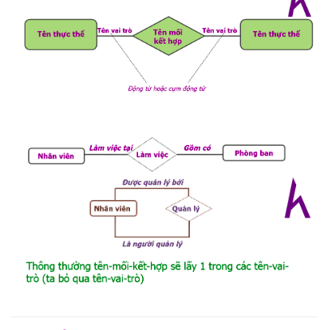

# ER diagram 

## What will we learn?

- What is an ER diagram?
- Components 
- Extend ER diagram 
- Example 

## What is an ER diagram? 

- ER - diagram stands for Entity Relationship diagram (ERD ), introduced by Chen in 1976. 
It becomes more widely popular in data conceptual design.
- It helps you have a overview about storage data diagram used in system. 
- includes: 

  - material diagram 
  - extending  diagram 

### Components 

- Entity 
- instance 
- Attributes 
- Union 
- Role 
- Table number

1. Entity 

- Describe a set concept in the real world. 
- intuitive: 
  
  - Human : staffs, students,...
  - place: Schools, apartments,...
  - Subject: Books, machine, ...
  - events: register, sell, ...
  
- unintuitive: accounts, times, courses...

 - symbol : a rectangle with the name inside 

2. Union 

- Describe the meaning relationship between 2 or many entities 
  
   - Combining events
   - Physical relationship 
  
- symbol : diamond 
 

3. role 

- Describe the meaning of entity joining in an union 

4. Number Table 

- Binding the number of entity joining in  a union 

- symbol : by a pair of (min, max)

  - min: Regulate the minimum entity joining in a union: 0,1,2,3,4,.....
  - max: Regulate the maximum entity joining in a union : 1,2,3....

 - classify union base the number table 

   - one - one 
   - one - many 
   - many - one 
   - many - many 

5.  Instance

- is a particular instance of entity
- example: entity student has many individual students: Student A, student B ...
6. Attributes 

- Describe the feature of entity or union 

- symbol : a line with the  white circle

## Extended ER diagram 

additional into ER diagram: 

- multi-combination attribute 
- Identify 
- generalization 
- sub set 
- extended union 

#### Hierarchical structure 

- Create the hierarchical tree structure between entities 

- example: 

