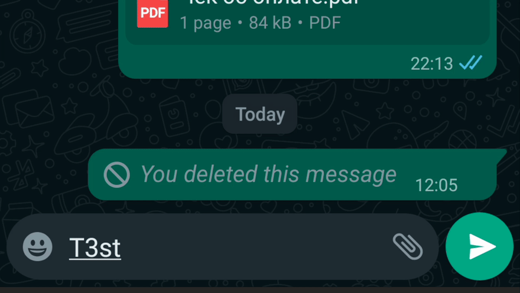
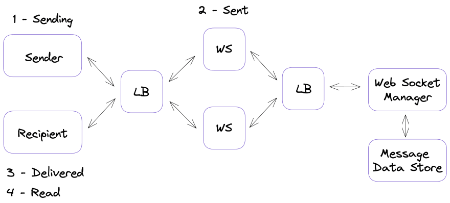
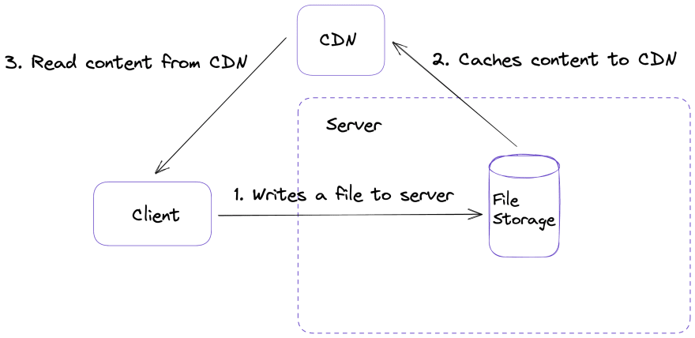

# Thiết kế hệ thống đằng sau 1 ứng dụng tin nhắn

Chúng ta hằng ngày sử dụng các ứng dụng tin nhắn như WhatApp và Telegram để trò chuyện với bạn của chúng ta. Tất cả chúng có 1 vài giải pháp thiết kế đằng sau ngữ cảnh cái mà ảnh hưởng trực tiếp tới trải nghiệm người dùng. Tôi đang mô tả một vài đặc tính có thể thấy từ khía cạnh người dùng  và giải thích công nghệ chi tiết cơ bản. Tuy nhiên, nó không phải là 1 hệ thống hoàn chỉnh và có nhiều chủ đề nơi mà chúng ta có thể đào sâu hơn. 

# Trạng thái phân phối tin nhắn
 
Tất cả trình tin nhắn chỉ định 1 trạng thía của 1 tin nhắn. Các ứng dụng cung cấp cho người dùng thông tin khi nào tin nhắn đưuọc gửi, được phân phối và được đọc bởi 1 người nhận. Điều này là rất tốt được thấy trên WhatApp.

Nó thể hiện 1 vài trạng thái của tin nhắn thông qua: 

1. Khi người dùng click vào 1 nút gửi tin nhắn đươc gửi từ 1 thiết bị máy khách tới máy chủ web ( hình đồng hồ).
2. Khi tin nhắn tới máy chủ , nó gửi 1 thông báo tới máy khách. Ở thời điển này, icon đã đổi thành 1 dấu check đơn. 
3. Máy chủ web tìm kiếm 1 kết nối cái mà được thiết lập giữa nó và một người nhận và gửi 1 tin nhắn. Thiết bị người nhận gửi trở lại 1 thông báo tới máy chủ và sau đó, máy chủ có thể gửi 1 thông báo tới người gửi rằng tin nhắn đã được phân phối và icon đổi thành dấu check đôi
4. Cuối cùng, người nhận mở tin nhắn và đọc tin nhắn. Thiết bị của anh ấy gửi nhiều hơn 1 thông báo tới máy chủ và máy chủ giao tiếp với người gửi thông báo tin nhắn đã đưuọc đọc. Icon đổi thành check đôi màu xanh.

Lược đò dưới đây chứng tiến trình này và mang 1 khối thiết kế cần thiết hơn cho các cuộc thảo luận tương lai. 

Các trình gửi tin nhắn phải xử lý hơn 100 tỷ tin nhắn hàng ngày hoặc sấp xỉ 1 triệu tin nhăn trên giây. Các ứng dụng tin nhắn tuân theo thiết kế phân tán để chịu tải và phần quan trọng của nó là `Cân bằng tải`(LB). Cân bằng tải áp dụng cho 1  chiến lược cụ thể để nỗi lực phân tán đều giưã các máy chủ khác nhau. 

Các trình tin nhắn mục đích để phân phối tin nhắn nhanh giữa người dùng và máy chủ. Web Socket là 1 giao thức cung cấp kết nối song song thông qua 1 kết nối TCP. Việc giữ cho 1 kết nối web socket có giá rẻ hơn 1 kết nối HTTP. Máy khách và máy chủ đăng ký với nhau và chờ cho các tin nhắn mới. 

Các người dùng khác nhau có thể được kết nối với các máy chủ web khác nhau. vì vậy chúng ta cần phải `Quản lý WebSocket`. Dịch vụ này chịu trách nhiệm cho cung cấp thông tin cho các kết nối và định tuyến các tin nhắn tới 1 máy chủ web đúng đắn. 

Nếu người nhận đang offline các tin nhắn nên đưuọc lưu lại. CSDL nên được tối ưu hóa cho các chuỗi hành động ghi và xóa liên tục. Hành động xóa thực thi sau khi khách online và tất cả cac tin nhắn được gửi tới anh ta. NoSQL sẽ là 1 lựa chọn cho trường hợp này, một vài tin nhắn sử dụng Hbase và Cassandra dể giải quyết nhiệm vụ này. 

Tìm nạp dữ liệu bên chạy ngầm và nhất quán mạnh mẽ

Giao thức web socket cho phép các ứng dụng nhắn tin giữ các kết nối sống cho 1 thời gian dài và tải các tin nhắn thậm chí người dùng không hoạt động ngya bây giờ. Các ứng dụng điện thoại thường chạy ngầm và có thể tải các tin nhắn mới nếu thiết bị của bạn kết nối mạng. Bạn có thể chú ý rằng chúng ta thường nhìn tháy tin nhắn ngay lập tức sau khi bạn bỏ khóa điện thoại và mở ứng dụng. Hãy xem 1 máy tính bàn cái mà khóa cho 1 thời gian dài và không có tiến trình ngầm. 

Trong bản ghi này , ứng dụng mở 1 kết nối web socket chỉ sau khi nó được kích hoạt. Khi kết nối được hình thành các tin nhắn mới được nhận từ máy chủ. Nó được tải không cuùng 1 lúc nhưng từng cái một. Nó tuân theo 1 yêu cầu quan trọng khác của hệ thống thiết kế tin nhắn. Đó là nhất quán. Chuỗi các tin nhắn là quan trọng. Nó sẽ lạ nếu người nhận nhận các tin nhắn trong thứ tự khác với ban đầu, cũng như tin nhắn không thể mất. Tính nhất quán của ứng dụng này là cung cấp các tin  nhắn theo đúng thứ tự. Đây là 1 đinh lý CAP: phát biểu rằng `Bất kỳ kho lưu trữ dữ liệu phân tán nào có thể cung cấp chỉ hai trong 3 đặc điểm dưới đây: Tính nhất quán, tính khả dụng, và dung sai phân vùng`. Các ứng dụng phải cung cấp dung sai phân vùng ( Partition tolerance), bởi vaây chúng phải chọn giữa nhất quán và tính khả dụng. Các dịch vụ gửi tin nhắn chọn tính nhất quán thay vì tính khả dụng. Đó là lý do tại sao chúng ta có bức tranh ở trên khi mà người dùng phải chờ vài giây cho các tin nhắn được tải. 

# Bộ nhớ đệm tệp đã tải 
 Chúng ta đã thảo luận một vài khía cạnh của chat, nhưng các tin nhắn cũng cho phép người dùng chia sẻ các file phươn tiện. Bit dài nhất là về tối ưu hóa băng thông mạng. Các tệp rõ ràng là lớn hơn các tin nhắn và nó sẽ là 1 sy tưởng tốt để tối thiểu thởi gian khi mà người dùng tải và tải xuống chúng. KHi người dùng tải lên 1 tệp lên máy chủ lưu nó và tính toán 1 kiểm tra tổng rằng nó là duy nhất cho bất kỳ tệp cụ thể nòa. Nếu người dùng tải lên 1 file cái mà đã đươc lưu trên máy chủ, ứng dụng sẽ xem ở cuộc kiểm tra tổng và ngăn cản trùng lặp . Từ khiasc cạnh người dùng, chúng ta có thẻ cố gắng nhắc lại các bước sau: 

1. Tải file lên. Tooi sử dụng tin nhắn đưuọc lưu trên Telegram để kiểm tra. 
2. Xóa nó và xóa bộ nhớ đệm trên thiết bị 
3. Tải tệp lại lần nữa. 

Ở đây sẽ là 1 khác biệt đáng chú ý giữa lần đầu và lần thứ hia cố gắng tải, cái thứ hai gần như ngay lập tức. 

 Chú ý: Tốc độ kiểm tra cho trùng lặp có thể phụ thuôc vào vị trí địa lý của người dùng. Hệ thống phân tán có nhiều máy chủ trên khắp thế giới vì vậy thời gian phản hồi ( khi chúng ta nói về thiết kế hệ thống phân phối  chúng ta thường nói thuật ngữ `độ trễ`), có thể thường là cao hơn. Nếu người dùng tải lên tệp trùng lặp ở 1 vị trí cái mà khác với nguồn gốc, nó có thể tốn nhiều thời gian hơn bởi vì máy chủ gần nhất không có thông tin về nó. 

Một thức khác để đề cập là Mạng lưới phân tán nội dung ( CDN ). CDNs được lưu các nội dung tĩnh như hình ảnh và video. Chúng dựa vào cơ sở hạ tầng mạng và cho phép đưa các tệp gần hơn với vị trí địa lý người dùng. Bởi vậy, nội dung dươc phân phối nhanh hơn, và độ trễ thấp hơn. 

# kết luận 

Chúng ta dã nói về một vài đặc tính của ứng dụng nhắn tin cái mà chúng ta thấy hàng ngày khi chúng ta đang trò chuyện với bạn bè và bây giờ bạn có những hiểu biết tốt hơn củakhối hệ thống và các quyết định thiết kế cái mà cung cấp cho chúng ta với những trải nghiệm người 
Cảm ơn bạn vfi đã dành thời gian đọc bài này. Tôi rất vui nếu thấy các phản hồi của các bạn và các đặc tính ứng dụng yêu thích cái mà bạn muốn biết trong các bình luận 
