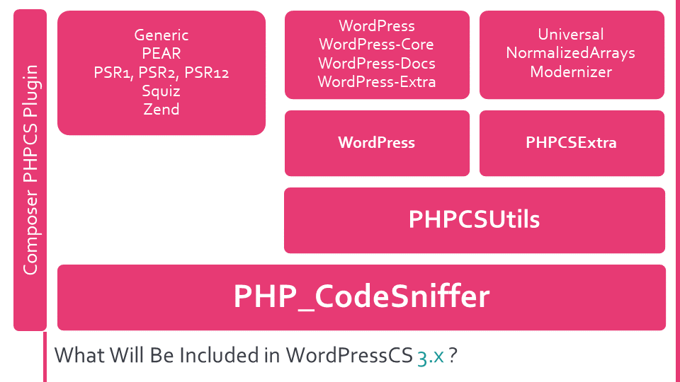

### from [https://make.wordpress.org/core/2023/08/21/wordpresscs-3-0-0-is-now-available/](https://make.wordpress.org/core/2023/08/21/wordpresscs-3-0-0-is-now-available/)

Chào mừng !
Nhóm phát triển core ( là một tập các phần mềm cầm thiết để chạy Wordpress) WordPress xây dựng WordPress! Theo dõi trang này cho các cập nhật chung, báo cáo trạng thái và các cuộc tranh luận mã. Có rất nhiều cách để đóng góp:   

- Phát hiện ra lõi? Tạo 1 [ticket](https://wordpress.org/support/bb-login.php?redirect_to=https://core.trac.wordpress.org/newticket) trong trình theo dõi lỗi .
- Bạn muốn đóng góp? Hãy bắt đầu nhanh với các thẻ đánh dấu như [lỗi đầu tiên tốt](https://core.trac.wordpress.org/tickets/good-first-bugs) cho những người đóng góp mới hoặc tham  gia [loại bỏ lỗi](https://make.wordpress.org/core/handbook/testing/bug-gardening/). Có nhiều thông tin hơn   trên [trang báo cáo ](https://make.wordpress.org/core/reports/), như các [bản vá](https://core.trac.wordpress.org/tickets/needs-testing) cần kiểm tra và các [trang dự án tính năng](https://make.wordpress.org/core/features/) 
- Câu hỏi khác? Đây là 1 [cuốn sách chi tiết](https://make.wordpress.org/core/handbook/) cho các nhà đóng góp với các hướng đãn đầy đủ.

  


# WordPressCS 3.0.0 hiện đã có sẵn.

Bài này thông báo tính khả dụng ngay lập tức cho bản phát hành  [WordPressCS 3.0.0](https://github.com/WordPress/WordPress-Coding-Standards/releases/tag/3.0.0) được chờ đợi rất lâu.

Đây là 1 bản phát hành quan trọng có những thay đổi có ý nghĩa để cải thiện độ chính xác, hiệu năng, độ ổn định, và khả năng bảo trì của tât cả các **sniffs** ( Một module cho PHP code Sniffer cái mà phân tich mã cho các vấn đề đặc biệt . Nhiều độ cứng kết hợp tạo ra 1 tiêu chuẩn PHPCS . Từ khóa được đặt tên bởi vì nó phát hiện ra "code smells", tương tự như con chó sẽ đánh hơi ra thức ăn ), cũng làm cho WordPressCs càng tốt hơn để xử lý PHP hiện đại 

Hầu hết các quy tắc cái mà được đề xuất trong [Make post from March 2020](https://make.wordpress.org/core/2020/03/20/updating-the-coding-standards-for-modern-php/) được thêm vào [Hướng dẫn tiêu chuẩn mã ](https://developer.wordpress.org/coding-standards/wordpress-coding-standards/php/)
Các **quy tắc" được đề xuất cái mà mang lại nhiều cuộc thảo luận hoặc bị phản đối, không được thêm vào. 
Mục đích là xuaasts bản các **bài đăng** cho từng đề xuất này theo thời gian, để thảo luận nhieue hơn về những đề xuất gây trang cãi 

Cho số lượng lớn các *rules* mới, "sniffs" đã được thêm vào WordPress để tập trung cho những rules này. 
Nhiều "Sniffs" có thể được thêm vào bản phát hành WordPress tương lai để bao quát toàn diện các quy tắc mới và các quy tắc được cập nhật.

# Kiến trúc mới 
 WordPressCs trước đây chỉ có 1 phụ thuộc thời gian chạy là [PHP_CodeSniffer](https://github.com/squizlabs/php_codesniffer) và người dùng cuối sẽ cần để đăng ký thủ công WordPress với PHP_codeSniffer ( hoặc sử dung Plugin Composer để thực hiện)

**Plugins** : Một Plugin là 1 phần của phần mềm chứa một nhóm các chức năng có thể thêm vào 1 web WordPress. Chúng có thể mở rộng các chức năng hoặc thêm các tính năng mới cho web Wordpress của bạn. Các plugins WordPress được viết bằng PHP và tích hợp liền mạch với WordPress. Có những Plugins free trên [thư mục Plugin WordPress.org](https://wordpress.org/plugins/) hoặc có thể là plugin dựa trên chi phí từ bên thứ ba. 
kể từ WordPressCS 3.0.0, WordPress sẽ có 4 phụ thuộc thời gian chạy bời và bởi vì điều này, Composer sẽ là các duy nhất để cài đặt WordPressCS.

     Lưu ý: vẫn có thể cài đặt WordPressCS và các phụ thuộc của nó mà không cần sử dung Composer. Nó chỉ không phải là một phương thức cài đặt được hỗ trợ sẽ được cung cấp. 

- [PHPCSUtils](https://github.com/PHPCSStandards/PHPCSUtils) là một tập các hàm tiện ích dể sử dụng PHP_CodeSniffer. 
- [PHPCSExtra](https://github.com/PHPCSStandards/PHPCSExtra) là 1 tập bổ sung của sniffs. 
- [Composer Installer](https://github.com/PHPCSStandards/composer-installer) là một plugin Composer cái mà đảm bảo rằng WordPressCS, PHPCSUtils cũng như PHPExtra sẽ được đăng ký chính xác với PHP_CodeSniffer. 

Giờ đây, các "sniffs" không dành riêng cho WordPress, sẽ được thêm vào PHPCSExtra, trong khi các sniffs dành riêng cho WordPress tiếp tục được bảo trì trong WordPressCS. 
Một vài Sniffs WordPressCS đã tồn tại trước đó, cái mà có thể có ích với cộng động rộng lớn PHP, được xóa và thay thế bởi sniffs tương tự ( và được cải thiện), cái mà đã dược thêm vào PHPCSExtra. 

# Nâng cấp lên WordPressCS 3.0.0
WP 3.0.0 chứa những thay đổi đột phá, cho cả những người sử dụng "ignore annotations", người đang duy trì bộ quy tắc tùy chỉnh,cũng như cho các nhà phát triển Sniff người mà bảo trì 1 tiêu chuẩn PHPCS tùy chỉnh dựa trên WPCS. 

Bên cạnh [nhật ký thay đổi](https://github.com/WordPress/WordPress-Coding-Standards/releases/tag/3.0.0), WPCS 3.0.0 xuất hiện với những hướng dẫn nâng cấp chi tiết cho cả [người dùng cuối/ người bảo trì các tập quy tắc](https://github.com/WordPress/WordPress-Coding-Standards/wiki/Upgrade-Guide-to-WordPressCS-3.0.0-for-ruleset-maintainers) cũng như 1 [hương dẫn nâng cấp riêng cho các nhà phát triển người](https://github.com/WordPress/WordPress-Coding-Standards/wiki/Upgrade-Guide-to-WordPressCS-3.0.0-for-Developers-of-external-standards) mà đang xây dựng tiêu chuẩn mã hóa trên WPCS.  

Vui lòng đọc các tài liệu được cung cấp 1 cách cẩn trọng trước khi nâng cấp. 

Lõi WP sẽ nâng cấp lên WPCS 3.0.0 trong tương lai gần. Theo dõi các Trac ticket [#59161](https://core.trac.wordpress.org/ticket/59161) nếu bạn muốn được cạp nhật thông tin và đảm bảo để chạy *composer update --with-all-dependencies* sau khi bản vá được cam kết để hưởng lợi từ những Sniff mới nhất và tốt nhất. 

# Tại sao cần thời gian quá lâu để bản phát hành này sẵn sàng? 
 Bản phát hành này là kết quả cơ bản của sự kết hợp 4 dự án lớn. Nó không cần thiết rằng ý định khi làm việc trên WPCS 3.0.0 bắt đầu, những dự án này sẽ được kết hợp trong 1 lần phát hành, nhưng tác động bên trong và bên ngoài đã ảnh hưởng tới thời gian,điều đã làm nó như vậy. 

Ngoài ra, vui lòng nhớ rằng dự án này cơ bản được bảo trì bởi 1 nhóm rất rất nhỏ của những tình nguyên viên làm việc được trả lương, những người có những công viêc thực sự để làm.
 
 Bốn dự án lớn mà chúng ta đang nói là : 
1. A big refactor
2. Thêm các quy tắc mới dựa trên "Make post from March 2020". 
3. Thêm các "sniffs" tương thích với PHP 7.4, 8.0, 8.1 và 8.2 ( * 8.2 cho đến nay có thể là do PHP_CodeSniffer không hỗ trợ đầy đủ cú pháp cho php 8.2  )
4. Cải thiện các tài liệu hiện có.

Bây giờ chúng ta sẽ nói một chút về từng phần được kể trên. 

# The refactor ( Tái cấu trúc)

WPCS trước đó chi có 1 **phụ thuộc thời gian chạy**, là PHP_CodeSniffer và người dùng cuối sẽ cần để đăng ký thủ công WPCS với PHP_CodeSniffer( hoặc sử dụng 1 plugin Composer để làm điều đó).

PHP_CodeSniffer đề nghị những chức năng "tiện ích " bị giới hạn cho Sniffs và một vài **abstracts** cơ bản. 

Nhưng WPCS - và những tiêu chuẩn bên  ngoài khác, như PHPCompatibility - muốn nhiều các chức năng "tiện ích" hơn và các "abstracts" tốt hơn, vì vậy những dự án này thêm các chức năng của nó và những tiện ích này sau đó phải được bảo trì trong những dự án đó. 

Để cải thiện điều này, ban đầu nó được [đề xuất cho các tiện ích chỉ định không tiêu chuẩn](https://github.com/squizlabs/PHP_CodeSniffer/issues/2189) để được thêm vào PHP_CodeSniffer. Sau đó gần 1 năm làm việc, nhiều cuộc thảo luận và chờ đợi, nó cuối cùng đã được quyết định vào [mùa hè năm 2019](https://github.com/squizlabs/PHP_CodeSniffer/pull/2456#issuecomment-525117958) rằng những tiện ích này nên được tồn tại trong 1 dự án riêng . 

 Việc chuyển những công việc này cho 1 dự án riêng là một bước thụt lùi và có nghĩa là phải làm lại rất nhiều. 
Dự án riêng này được xuất bản như [PHPCSUtils](https://github.com/PHPCSStandards/PHPCSUtils) vào tháng 1 năm 2020. 
Thời điểm đó, PHP 8.0 cũng bắt đầu tham gia vào cuộc chơi và nó bắt đầu trở nên rõ ràng rằng điều này sẽ liên quan tới rất nhiều thay đồi cho các dự án Tiêu chuẩn mã và cả PHP_CodeSniffer, cũng nhữ các tiện ích, sẽ phải được hoàn thiện tương thích với PHP 8.0 trước 1 phiên bản mới của WPCS có thể được phát hành. 

Trong thực tế, hầu hết các tiện ích không dành riêng cho WP hiện đã có sẵn thông qua PHPCSUtils. 
Các chức năng tiện ích còn lại, như các ngoại lệ mới + các tiện ích dành riêng cho WP, tất cả đã được chuyển tới lớp "helper" và các "traits" để mã có thể tái sử dụng hơn cho các sniffs không dựa vào lớp "Sniff" cơ sở cụ thể của WPCS. 


# New rules 
  Bài "Make post from March 2020" đã đề xuất nhiều quy tắc mới, kết quả đã dẫn đến các cuộc thảo luận lành mạnh trên bài đăng và lưu lại một vài quy tắc mới, hầu hết các quy tắc mới đã được phê duyệt. 
Điều này có nghĩa là hai thứ: 
- Nghiên cứu cần được hoàn thành liệu có bất kì các Sniffs tồn tại trước đó có thể dược sử dụng để triển khai các quy tắc đã được phê duyệt.
- Cho bất kỳ sniff chưa tồn tại, một sniff mới sẽ cần được viết.

35 sniffs mới khổng lồ được viết cho bản phát hành này, 32 trong số chúng được thêm vào [PHPCSExtra](https://github.com/PHPCSStandards/PHPCSExtra)  và 3 được thêm vào chính WPCS. 

Để xem một danh sách tất cả các quy tắc dã được thêm trong 1 tiêu chuẩn chụ thể, sử dụng
```php
vendor/bin/phpcs -e --standard=WordPress
```

( Bạn có thể thay thế WP với, ví dụ, WP-Core hoặc Universal or PSR12 để thấy các sniffs đã được thêm vào 1 tiêu chuẩn cụ thể). 

# Làm cho các sniffs tương thích với PHP 7.4, 8.0, 8.1 và 8.2

Làm cho 1 dự án PHP tương thích với 1 phiên bản PHP mới là  một chuyện, làm điều đó cho1 công cụ phân tích tĩnh là 1 chuyên hoàn toàn khác. 

Làm cho sniffs tương thích với 1 phiên bản PHP mới, cơ bản liên quan đến 3 điều: 
- Đảm bảo các mã tồn tại sẽ chạy trên phiên bản mới mà không có lỗi hoặc thông báo. 
- Đảm bảo rằng Sniff không ném ra 1 positive/negative sai khi gặp 1 cú pháp mới. 
Ví dụ: nếu 1 sniff tìm thấy các cuộc gọi hàm tới trình phân tích và loại trừ các cuộc goi phương thức, các cuộc gọi phương thức được đứng trước bởi 1 `->`hoặc `::` , đối với PHP 8.0, những sniffs cần được điều chỉnh để có thể loại trừ các cuộc gọi hàm được đúng trước bới toán tử nullsafe `?->`.
-  Thêm các hỗ trợ rõ ràng cho các tính năng mới của PHP.

Ví dụ: nếu 1 sniff muốn kiểm tra tên của 1 `structure` tương tự class, giống như 1 `class`, `interface` hoặc `trait`, `sniff` có thể sẽ hưởng lợi từ các mã mới để cũng có kiểm tra tên của cấu trúc enum của PHP 8.

Bây giờ, bên cạnh các điều 1, 2 và 3, WPCS có 1 `Big Dependency` trên chính PHP_CodeSniff  vì PHP_CodeSniffer cần để hỗ trợ các cú pháp mới đầu tiên trước 1 cá nhân Sniff co thể bắt đầu hỗ trợ chúng. 

Vào thời điểm WPCS 3.0.0 bắt đầu hoạt động, PHP_CodeSniffer không hỗ trợ đầy dủ cho PHP 7.4, cái đã thêm khá nhiều cú pháp mới và sau đó PHP 8.0, 8.1 và 8.2 xuất hiện càng thêm nhiều hơn các tính năng mới. 

    PHP 7.4, 8.0, 8.1 và 8.2 đã thêm nhiều cú pháp mới cho PHP hơn tất cả bản phát hành PHP 5 và 7 trước khi kết hợp. 

Bây giờ bạn có lẽ tự hỏi bản thân: " Tại sao các sniffs nên lấy tất cả những cú pháp mới này của PHP vào trong". Sau tất cả, WP cũng hỗ trợ .7.0 ( PHP 5.6 ưu tiên cho WP 6.3), vì vậy những cú pháp này có thể không được sử dụng trong các đoạn mã dược viết cho WP Core. 

Chà, Tiêu chuẩn mã WP là một tiêu chuẩn cộng đồng và WPCS  đã mã hóa điều này thành tự động kiểm tra và do đó, WPCS không chỉ được sử dụng bới WP Core, mà còn bởi cộng đồng WP to lớn, bao gôm các agencies, plugin và theme...
 
Bên cạnh đó, không sớm thì muộn, WP sẽ phát triển phiên bản PHP được hỗ trợ tối thiểu tới 1 phiên bản bao gồm những cú pháp mới, vì vậy công việc sẽ cần được hoàn thiện và việc này dễ hơn để làm khi những cái dược thay đổi trong PHP vẫn được làm mới trong đầu bạn. 

Vì vậy, một trò chơi chờ đợi mới bắt đầu, nơi mà PHPCS cần được cập nhật đầu tiên, sau đó PHPCSUtils và chỉ có sau đó có thể hỗ trợ cho các cú pháp mới có thể được thêm vào WPCS. 

An toàn cho các loại biểu mẫu thông thường phân biệt PHP 8.2, cái mà không được hỗ trợ bởi PHP_CodeSniffer, tất cả các cú pháp mới cái mà được giới thiệu trong phiên bản PHP gần đây hiện tại đã được tinh vào trong tất cả các sniffs theo trí tưởng tượng của (tôi) chúng tôi. 

Nếu bạn chạy trong 1 trường hợp nơi 1 sniff xuất hiện không tương thích đầy đủ với 1 cú pháp PHP hiện đại, vui lòng mở 1 báo cáo lỗi. 

# Cải thiện tài liệu. 
PHPCS có 1 tính năng ghi tài liệu Sniff được tích hợp sẵn. Cho đến hiện nay, WPCS không thực sự hỗ trợ tính năng này và WP Sniffs không cung cấp các tài liệu cần thiêt. 

Một khởi đầu đã dược thực hiện để thêm tài liệu vào sniffs trong ngày đóng góp tại WordCamp Europe 2019. 

Nỗ lực này đã tiếp tục trong vòng chu trình WPCS 3.0.0 và hầu hết các Sniffs được sử dụng và cung cấp bởi WPCS hiện nay bao gồm các tài liệu với các mẫu code cái mà 1 sniff mong chờ. 

Để xem tài liệu cho bất kỳ các tiêu chuẩn được bao gồm : 
```php
vendor/bin/phpcs --generator=Text --standard=WordPress

```
( Bạn có thể thay thế WP, ví dụ, WP-core hoặc Universal or PSR12 để xem tài liệu cho các tiêu chuẩn khác. )

# Tương lai của WPCS. 


Trong khi WPCS hiện tại là 1 nơi tốt với bản phát hành này, điều này sẽ không kéo dài lâu với tốc độ phát triển của PHP. 

WPCS 3.0.0 có hàng ngàn giờ làm việc gia trị và đại đa số công việc được thực hiện xong bởi một người, hầu hết không mất phí, người đóng góp với đánh giá mã hỗ trợ từ hai bảo trì đồng nghiệp. 

Nếu chúng ta thực tế, hệ số bus của WPCS là 1, trường hợp nguy hiểm nhất cho bất kì dự án  nào tham gia. 

Một phần lớn của cộng đồng WP, bao gồm WP Core, phụ thuộc rất nhiều vào WP Coding Standards cho chất lượng mã và kiểm tra bảo mật và trong khi cộng đồng khá hay lên tiêng với các phàn nàn về các bản phát hành trì hoãn, hầu như không ai dứng lên và có các đóng góp thực sự. 

Hầu hét các công việc cho WPCS đòi hỏi các kiến thức chuyên môn. Kiến thức có thể học với thời gian đầu tư đủ, nhưng trong những năm gần đây không ai bắt tay vào làm điều đó. 

Điều này là hoàn cảnh không bền vững và nó kết thúc bây giờ. 

Trừ khi tìm được nguồn tài trợ để tiếp tục bảo trì WPCS và các phụ thuộc của nó, tương lai sẽ ảm đạm và việc bảo trì sẽ bị dừng. 

Hãy đê điều này 1 lời kêu gọi hành động cho các người dùng doanh nghiệp/đại lý của WPCS cùng nhau và tìm ra cách để tài trợ tiếp tục duy trì và phát triển của WPCS như là một người mà toàn bộ dự án, bao gồm các phụ thuộc, được hoàn thành với trạng thái hiện tại.
Let this be a call to action for the corporate/agency users of WordPressCS to come together and figure out a way to fund the continued maintenance and development of WordPressCS as that one person on which the whole project, including all dependencies, leans, is done with the current status quo.

Nếu bạn muốn giúp thay đổi tình trạng này, vui lòng liên hệ với nhóm bảo trì WordPressCS (@jrf, @GaryJ, @dingo_d) qua WordPress Slack để thảo luận.


